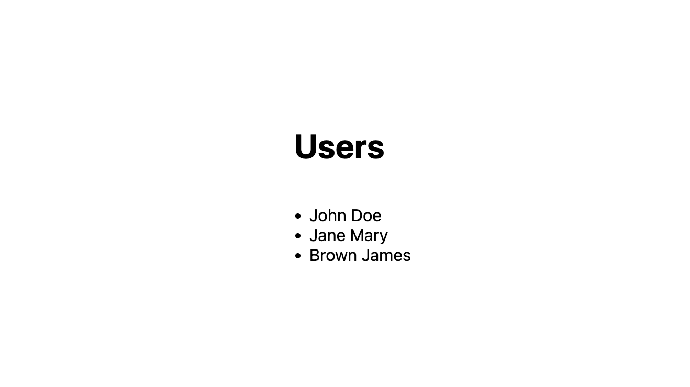
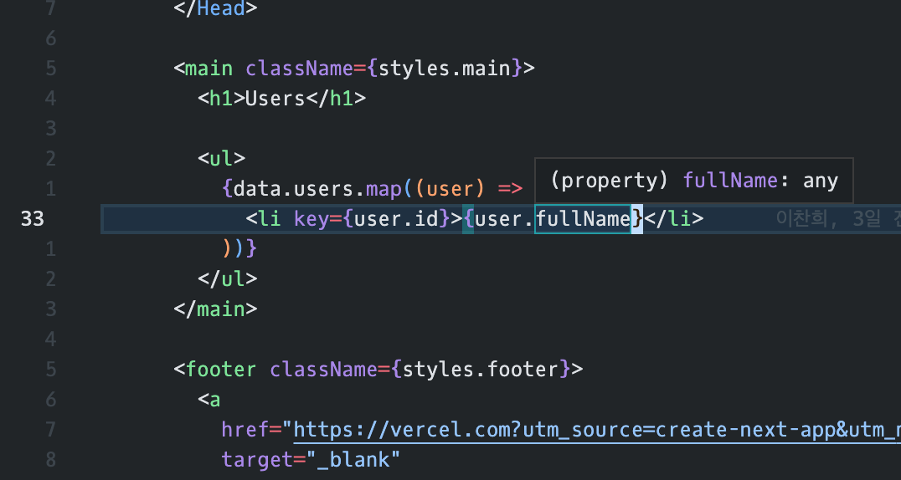
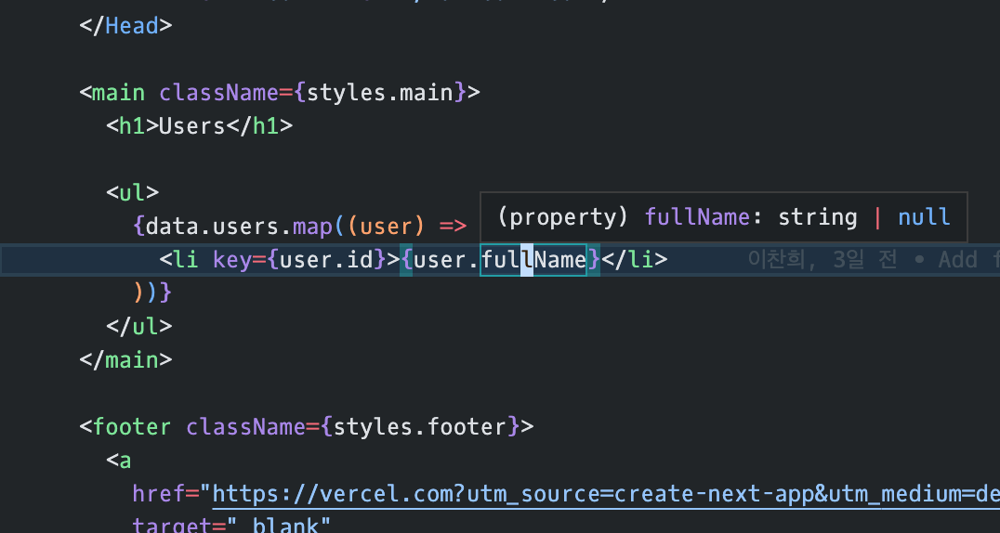

스매치 코퍼레이션에서는 최근에 GraphQL과 Relay를 도입해서 업무를 진행하고 있다. Relay가 프레임워크를 표방하는 만큼 초기 도입 비용이 높지만,
컴파일러나 Relay가 갖고 있는 철학을 통해 클라이언트에서 GraphQL을 가장 잘 활용할 수 있도록 도와준다고 생각한다.

Relay가 제공하는 기능 중 가장 최근에 사용한 것은 Relay Resolver 라는 기능인데, 이 기능을 사용하면서 좋았던 점과 사용하는 방법 그리고 문제 해결 과정을 정리해보려고 한다.

## Relay Resolvers?

Relay Resolvers는 Relay 14에서 추가된 기능인데, 파생된 상태를 반환하는 필드를 리졸버로 구현하면, 릴레이 컴파일러가 클라이언트 스키마를 확장해준다. 이후 프래그먼트나 쿼리에 해당 필드를 사용하면, 내부적으로는 Relay Resolver에 정의한 프래그먼트를 사용하고, 런타임에서 바로 계산된, 파생된 상태를 사용할 수 있다.

### `readInlineData`와 비교

이미 Relay에는 `readInlineData, @inline`라는 API가 있다. 프래그먼트를 선언해서 값을 활용할 수 있다는 점에서 어느정도 유사하지만, 해당 프래그먼트를 사용하기 위해서 `@inline` 프래그먼트를 확장해야 하고, `readInlineData`가 포함된 함수를 호출해야 하는 부분이 다르다.

그리고 Relay Resolvers가 컴포넌트 내부에서만 사용될 수 있다는 점에서 `readInlineData`와 차이가 있다. 둘 중 하나만 채택해서 사용한다기 보다,
상황에 맞게 서드 파티 툴이나 API 요청을 다른 함수에서 사용한다면 `readInlineData`를, 컴포넌트 내에서 파생된 상태를 활용해야 한다면 Relay Resolvers를 사용하면 된다.

### 코드 비교

다음은 `readInlineData`를 사용해서 컴포넌트에 값을 표시하는 예시이다.

```typescript
// readInlineData 함수를 호출하는 함수를 선언한다.
function readFullName(fragmentRef: readFulleName$key) {
  const data = readInlineData(
    graphql`
      fragment readFullName on User @inline {
        firstName
        lastName
      }
    `,
  );

  return `${data.lastName} ${data.firstName}`;
}

// 컴포넌트 내부:
const data = useFragment(
  graphql`
    fragment UserProfile on User {
      # @inline 프래그먼트를 확장해야 함
      ...readFullName
    }
  `,
  fragmentRef,
);

return (
  // readInlineData를 사용하는 함수를 호출해야 함.
  <p>Your name: {readFullName(data)}</p>
);
```

이 기능을 Relay Resolvers로 구현한다면 이렇게 사용할 수 있다.

```typescript
const data = useFragment(
  graphql`
    fragment UserProfile on User {
      # 실제 서버 스키마에는 존재하지 않는 필드
      fullName
    }
  `,
  fragmentRef,
);

return <p>Your name: {data.fullName}</p>;
```

아래에서 보다 자세히 다루기 위해, 예시 코드에서는 `readInlineData`와 다르게 Relay Resolvers를 선언하는 부분을 의도적으로 생략했다.
`readInlineData`가 파생 상태를 다룰 때에도 활용할 수 있는 API이긴 하지만, 매번 프래그먼트를 확장해야 한다는 점과 해당 함수를 호출해야 하는 부분은 꽤 번거롭다.

Relay Resolvers는 이러한 번거로움을 해결했고, 보다 자연스럽게, 파생된 상태를 일반 필드에 접근하는 것처럼 사용할 수 있다.

## Relay Resolvers 사용하기

Relay Resolvers에 대해 간단히 알아봤으니, Relay Resolvers를 사용하는 방법에 대해 알아보자. 몇 개의 설정만 적용하고, Relay Resolvers를 위한 파일을 하나 만들면, Relay 14에서 바로 사용해볼 수 있다.

### 피처 플래그 활성화

우선 Relay Resolvers는 작성일 기준으로 실험 단계에 있는 기능이다. 이 기능을 사용하기 위해서는 Relay 런타임과 컴파일러의 피처 플래그를 활성화 해야 한다.

Relay 컴파일러의 피처 플래그를 활성화 하기 위해, `relay.config.js` 파일에 아래와 같이 필드를 추가한다.

```javascript{3-5}
module.exports = {
  // ...
  featureFlags: {
    enable_relay_resolver_transform: true,
  },
};
```

Relay 런타임의 피처 플래그를 활성화 하기 위해, 진입점에 해당하는 코드나 Relay Environment를 생성하는 부분에 아래와 같이 코드를 추가한다.

```javascript
import * as RelayRuntime from 'relay-runtime';

RelayRuntime.RelayFeatureFlags.ENABLE_RELAY_RESOLVERS = true;
```

### 리졸버 파일 작성

피처 플래그를 설정했다면 이제 리졸버 파일을 작성할 수 있다. 리졸버 파일은 `readInlineData`를 사용하는 함수를 만드는 느낌과 비슷하다. 단, `readInlineData` 대신 `readFragment` API를 사용하고, 프래그먼트 선언부에 `@inline` 디렉티브는 추가하지 않는다. 그리고 리졸버 함수는 꼭 `export default`로 지정해야 한다.

```typescript
export default function fullNameResolver(fragmentRef: fullNameResolver$key) {
  const data = readFragment(
    graphql`
      fragment fullNameResolver on User {
        firstName
        lastName
      } 
    `,
    fragmentRef,
  );

  return [data.lastName, data.firstName].join(' ');
}
```

여기까지는 `readInlineData`를 사용하는 함수의 선언과 99% 유사한데, 나머지 1%, 이 함수가 Relay Resolvers를 위한 함수임을 알려주기 위해 특별한 JSDoc, DocBlock을 추가해야 한다.

```typescript{1-7}
/**
 * @RelayResolver
 *
 * @onType User
 * @fieldName fullName
 * @rootFragment fullNameResolver
 * 
 * 유저의 전체 이름을 조합해서 리턴
 */
export default function fullNameResolver(fragmentRef: fullNameResolver$key) {
  // 생략
}
```

Relay 공식 문서에 따르면, 리졸버 함수의 DocBlock에는 4개의 필드가 필수로 입력되어야 한다.

- `@RelayResolver`: 필수 입력.
- `@onType`: 어떤 타입을 확장할 것인지. 이 타입은 `relay.config.js`에 지정된 스키마에 존재해야 한다.
- `@fieldName`: 사용할 필드 이름. 기존 스키마나 클라이언트 확장 스키마에 있는 필드 이름과 중복될 수 없다.
- `@rootFragment`: 함수 내의 `readFragment`에서 사용한 프래그먼트 이름.

여기에 추가적으로 `@deprecated`도 사용할 수 있고, 위의 예시처럼 해당 필드에 대한 설명을 입력할 수도 있다.

### 사용하기

이후 Relay 컴파일러를 실행하고, `useFragment`나 `useLazyLoadQuery`, `usePreloadedQuery` 등을 사용해서, Relay Resolvers로 작성한 필드를 Operation에 추가하면 사용할 수 있다.

```tsx{7,20}
export default function Home() {
  const data = useLazyLoadQuery<pagesIndexQuery>(
    graphql`
      query pagesIndexQuery {
        users {
          id
          fullName
        }
      }
    `,
    {},
  );

  return (
    <div className={styles.container}>
      <main className={styles.main}>
        <h1>Users</h1>
        <ul>
          {data.users.map((user) => <li key={user.id}>{user.fullName}</li>)}
        </ul>
      </main>
    </div>
  );
}
```

실행 결과는 다음과 같다. 실제로 스키마의 정의된 필드는 아니지만, 필요한 필드를 모아서 파생된 값을 리턴하는 것을 볼 수 있다.



## 타입스크립트 환경에서 타입 추론 이슈

타입스크립트 환경에서 Relay Resolvers로 추가한 필드의 타입이 추론되지 않는 문제가 있다.
아래 사진을 보면 `fullName`이 `any`로 확인되는 것을 볼 수 있다.



구글링 결과, Relay 컴파일러가 Relay Resolvers와 관련된 아티팩트 생성 시, 생성된 아티팩트 코드를 보면, Relay Resolver 모듈 경로에 `.ts`를 추가하면서 타입 추론이 작동하지 않는다.

```ts{3,4}
import { ConcreteRequest, Query } from 'relay-runtime';
import { FragmentRefs } from 'relay-runtime';
import userFullNameResolver from '../resolvers/fullNameResolver.ts';
//                                ^^^^^^^^^^^^^^^^^^^^^^^^^^^^^^^^
export type pagesIndexQuery$variables = {};
export type pagesIndexQuery$data = {
  readonly users: ReadonlyArray<{
    readonly fullName: ReturnType<typeof userFullNameResolver> | null;
    readonly id: string;
  }>;
};
```

`main` 브랜치 기준으로 관련 수정이 반영된 것 같은데, 작성일 기준으로 `main` 버전을 사용하니 뭔가 잘 안되어서, Stable 버전 기준으로 문제를 해결했다.
약간의 불편함을 감수하는 방법인데, Relay Resolvers 파일을 자바스크립트로 작성하면 된다 (!)

당연하게도, 자바스크립트에서는 `readFragment`의 리턴 타입을 얻을 수 없는데, `tsconfig.json`에 `allowJs`가 `true`로 설정되어 있다면, `@type` DocBlock 필드를 사용해서 타입을 추론할 수 있다.

```javascript{2}
export default function fullNameResolver(
  /** @type { import('../generated/fullNameResolver.graphql').fullNameResolver$key } */
  fragmentRef,
) {
  // data의 타입은 { firstName: string, lastName: string }
  const data = readFragment(
    graphql`
      fragment fullNameResolver on User {
        firstName
        lastName
      } 
    `,
    fragmentRef,
  );

  return `${data.lastName} ${data.firstName}`;
}
```

이후 다시 타입을 확인해보면 정상적으로 추론되는 것을 확인할 수 있다. `string | null`로 잡히는 이유는 Relay 컴파일러가 아티팩트 생성 시, `ReturnType<...> | null`로 타입을 지정하기 때문이다.



참고로, Relay Resolvers의 리턴 타입은 꼭 스칼라 타입이 아니어도 된다. 필요하다면 배열이나 객체를 리턴해서 사용할 수 있다.

---

## 마무리

조금 번거로운 방법으로 타입 추론까지 얻어냈지만, 이 정도는 감수할 수 있을 만큼 Relay Resolvers는 편리한 기능이다. GraphQL의 스키마의 표현력이 뛰어나지만, UI에 표시되는 형태와 직결되는 값을 담기에는 조금 애매했는데, 이 기능이 가려운 부분을 적당히 긁어줄 수 있는 것 같다.

작동하는 샘플 코드는 [https://github.com/iamchanii/relay-resolvers-example](https://github.com/iamchanii/relay-resolvers-example)에서 확인할 수 있다.

### 참고

- [https://relay.dev/docs/guides/relay-resolvers/](https://relay.dev/docs/guides/relay-resolvers/)
- [https://relay.dev/docs/api-reference/graphql-and-directives/#inline](https://relay.dev/docs/api-reference/graphql-and-directives/#inline)
- [https://gist.github.com/Beingbook/4f1f3d240f12a6f35f1ac241e1e0264a](https://gist.github.com/Beingbook/4f1f3d240f12a6f35f1ac241e1e0264a)
- [https://github.com/facebook/relay/issues/3989](https://github.com/facebook/relay/issues/3989)
- [https://github.com/facebook/relay/issues/4056](https://github.com/facebook/relay/issues/4056)
- [https://www.typescriptlang.org/docs/handbook/jsdoc-supported-types.html#import-types](https://www.typescriptlang.org/docs/handbook/jsdoc-supported-types.html#import-types)
