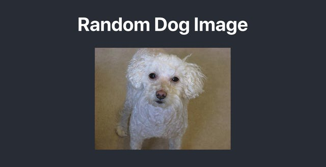
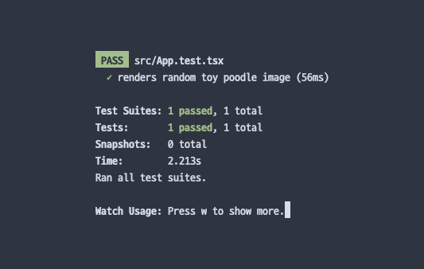

Promise를 가만히 두면 어떻게 되는지 소개하는 글 말미에 resolve를 대신 호출하는 사례로 최근에 리팩토링을 진행한 코드의 테스트 코드를 일부 소개했었는데, 해당 코드에 대헤 궁금해 하시는 분이 계셔서 짧게 정리해 봤다.

# 기존에 API 호출 테스트를 작성하면서 귀찮았던 점

정확히는 리덕스에 API 호출 결과를 관리하면서 발생하는 귀찮은 점이라고 볼 수 있는데, 테스트 코드를 작성할 때 **API 호출 요청하는 액션**과 **API 호출 결과를 저장하는 액션**을 같이 테스트 하지 않으면 원활하게 컴포넌트 레벨의 테스트 코드를 작성하기 어려웠다. 예를 들면,

```
// store 인스턴스에 actions 를 노출하도록 만든
// 별도의 store 생성 함수가 필요하다.
const store = createMockStore(/* ... */);

const { /* ... */ } = render(
  <Proivder store={store}>
    <Component />
  </Provider>
);
```

```
// API를 잘 호출했는지 확인해야 하고
expect(store.actions).toContainEqual(apiCall(payload));

// API를 잘 호출했다는 가정 하에 완료 액션도 보내야...
store.dispatch(apiCallSuccess(payload));

// 이제야 컴포넌트 레벨의 테스트 코드 작성할 수 있다.
await wait(() => getByText('Some data of api response'));
```

컴포넌트 레벨의 테스트를 쓰는 것도 어렵고 번거롭다는 느낌이 들던 것에서 **본질적으로, 리덕스에 API 호출 결과를 저장하는 것이 맞나?**라는 생각이 들기 시작했다.

리액트는 곧 UI 라이브러리고 API 호출 결과 자체가 UI 상태와는 거리가 있다고 생각이 들었다. UI를 통해 데이터를 표시하는 것과 UI의 상태로서 API 호출 결과를 저장하는 것은 다른 문제라는 결론을 내렸다.

그러던 중 [react-query](https://github.com/tannerlinsley/react-query)와 [useSWR](https://github.com/zeit/swr) 라이브러리를 발견하였고, Stale-While-Revalidation 전략을 통해 서버 리소스를 캐싱하는 방식이 매력적이었고, 나의 고민을 해결할 수 있을 것 같아서 부분적으로 리팩토링을 겸해서 사용하기로 했다.

그로 인해 **필요하지 않다면 장기적으로 리덕스를 덜어내는 것**과 전체적인 코드 베이스가 깔끔해지는 것을 기대할 수 있게 되었다. 이 부분은 좀 더 시간이 지난 뒤에 회고를 해보기로 하고 본격적으로 테스트 코드 작성에 대해 정리해보자.

# 예제 프로젝트

간단하게 Fetch API를 호출하여 가져오는 예제를 만들어보기로 했다. [Public APIs](https://github.com/public-apis/public-apis)에 있는 것 중에 CORS가 허용되어 있는 동물 API 중 [Dog API](https://github.com/public-apis/public-apis)가 있어, 랜덤하게 토이 푸들 이미지를 표시하는 앱을 만들었다.



전체 코드는 [여기](https://github.com/iamchanii/react-fetch-test-example)서 확인할 수 있다.

# 컴포넌트 구현

간단한 API 호출 로직을 포함하는 컴포넌트를 만들었다.

```
// 토이 푸들 종의 이미지를 무작위하게 반환하는 API 주소
export const RANDOM_DOG_IMAGE_URL =
  'https://dog.ceo/api/breed/poodle/toy/images/random';

// API 요청 결과 인터페이스 정의
export interface RandomDogImage {
  message: string;
  status: 'success';
}

function App() {
  const [imageUrl, setImageUrl] = useState();

  // 컴포넌트가 마운트 되면
  // API를 호출하여 이미지 주소를 저장한다.
  useEffect(() => {
    async function fetchRandomDogImage() {
      const response = await fetch(RANDOM_DOG_IMAGE_URL);
      const randomDogImage: RandomDogImage = await response.json();
      setImageUrl(randomDogImage.message);
    }

    fetchRandomDogImage();
  }, []);

  return (
    <div className="App">
      <header className="App-header">
        <h1>Random Dog Image</h1>
        {/* 저장된 주소가 있는 경우 이미지를 표시한다. */}
        {imageUrl && }
      </header>
    </div>
  );
}
```

# 테스트 코드 작성

이제 테스트 코드를 살펴보자.

## jest-fetch-mock

Fetch API를 자동으로 모킹해 주는 라이브러리다. Create React App은 기본적으로 Jest 기반의 테스트 환경을 제공하기 때문에 이 라이브러리를 사용하면 좀 더 쉽게 Fetch API를 모킹하여 테스트할 수 있다.

제공하는 메소드 중 mockResponse 메소드는 Request 객체를 인자로 하는 함수를 전달하여 좀 더 유연하게 요청을 모킹할 수 있다.

```
fetchMock.mockResponse((req: Request) => {
  if (req.url === 'https://example.com') {
    return Promise.resolve(JSON.stringify({ status: 'ok' }));
  }

  return Promise.reject('Invalid Request');
});
```

## 일단 작성해보기

일단 리팩토링은 다음 단계에 해보기로 하고, 앞서 작성한 컴포넌트에 대해 테스트 코드를 구현해보자.

```
test('renders random toy poodle image', async () => {
  let _resolve: any;

  fetchMock.mockResponse(request => {
    if (request.url === RANDOM_DOG_IMAGE_URL) {
      return new Promise(resolve => {
        _resolve = resolve;
      });
    }

    return Promise.resolve('');
  });

  const { getByAltText } = render(<App />);

  _resolve(
    JSON.stringify({
      message: 'https://dog.jpg',
      result: 'success',
    }),
  );

  const toyPoodle = await waitForElement(() => {
    return getByAltText(/toy poodle/i);
  });

  expect(toyPoodle).toHaveAttribute('src', 'https://dog.jpg');
});
```

### 특정 URL 요청 시 Resolve 함수 저장

```
let _resolve: any;

fetchMock.mockResponse(request => {
  if (request.url === RANDOM_DOG_IMAGE_URL) {
    return new Promise(resolve => {
      _resolve = resolve;
    });
  }

  return Promise.resolve('');
});
```

Fetch API를 전역으로 모킹하고 비어있는 응답을 반환하되, RANDOM\_DOG\_IMAGE\_URL로 요청하는 경우 별도의 Promise 객체를 반환하도록 했다. 이후 \_resolve에 해당 객체의 resolve 함수를 가리키도록 저장한다.

이렇게 하면 테스트 환경에서 컴포넌트는 Fetch API 사용 시 RANDOM\_DOG\_IMAGE\_URL로 요청했기 때문에 테스트 코드 내에서 \_resolve가 호출될 때 까지 계속해서 대기 상태에 있을 것이다.

### 컴포넌트 렌더링 및 Resolve 호출

```
const { getByAltText } = render(<App />);

_resolve(
  JSON.stringify({
    message: 'https://dog.jpg',
    result: 'success',
  }),
);
```

뭐든 그렇지만 모킹할 때에는 순서에 유의할 필요가 있다. 만약 버튼을 클릭해서 Fetch API를 호출하는 경우 render 호출 이후에 모킹해도 상관 없지만, 컴포넌트 마운트와 동시에 요청하는 경우 그보다 먼저 모킹이 되어야 정상적으로 테스트를 할 수 있다.

컴포넌트를 렌더링 한 뒤, \_resolve 함수를 호출할 때 임의의 API 응답을 문자열로 변환하여 호출한다. 좀 더 구체적인 응답을 해야하는 경우, 예를 들어 상태 코드에 따른 로직이 있다면 직접 Response 객체를 전달할 수도 있다.

### Expect!

```
const toyPoodle = await waitForElement(() => {
  return getByAltText(/toy poodle/i);
});

expect(toyPoodle).toHaveAttribute('src', 'https://dog.jpg');
```

Toy Poodle이라고 지정된 Alt를 가진 요소(= 이미지 요소)가 나올 때 까지 대기한 뒤, 해당 요소가 src 속성을 가지고 있고, 해당 속성값이 https://dog.jpg인지 확인한다.

flushPromises를 사용하지 않은 이유는 flushPromises는 사용자 관점의 코드가 아니기 때문이다.

실제 사용자가 제품을 사용하는 방식대로 테스트 코드를 작성하는 것이 중요한 만큼 flushPromises를 사용하는 것을 가급적 지양하고자 한다. 실제 사용자는 이미지가 나타나는 것을 기다리는 것이지 이벤트 루프가 한 큐 끝나는 것을 기다리는 것이 아니기 때문이라고 생각이 들었다.

그런 주관적인 생각도 있지만, @testing-library/react 라이브러리가 wait과 waitForElement, waitForDomChange API를 제공하기 때문이다. 제공되는 API를 사용하지 않을 이유는 더욱이 없는 것 같고, 다른 사람이 봐도 좀 더 이해하기 쉬운 코드라고 해야 할까.

## 테스트 코드 리팩토링

앞서 작성한 테스트 코드를 향후 다양한 컴포넌트에서 Fetch API를 호출할 것을 고려하여 리팩토링을 진행한다. 매번 fetchMock.mockResponse를 입력하는 것도 방법이겠으나, 헬퍼 함수로 분리해 두면 더욱 깔끔하게 테스트 코드를 작성할 수 있다.

리팩토링이 완료된 코드는 다음과 같다.

```
test('renders random toy poodle image', async () => {
  const assertFetch = mockFetchRequest(new RandomDogImageDummy());
  const { getByAltText } = render(<App />);

  const randomDogImage = assertFetch(RANDOM_DOG_IMAGE_URL);

  const toyPoodle = await waitForElement(() => {
    return getByAltText(/toy poodle/i);
  });

  expect(toyPoodle).toHaveAttribute('src', randomDogImage.message);
});
```

### RandomDogImageDummy

다른 코드를 설명하기 전에 RandomDogImageDummy부터, Dummy부터 설명하고 넘어가도록 하겠다. 타입스크립트로 특정 도메인의 인터페이스를 정의하면 정말 좋은데 아쉬운 점은 더미 데이터를 생성할 때 일일히 만들어야 한다. 장고의 픽스쳐처럼 JSON으로 할 순 있지만 타입 안정성을 잃을 수 있다.

그래서 Dummy 인터페이스를 정의하고, 각 인터페이스에 맞는 Dummy 클래스를 만들어서 사용한다.

```
interface Dummy<T> {
  create(): T;
}

class RandomDogImageDummy implements Dummy<RandomDogImage> {
  create(): RandomDogImage {
    return {
      message: 'https://dog.jpg',
      status: 'success',
    };
  }
}

new RandomDogImageDummy().create();
```

이렇게 하면 타입 안정성을 챙긴 더미 데이터를 생성할 수 있고, JSON과 달리 나중에 인터페이스에 변동이 생기면 타입 에러가 발생하여 쉽게 업데이트를 할 수 있다.

무슨 패턴이라고 해야 할 지 모르겠다. 디자인 패턴을 많이 알고 있는게 아니기도 하고, 그저 예전 직장에서 [나석주](https://github.com/seokju-na)님이 작성하신 코드를 보고 따라서 지금까지 잘 사용하고 있다. 👍

이 부분에서 faker 같은 라이브러리를 사용하여 좀 더 무작위의 실제와 유사한 데이터를 사용하도록 하는 것을 추천한다.

### mockFetchRequest

```
function mockFetchRequest<T>(dummy: Dummy<T>) {
  let _resolve: any;

  fetchMock.mockResponse(() => {
    return new Promise(resolve => {
      _resolve = resolve;
    });
  });

  return (...args: any[]): T => {
    const created = dummy.create();
    _resolve(JSON.stringify(created));
    expect(fetchMock).toHaveBeenLastCalledWith(...args);

    return created;
  };
}
```

리팩토링 이전의 테스트 코드 중 Fetch와 관련된 코드를 옮겨온 함수다. Dummy를 인자로 받으면 fetchMock.mockResponse를 통해 Fetch API를 모킹하고 클로저 함수를 반환한다.

반환된 클로저 함수를 호출하면 전달했던 Dummy의 create() 메소드를 호출하고, 생성된 데이터를 Resolve 함수에 전달한다. 이후 클로저 함수에 전달한 인자를 사용하여 가장 마지막에 호출했던 Fetch 호출 인자와 동일한지 확인한다.

이 단언이 통과하면 생성된 Dummy 데이터를 반환한다.

### 깔끔해진 테스트 케이스

```
const randomDogImage = assertFetch(RANDOM_DOG_IMAGE_URL);

const toyPoodle = await waitForElement(() => {
  return getByAltText(/toy poodle/i);
});

expect(toyPoodle).toHaveAttribute('src', randomDogImage.message);
```

다시 테스트 케이스를 보면 이제 조금 코드가 읽히는 것 같다. (아닌가?)

Dummy를 이용하여 데이터를 생성하면 테스트 케이스 내에서 어떤 데이터를 만들어야 하는지 신경쓰지 않아도 되고, 의도한대로 Fetch API가 호출된 경우에만 생성된 데이터를 받을 수 있기 때문에 **테스트 코드가 컴포넌트의 로직을 커버할 수 있다는 믿음**이 생긴다.

# 마치며



소개해드린 방법이 절대적으로 옳은 방법은 아니기 때문에 가볍게 읽어주시면 좋겠고, 또한 더 나은 방법이 있다면, 혹은 틀렸거나 정정해야 하는 내용이 있다면 피드백은 언제든지 반갑게 맞이할 예정. 🙌

찾다보니 [intermock](https://github.com/google/intermock)이라는 라이브러리를 찾게 되었는데, 잘 사용하면 Dummy를 일일히 작성하지 않아도 될 것 같아서 너무 설렌다.
