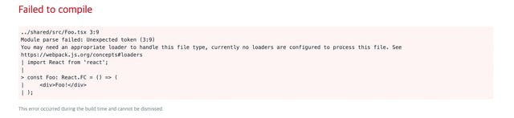
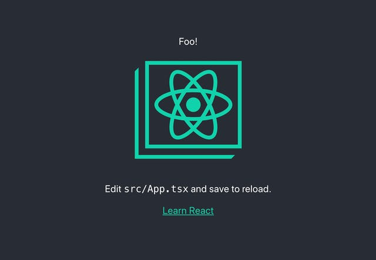
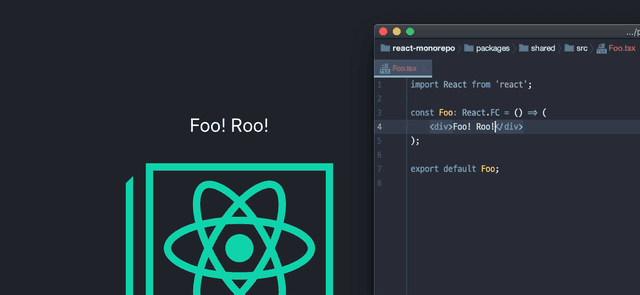

회사에서 진행하는 프로젝트의 규모가 점점 커지고 있습니다. 규모가 커질 것을 고려해서 몇 번 폴더 구조를 (나름) 체계적으로 정리하는 등, 최선을 다했지만 단순하게 폴더를 정리하는 선을 넘고 있어서(ㅠㅠ) 모노레포(Monorepo)에 관심이 생겼습니다. 리액트 프로젝트에 모노레포를 도입하는 방법에 대해 알아봅시다.

# 시작

## 새로운 프로젝트 생성

새로운 폴더에서 새롭게 시작 해 봅시다.

```
$ mkdir react-monorepo
$ cd react-monorepo
$ yarn init -y
```

생성된 package.json 파일을 열어서 수정합니다.

```
{
  "name": "react-monorepo",
  "version": "1.0.0",
  "main": "index.js",
  "license": "MIT",
  "private": true,
  "workspaces": ["packages/*"]
}
```

## Lerna 설정

모노레포 구성에 필요한 Lerna 를 설치합니다. Yarn Workspace 설정 뒤에는 -W 플래그를 주지 않으면 프로젝트 루트 레벨에 패키지를 설치할 수 없습니다.

```
$ yarn add -DW lerna
```

Lerna 설정 파일을 생성합니다.

```
$ lerna init
```

생성된 lerna.json 파일을 열어서 아래와 같이 수정합니다. useWorkspace는 Yarn Workspace 를 사용하겠다는 옵션이고, npmClient는 어떤 것을 패키지 관리 클라이언트로 사용할 것인지 결정하는 옵션입니다.

```
{
  "packages": ["packages/*"],
  "version": "1.0.0",
  "useWorkspaces": true,
  "npmClient": "yarn"
}
```

여기까지 마치고 나면 기본적으로 모노레포 패키지를 추가 할 준비가 끝났습니다.

# 패키지 추가

## 리액트 앱 추가

Create React App을 사용하여 리액트 앱 패키지를 추가 해 보겠습니다.

```
$ yarn create react-app packages/app --typescript
```

그러면 packages 폴더 내에 app 으로 생성됩니다. 생성된 폴더 내의 package.json 파일을 열어 name 을 변경합니다. 이 리액트 앱을 lerna 나 yarn workspace 에서 식별하기 위한 이름으로 @foo/app 을 사용하겠습니다.

```
{
  name: '@foo/app',
  version: '0.1.0',
  private: true,
  dependencies: {
    '@types/jest': '24.0.23',
    '@types/node': '12.12.7',
    '@types/react': '16.9.11',
    '@types/react-dom': '16.9.4',
    // ...
  },
}
```

생성된 패키지를 실행 해 보겠습니다. @foo/app의 스크립트를 실행하는 방법은 다음과 같습니다.

**yarn workspace 사용**

```
$ yarn workspace @foo/app start
```

**lerna 사용**

```
$ lerna run start --scope=@foo/app
```

단일 명령을 사용하고 확인 할 때는 yarn workspace가 나은 것 같고, 필터를 사용해서 여러 패키지에 대한 작업을 수행 할 때는 lerna가 좋은 것 같습니다.

패키지 명령을 통해 리액트 앱이 실행되는 것을 확인할 수 있습니다.

## 라이브러리 패키지 추가

방금 만든 앱에 별도의 패키지를 설치하여 그 패키지의 컴포넌트를 사용 해 보겠습니다. packages 폴더 안에 shared 폴더를 생성합니다.

```
$ mkdir -p packages/shared
$ cd packages/shared
```

프로젝트 생성할 때 처럼 yarn init 을 진행하고 이름을 적당하게 변경합니다. 타입스크립트를 설치합니다.

```
$ yarn init -y
$ yarn add -D typescript
```

이후 tsc --init 를 통해 타입스크립트 설정 파일을 생성하고, jsx 옵션과 declaration 옵션을 활성화 합니다. 그리고 outDir를 설정하여 빌드 파일이 생성될 위치를 지정합니다. 아래 내용은 주석된 내용을 제거한 현재 상태입니다.

```
{
  "compilerOptions": {
    "jsx": "react",
    "target": "es5",
    "module": "commonjs",
    "declaration": true,
    "declarationMap": true,
    "outDir": "./build",
    "strict": true,
    "esModuleInterop": true
  }
}
```

package.json 파일을 열어서 main, types, files 를 수정하고 scripts에 build 를 추가하였습니다.

```
{
  "name": "@foo/shared",
  "version": "1.0.0",
  "main": "build/index.js",
  "types": "build/index.d.ts",
  "files": ["build"],
  "license": "MIT",
  "devDependencies": {
    "typescript": "^3.7.2"
  },
  "scripts": {
    "build": "tsc"
  }
}
```

src 폴더를 만들고 Foo.tsx 파일을 생성하여 간단한 컴포넌트를 작성합니다.

```
import React from 'react';

const Foo: React.FC = () => <div>Foo!</div>;

export default Foo;
```

index.ts 파일을 추가하여 export 하는 내용을 작성합니다.

```
export { default as Foo } from './Foo';
```

## app 패키지에 shared 패키지 설치

이제 @foo/app 에 패키지를 추가해 봅시다. 로컬 패키지끼리 의존 관계를 추가할 때는 lerna 를 사용합니다.

```
$ lerna add @foo/shared --scope=@foo/app
```

그 다음 @foo/app 내에서 추가된 @foo/shared 패키지의 Foo 컴포넌트를 가져오도록 한 다음 실행하면 오류가 납니다. 빌드를 하지 않으면 정상적으로 사용할 수 없습니다. 실제로 실행시켜야 하는건 자바스크립트 파일인데 @foo/shared 에서 제공하는건 타입스크립트 파일만 제공하기 때문입니다.



@foo/shared 패키지를 빌드합니다.

```
$ yarn workspace @foo/shared build
```

그러면 정상적으로 @foo/shared 패키지에서 만든 컴포넌트가 표시되는 것을 확인할 수 있습니다. 여전히 오류가 발생한다면 `import { ... } from '@foo/shared/src'` 처럼 경로를 확인해야 합니다.



이 상태에서 @foo/shared 패키지 내의 컴포넌트를 변경해도 @foo/app 에서 변경 사항이 반영되지 않습니다. 아까 언급한대로 변경한 타입스크립트 파일이 자바스크립트로 변경 되어야 합니다. 이를 해결하려면 tsc -w 를 실행하면 됩니다.

@foo/shared 패키지 scripts에 start를 추가합니다.

```
{
  "name": "@foo/shared",
  "version": "1.0.0",
  "main": "build/index.js",
  "types": "build/index.d.ts",
  "files": ["build"],
  "license": "MIT",
  "devDependencies": {
    "typescript": "^3.7.2"
  },
  "scripts": {
    "build": "tsc",
    "start": "tsc -w"
  }
}
```

이제 @foo/shared 와 @foo/app 패키지의 start 명령을 동시에 실행합니다. 아래와 같이 별도의 --scope 플래그 같은 필터를 추가하지 않으면 모든 패키지를 대상으로 start 스크립트를 실행합니다.

```
$ lerna run start --parallel
```

@foo/shared 패키지의 변경 사항이 바로 반영되는 것을 확인할 수 있습니다.



# **마치며**

리액트 프로젝트를 모노레포로 구성 해 보았습니다. 느낀점은 확실히 패키지 단위로 분리하면 나중에 유지 보수하는 관점에서 편리할 것 같고, 모든 단위 테스트를 실행 해 보지 않아도 된다는 장점이 예상됩니다.

단점은 모노레포를 구성하는 것 자체가 생각보다 간단하지는 않고, 실제로는 Babel 부터 Webpack 까지 수동으로 해야 하지만 어느정도 CRA의 도움을 받았다는 점이 있습니다. 또한 회사에서 도입 시 모노레포에 대한 지식이 없으면 곤란한 상황이 오게 됩니다.

단점 때문에 도입을 할지 말지 고민하는 것은, 리덕스를 두고 '코드가 너무 늘어날 것 같다'고 고민하는 것과 같습니다. 이러한 단점을 감내하더라도 규모가 더 커질 것으로 예상된다면 도입을 고려하는게 맞고, 규모가 크지 않을 것 같고, 프로젝트 내부에서 폴더 구분만으로 충분하다면 그냥 안해도 상관 없는 기술인 것 같습니다.

이 글을 쓰면서 rush 와 많이 고민했는데 아직 rush를 제대로 활용하기엔 부족한 것 같습니다. 다만 rush는 pnpm 이 추구하는 도플갱어 문제를 완벽하게 해결한 부분은 최고라고 생각됩니다. 추후에 lerna가 pnpm을 지원할 것처럼 보이는데, 그때 lerna를 통해 다시 다뤄보거나 rush를 사용해서 모노레포를 해보고 싶습니다.

### References

- https://dev.to/stereobooster/typescript-monorepo-for-react-project-3cpa
