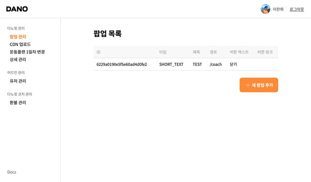
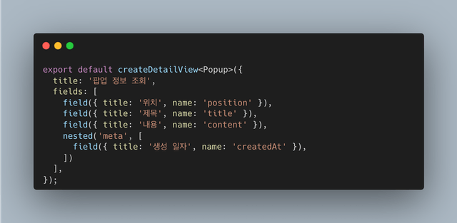
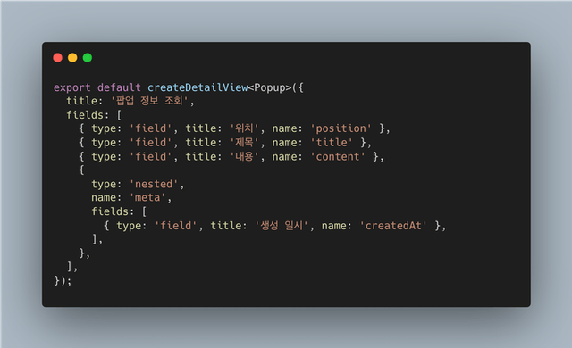

비교적 최근에 Remix가 공개되었다. Remix는 React를 사용하는 풀스택 웹 프레임워크이다. 처음 발표 소식을 들었을 때부터 관심이 있었기 때문에 오픈소스로 공개된 이후 간단하게 찍먹을 해봤다. 쓰면 쓸 수록 괜찮았고, 기회만 된다면 회사 업무에 가져다 쓰고 싶었다.

그러던 중 어드민을 만들어야 할 일이 생겼다. (사실은 일을 만들었다.) 나는 지금이 바로 회사 업무에 Remix를 써볼 수 있는 시기라고 생각했고, 바로 작업에 시작했다. 여러 삽질을 거치고 거쳐, 이런 결과물을 만들었다.

이번 포스팅에서는 어드민을 만들게 된 배경과, 여러가지 문제를 해결한 경험 위주로 글을 작성하려고 한다.

## 어드민을 만들게 된 배경

우선 어드민을 만들게 된 배경부터 이야기를 해보자.

### 리소스 부족

솔직히 어드민까지 만들 리소스는 부족한 상황이었다. 만약 여유가 있는 조직이라면, 어드민도 만들어서 운영 효율화도 챙겨갈 수 있겠지만, 다노에서는 기민함이 조금 더 중요한 시기였다. 그래서 운영과 CX 레벨에서 수기로 처리하는 일들이 많았다.

하지만 수기로 처리할 수 있는 일도 한계가 있다. 예를 들어, 유저의 구독 정보를 초기화 한다던지, 환불을 처리한다던지 등... 운영 효율화의 부채는 개발자의 리소스를 빌려야 하는 생산성 하락으로 돌아온다. 그래서 나는 모두의 생산성을 올리면, 제품에 집중할 수 있을 것이라고 기대했다.

### 해보고 싶어서 (!)

사실 직접 어드민을 만드는 일은 재미없다. 특히 Django 나 Rails 를 선택하지 않았다면 더더욱 재미없다. 대체로 구현 및 작성해야 하는 코드가 반복되기 때문인데, 이 문제를 한 번 해결해보고 싶었다. 과연 내가 반복을 줄이고, 선언적인 API로 어드민을 만들 수 있을 것인가에 대한 궁금증이랄까.

## 기억에 남는 문제들

어드민을 만드는 과정은 매우 순탄치 않았는데 그런 것들 중에서 기억에 남는 것들을 정리해보자면...

### TypeError: Cannot read properties of undefined (reading 'root')

열심히 로직을 작성하고 실행해보니 이런 오류와 함께 정상적으로 실행이 되지 않았다. 이게 가장 원인을 찾기 어려웠는데, 어떤 작업을 하기 전까지는 잘 되다가, 특정 로직을 쓰고난 다음부터 발생했기 때문에, 내가 작성한 코드에 문제가 있는 것이라고 생각했다. 그러나 그런 접근 방식으로는 문제를 해결할 수가 없었다.

그래서 Remix 깃헙 이슈를 찾아보니, 나와 같은 오류로 고생하는 사람들이 이미 있었다. 원인은 브라우저 번들에 서버 환경에서만 실행 가능한 코드가 포함되었기 때문이다. 해결 방법도 다양했는데, 그 중에서 가장 간단하고 효과적인 해결책은, 서버 환경에서 실행되어야 하는 코드의 파일 이름을 something.server.ts 처럼 변경하는 방법이었다. 이렇게 하면 해당 파일이 서버 환경에서만 필요하다는 것에 대한 힌트를 제공하는 방식이 된다.

해결은 했는데 왜 이런 문제가 발생하는지에 대한 원인은 찾지도, 하물며 스스로 이해할 수 있는 근거도 마련하지 못했다. 이 부분이 좀 아쉽다.

### 재귀적으로 타입 추론하기

내 경험을 통틀어서 이만큼 타입스크립트를 최대한 활용하려고 했던 적이 없었던 것 같다. 타입 인자를 T로 전달 받으면, keyof T로 해당 타입의 키값을 사용할 수 있는 구조로 채택했는데, 특정 필드가 원시 타입이 아닌, 객체 타입일 경우에는 해당 객체를 다시 활용해서 keyof T\[K\]가 되는 것을 의도했다.

처음에는 타입 추론을 위해서, 입력해야 하는 타입을 함수를 통해 전달하려고 했다. 예를 들자면 이런 형태인 것이다:

예시를 위해 작성해서 당시 시도했던 코드와는 좀 다르지만, 큰 틀에서는 이런 구조를 원했다. meta 라는 객체에 생성 일시와 같은 데이터가 있다고 가정하고, nested 로 해당 필드명을 사용하면, 두번째 배열 내에서는 meta 객체를 타입으로 사용해서 field 함수가 적절하게 타입 추론을 해줄 것을 기대했다.

하지만 예상과 달리, 중첩된 배열 내에서는 타입이 unknown 으로만 제공되는 문제가 발생했다. 물론 런타임에서는 전혀 문제되지 않지만, 코드를 작성하는 시점에 오류가 발생하기 때문에 이 문제를 해결하고 싶었다.

며칠 고민하다가 타입스크립트 디스코드 채널에 도움을 요청했고, 거기서 적절한 도움을 받아 해결할 수 있었다.

함수 형태로는 쓰지 못하게 됐지만, 그래도 문제를 해결할 수 있어서 좋았다. 그리고 디스코드 채널 내에서 질문을 위한 시스템이 잘 갖춰져 있는 것도 인상적이었다.

## 후기?

사실 마무리 되지 않고, 여전히 진행중이고, 앞으로도 진행할 작업이라 후기가 맞는지는 모르겠지만...

어드민은 여러모로 나한테 동기부여를 심어주는 프로젝트였다. 그 동안 실무의 비중을 줄여나가고 있었는데, 이런 작업을 하니까 무엇보다 신이 좀 난다. 즐겁게 코드를 쓰는 기분이 너무 좋다. 역시 나는 코드를 작성할 때 재미를 좀 느끼는 것 같다.

혹시 나처럼 어드민을 만들 계획이 있거나 필요한 사람이 있다면 꼭 Remix로 하지 않아도 된다고 말하고 싶다. 기술적으로는 Remix의 개념을 적극적으로 활용했지만, 내 생각에 어드민에서 중요한 것은 프레임워크보다 반복을 줄이고, 선언적으로 구성할 수 있게 만드는 것이 더 중요하다고 본다. 난 그냥... Remix를 써보고 싶었을 뿐.

그리고 문서를 잘 써야겠다. 나름 기능적으로는 괜찮은 것 같은데, 이걸 사용해서 다른 개발자분들도 어드민을 쉽게 구현할 수 있어야 하니까.
