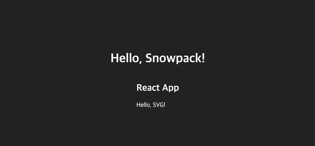
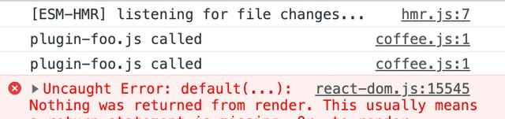
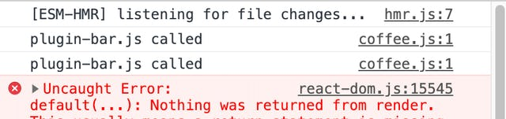

Snowpack으로 간단한 프로젝트와 플러그인을 작성해봤다.

---

### **아쉬웠던 경험**

3개월전, [Snowpack](https://www.snowpack.dev/)이 2.0을 릴리즈 했을 때 시험삼아 써보려고 했다. 그 당시 회사에서 웹팩 구성을 이리 저리 바꿔보는 일을 하고 있었기 때문에 새로운 번들러의 출시가 반가웠다.

결론부터 이야기 하자면, 당시에는 **뭔가 좀 이상하다**고 생각했다.

나는 주로 SVG 아이콘을 가져와서 리액트 컴포넌트로 사용하는 것을 선호한다. 그래서 회사 프로젝트에도 [@svgr/webpack](https://www.npmjs.com/package/@svgr/webpack) 로더를 추가해서 사용하고 있다.

Snowpack 으로 같은 결과를 얻어내기 위해 플러그인을 직접 작성해보기도 했지만 실패했다. SVG 아이콘을 컴포넌트로 변환해서 반환해도 Snowpack 내부의 기본 동작이 SVG 파일을 이미지 리소스로 처리하여 static 하게 접근할 수 있는 주소만을 반환할 뿐이었다.

처음에는 플러그인을 잘못 작성한 내 문제라고 생각하고 열심히 삽질했다. 그러나 아직 완성되지 않은 플러그인쪽 문서는 막막했고, 내가 원하는 방식으로는 현재 단계에서 지원하지 않는다는 [답변](https://www.pika.dev/npm/snowpack/discuss/354#comment-7405)을 보게 되었다. 그때부터 기대를 접어두고 있었다.

그러던 중 최근 릴리즈된 2.7 버전에서 플러그인 API가 재설계 되었고 플러그인 문서도 어느정도 완성된 것 같다. 그래서 간단한 프로젝트와 플러그인을 만들어서 사용하기 괜찮은 단계에 있는지 확인해보기로 했다.

### 프로젝트 생성

새 프로젝트를 만들고 거기에 Snowpack을 설치했다.

```
yarn add -D snowpack
```

그 다음 프로젝트 최상위에 index.html 파일을 생성한 뒤 snowpack dev 명령을 실행했다.

```
touch index.html && vim index.html
yarn snowpack dev
```


기본값으로 프로젝트 최상위의 index.html을 서빙하는 것을 알 수 있었다.

### 설정 파일 만들기

이제 설정 파일을 만들어보자. 프로젝트 최상위에 snowpack.config.json 파일을 생성한 뒤 아래와 같이 입력한다.

```
{
  "mount": {
    "src": "/_dist_",
    "public": "/"
  }
}
```

주요 코드를 작성할 src 폴더는 /\_dist/, index.html 같은 정적 파일을 포함한 public 폴더는 / 경로로 지정했다. 특정 폴더를 특정 주소로 마운트하는 것이다.

설정 파일에 맞게 public 폴더와 src 폴더를 만든다. 그리고 아까 만든 index.html 파일을 public 폴더로 이동한다. 다시 snowpack dev를 실행하면 아까와 같은 화면이 나타난다.

### 플러그인 써보기

Snowpack은 [플러그인](https://www.snowpack.dev/#official-plugins)도 이미 공식으로 제공하고 있는게 있다. 가장 무난한, Babel 플러그인을 설치했다.

```
yarn add -D @snowpack/plugin-babel
```

```
{
  "mount": {
    "src": "/_dist_",
    "public": "/"
  },
  "plugins": ["@snowpack/plugin-babel"]
}
```

이어서 리액트 컴포넌트를 사용하기 위해 babel-preset-react-app을 설치하고 타입스크립트 관련 옵션을 추가했다. 이후 src 폴더에 index.tsx 파일을 만들고 간단한 컴포넌트 하나와 그것을 ReactDOM으로 렌더링 하는 코드를 작성했다.

```
import ReactDOM from 'react-dom';
import React, { FC } from 'react';
import './index.css';

const App: FC = () => {
  return <h2>React App</h2>;
};

ReactDOM.render(<App />, document.querySelector('#app'));
```

index.tsx 파일은 Snowpack을 통해 Babel로 컴파일이 될 예정이다. 컴파일된 코드를 사용하기 위해 public/index.html 파일에 script 태그를 추가했다.

```
<script type="module" src="/_dist_/index.js"></script>
```

Snowpack은 개발 환경에서 ESModule로 작업중인 코드를 제공하기 때문에 type="module"을 사용하는 것이 중요하다. 이후 실행 화면은 다음과 같이 나왔다.


> Snowpack 내부에는@snowpack/plugin-esbuild라는 플러그인이 내장되어 있다. 그래서 별도의 설정을 하지 않아도 .mjs, .jsx, .ts, .tsx 파일을 import해서 사용할 수 있다. 간단한 웹 애플리케이션은 Babel을 구성하지 않아도 사용할 수 있을 것 같다.

이번에는 플러그인을 직접 만들어보자. 먼저 프로젝트 최상위에 plugins 폴더를 만들고 plugin-svgr.js 파일을 생성했다. 아직 svgr은 사용하지 않는다. 대신 임의의 자바스크립트 코드가 반환되도록 수정한다.

```
module.exports = function() {
  return {
    resolve: {
      input: ['.svg'],
      output: ['.js'],
    },
    async load() {
      return {
        '.js': `
          import React from 'react';
          export default function () {
            return React.createElement('div', {}, 'Hello, SVG!');
          }
        `,
      };
    },
  };
};
```

여기서 반환되어야 하는 코드는 **브라우저에서 실행 가능한** 코드여야 한다.

그 다음 snowpack.config.json에 이 플러그인을 사용하도록 추가한다. 아래와 같이 입력하면 NPM에 게시되지 않은 플러그인도 사용할 수 있다.

```
{
  "mount": {
    "src": "/_dist_",
    "public": "/"
  },
  "plugins": [
    "@snowpack/plugin-babel",
    "./plugins/plugin-svgr.js"
  ]
}
```

테스트를 위해 적당한 SVG 아이콘을 받아오고 index.tsx에서 SVG 파일을 import 하여 컴포넌트를 사용하는 것처럼 추가한다. (아이콘은 [feathericons.com](https://feathericons.com/)에서 가져왔다.)

```
import FiCoffee from './coffee.svg';

const App: FC = () => {
  return (
    <>
      <h2>React App</h2>
      <FiCoffee />
    </>
  );
};
```

이후 다시 실행하면 사진과 같이 Hello, SVG!가 표시되는 것을 볼 수 있다.



svgr을 사용하는 플러그인을 만들기 전에 Snowpack의 플러그인에 대해 조금 더 알아보기로 했다.

---

## **Snowpack의 플러그인**

[플러그인 문서](https://www.snowpack.dev/plugins)의 Overview에는 이렇게 나와있다.

A**Snowpack Plugin**is an object interface that lets you customize Snowpack’s behavior. Snowpack provides different hooks for your plugin to connect to. For example, you can add a plugin to handle Svelte files, optimize CSS, convert SVGs to React components, run TypeScript during development, and much more.

**Snowpack 플러그인**은 Snowpack의 동작을 커스터마이징 할 수 있게 해주는 오브젝트 인터페이스 입니다. Snowpack은 플러그인이 연결할 수 있도록 다양한 훅을 제공합니다. 예를 들면 Svelte 파일을 다루거나, CSS 최적화, SVG를 리액트 컴포넌트로 변환하거나, 개발 중 타입스크립트를 실행하는 등의 플러그인을 추가할 수 있습니다.

위 내용의 예시로 언급되는 내용들이 웹팩의 구성 중 로더나 플러그인을 수정해야 할 수 있는 일들이다.

이러한 작업을 할 수 있도록 Snowpack 플러그인은 load 메소드와 transform 메소드를 제공하고, Snowpack은 빌드가 필요한 파일들을 대상으로 두 메소드를 실행시킨다.

### load() 메소드

플러그인의 load() 메소드를 구현하려면 resolve 필드를 사용해서 입력 받을 수 있는 확장자를 input으로 받고 결과물의 확장자를 output으로 지정해야 한다. 위에서 작성한 플러그인은 .svg 파일을 받아서 .js 파일로 반환하도록 명시했었다.

```
module.exports = function() {
  return {
    resolve: {
      input: ['.svg'],
      output: ['.js'],
    },
    /** ... */
  };
};
```

Snowpack은 설정된 플러그인 중 특정 파일을 resolve 할 수 있는 제일 첫번째 플러그인을 찾은 뒤 load() 메소드를 실행한다. 이 방법을 통해 자바스크립트가 아닌 파일을 실행할 수 있는 코드로 컴파일 할 수 있게 된다.

만약 같은 확장자에 대해 resolve하는 플러그인이 두 개 이상인 경우 어떻게 될까? 위에서 임시로 만든 플러그인 코드를 복사해서 각각 foo와 bar를 console.log로 표시하는 코드로 변경했다.

```
// plugin-foo.js
module.exports = function() {
  return {
    resolve: {
      input: ['.svg'],
      output: ['.js'],
    },
    async load() {
      return "export default () => console.log('plugin-foo.js called');";
    },
  };
};

// plugin-bar.js
module.exports = function() {
  return {
    resolve: {
      input: ['.svg'],
      output: ['.js'],
    },
    async load() {
      return "export default () => console.log('plugin-bar.js called');";
    },
  };
};
```

이제 snowpack.config.json에 두 플러그인을 추가한다. 확인을 위해 plugin-foo.js가 먼저 오도록 지정했다. 실행 결과는 다음과 같다.



우선순위를 바꿔서plugin-bar.js가 먼저 오도록 수정한 뒤 실행하면



예상한 대로 plugin-bar.js만 실행된 것을 알 수 있었다. 만약 load() 메소드 내에서 아무것도 리턴하지 않으면 그 다음 플러그인을 찾아서 load() 메소드를 실행하게 된다.

### transform() 메소드

load() 메소드가 resolve를 통해 특정 파일에 대해서 작업을 수행했다면, transform() 메소드는 load() 메소드로 빌드된 모든 파일에 대해 작업을 수행한다.

load()와 transform() 각각 어떤 경우에 사용해야 할까? load() 메소드는 자바스크립트가 아닌 코드를 컴파일 해야 할 때, transform() 메소드는 컴파일 된 또는 사용할 수 있는 파일을 변환해야 할 때 사용하면 된다.

load()는 SCSS를 CSS로 컴파일, transform()은 CSS에 PostCSS를 실행하는 케이스가 대표적인 것 같다.

---

### **플러그인 작성하기**

본격적으로 만들었던 plugin-svgr.js 파일을 완성해보자. SVG 아이콘을 리액트 컴포넌트로 변경하기 위해 svgr 패키지를 설치한다.

```
yarn add -D @svgr/core
```

아까 작성했던 load() 메소드 내용을 지워준 뒤 SVG 파일을 읽어오자.

```
const fs = require('fs').promises;

// ...
async load({ filePath }) {
  const svgCode = await fs.readFile(filePath, { encoding: 'utf8' });
}
```

SVG 파일을 읽어온 다음 해당 내용을 svgr을 사용해서 리액트 컴포넌트로 변환한다.

```
const svgr = require('@svgr/core').default;

// ...
async load({ filePath }) {
  const svgCode = await readFile(filePath, { encoding: 'utf8' });
  const jsCode = (await svgr(svgCode, { icon: true }));
}
```

이 시점에서 로그를 찍어보면 변환된 코드가 JSX를 사용하고 있는 것을 알 수 있다. load() 메소드는 브라우저에서 실행할 수 있는 코드를 제공해야 하므로 @babel/core를 이용해 컴파일을 했다.

```
const babel = require('@babel/core');

// ...
async load({ filePath }) {
  const svgCode = await readFile(filePath, { encoding: 'utf8' });
  const jsCode = (await svgr(svgCode, { icon: true }));
  const { code } = await babel.transformAsync(jsCode, {
    filename: filePath,
    compact: true,
    presets: ['react-app']
  });

  return code;
}
```

snowpack dev를 다시 실행하면 SVG 아이콘이 표시되는 것을 볼 수 있다.


### **마치며**

아무리 좋은 기능을 탑재한 무언가가 나오더라도 현재 프로젝트에서 필요한 기능을 구현할 수 있는지 여부가 나에게는 중요했다.

딱 하나 더 체크해보고 싶은게 있다면 MPA 프로젝트를 구성할 수 있는지 여부지만, 그건 따로 확인해보기로. 내 기준에서는 지금 프로젝트에 구성된 것을 교체하지 않더라도, 다음 프로젝트를 진행한다면 고려해볼 수 있는 옵션이 되었다.
