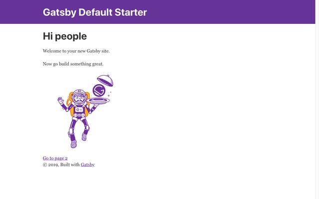
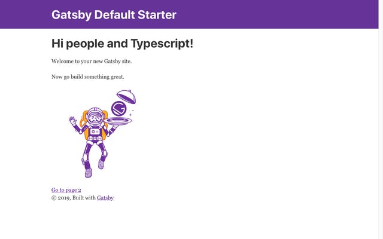

최근 들어 개인 블로그의 필요성을 느꼈습니다. Velog 는 제가 좋아하는 플랫폼이지만, 여전히 가슴 한 켠에 있는, 개인 블로그를 만들고 싶다는 욕망이 솟아난게 아닐까 싶습니다. 어떻게 만들어야 할 지 고민한 결과, 지금이 [GatsbyJS](https://www.gatsbyjs.org/) 를 사용하기 가장 적당하다고 생각했습니다.

GatsbyJS 는 유명한 정적 사이트 생성기 입니다. 자바스크립트와 리액트를 이용해 만들 수 있다는 특징이 GatsbyJS 의 많은 장점 중 가장 매력적인 부분입니다. 만드는 동안 GatsbyJS 에 올라온 다양한 스타터를 사용하지 않기로 했습니다. 내 코드 스타일이 아닌 코드가 미리 작성된 프로젝트는 영 마음에 들지 않기도 하고, 직접 삽질을 해보는게 GatsbyJS 을 이해하는 데 더욱 도움이 될 것 같습니다.

물론 스타터들은 어떤 기능을 포함하고 있는지 명시되어 있고, 어떤 Dependency 가 포함되어 있는지 전부 표시되어 있어서 대부분의 코드를 이해하는게 어렵지 않기 때문에 스타터를 선택해서 시작하는 것도 좋은 선택입니다.

## 프로젝트 생성

**gatsby-cli** 는 이미 설치 되어 있다는 가정 하에, 블로그 프로젝트를 생성 해 보겠습니다.

```
$ gatsby new blog
```

## 일단 실행

프로젝트 구조는 잠시 후에 확인하기로 하고, 지금 실행하면 어떤 모습이 보는지 확인 해 봤습니다.

```
$ yarn develop
```

그러자 아래와 같은 화면이 표시되었습니다. 이 기본적인 화면을 앞으로, 차차... 블로그로 만들어 보겠습니다.



## 프로젝트 구조

프로젝트를 만들면 여러 파일들이 자동으로 생성됩니다. 그 중 루트 폴더에는 Prettier 설정 파일을 포함한 여러 파일이 있습니다. 그 중 아래 파일들이 GatsbyJS 를 사용할 때 중요한 것 같습니다.

- **gatsby-browser.js, gatsby-node.js, gatsby-ssr.js**\
  각각 브라우저, 노드, 서버사이드 렌더링 환경에서 사용하고자 하는 API 를 정의하는 파일입니다.\
  프로젝트를 생성 한 직후에는 필요하지 않으면 지워도 된다는 주석 외에 작성된 코드는 없습니다. 이 말은, 만약 정말 간단한 수준의 정적 페이지가 필요하다면 별도의 API 를 작성하지 않아도 된다는 것을 의미합니다.
- **gatsby-config.js**\
  사이트의 메타 데이터와 플러그인을 구성할 수 있는 파일입니다. 아마 API 파일보다 이 파일을 가장 많이 수정하게 될 것 같습니다.

src 폴더에는 **pages** 폴더를 볼 수 있습니다

- gatsby develop 이나 gatsby build 명령어를 실행하면 자동으로 이 폴더에 있는 컴포넌트들은 각각의 URL 을 갖는 페이지로 변환됩니다.
- index.js 파일은 브라우저에서 해당 주소로 들어가자 마자 보이는 페이지가 됩니다.
- 404.js 파일은 존재하지 않는 URL 로 들어갔을 때 표시되는 페이지가 됩니다.

components 는 공통적으로 사용되는 리액트 컴포넌트를 분리해 둔 곳이고, images 는 사용하고자 하는 이미지가 위치한 곳입니다. 나중에 블로그 기능을 구현했을 때, 게시글 내의 이미지는 마크다운 파일과 같은 곳에 두기로 하고, 이 폴더에는 공통적인 레이아웃 내에서 필요한 이미지를 넣어 두도록 하겠습니다.

미리 작성된 컴포넌트를 분석하는 것은 따로 정리하지 않고 필요할 때 진행하도록 하겠습니다.

## 타입스크립트 구성

첫번째로, 타입스크립트를 적용 해 보면서 GatsbyJS 프로젝트에 플러그인을 구성하는 방법을 알아보겠습니다. (타입스크립트를 사용할 계획이 없다면 이 부분은 읽지 않아도 괜찮을 것 같습니다.)

### 타입스크립트 설치

먼저 이 프로젝트 내에서 사용 할 타입스크립트를 설치합니다. (devDependency 로 설치합니다.)

```
$ yarn add -D typescript
```

### 타입스크립트 플러그인 설치

타입스크립트 플러그인도 설치합니다.

```
$ yarn add gatsby-plugin-typescript
```

### gatsby-config.js 파일 수정

타입스크립트 플러그인을 활성화 하기 위해 gatsby-config.js 파일을 열고, plugins 배열에 추가하겠습니다. 순서는 중요하지 않은 듯 하여, 가장 첫번째 요소로 추가하였습니다.

```
module.exports = {
    siteMetadata: {
        title: `Gatsby Default Starter`,
        description: `Kick off your next, ...`,
        author: `@gatsbyjs`,
    },
    plugins: [
        `gatsby-plugin-typescript`, // 추가!
        `gatsby-plugin-react-helmet`,
        ...
    ],
    ...
}
```

### tsconfig.json 파일 생성

타입스크립트 구성은 이렇게만 하면 끝납니다. 타입스크립트 지원이 플러그인 한 줄 추가로 끝나는 부분에서 굉장히 만족스러웠습니다. 타입스크립트 설정을 진행하기 위해 미리 tsconfig.json 파일을 생성하겠습니다.

```
$ yarn tsc --init
```

이 명령어를 실행하면 프로젝트 루트 폴더에 tsconfig.json 파일이 생성되고, 꽤 많은 내용이 미리 작성되어 있지만 긴장할 필요 없습니다. 이 옵션의 기본값이 무엇이고, 대략 어떤 내용인지 나와있기 때문에 필요하지 않은 옵션은 수정하지 않겠습니다.

지금 상태에서 index.js 파일을 index.tsx 로 변경해서 열어 보면 빨간 줄의 에러가 마구 나와있습니다. 이 문제는 단순히 타입스크립트 옵션에서 jsx 를 활성화 하지 않았고, 미리 만들어진 컴포넌트가 자바스크립트로 작성되어 타입을 유추할 수 없어서 발생하는 문제입니다. 아래 두 개의 옵션을 수정하겠습니다.

```
{
  "compilerOptions": {
    // ...
    "allowJs": true,
    "jsx": "preserve"
    // ...
  }
}
```

키워드로 검색하니 쉽게 찾을 수 있었습니다.

### 확인: index.js 파일을 타입스크립트로 작성하기

확인을 위해서 한 번 타입스크립트로 작성 해 보겠습니다. 위 단계에서 이름을 변경한 index.tsx 파일을 다시 열어서 확인 해 보니 빨간 줄이 없어졌습니다. 타입스크립트에 맞게 컴포넌트 타입을 지정 해 보겠습니다.

```
const IndexPage: React.FC = () => (
  <Layout>
    <SEO title="Home" />
    <h1>Hi people and Typescript!</h1>
    <p>Welcome to your new Gatsby site.</p>
    <p>Now go build something great.</p>
    <div style={{ maxWidth: `300px`, marginBottom: `1.45rem` }}>
      <Image />
    </div>
    <Link to="/page-2/">Go to page 2</Link>
  </Layout>
);
```

저장을 하면 타입스크립트로 작성 된 컴포넌트가 정상적으로 표시되는 것을 확인할 수 있습니다.



## Prettier 설정

기본적으로 설정 된 Prettier 는 세미콜론을 사용하지 않거나 문자열 리터럴을 쌍따옴표로 사용하는 등, 개인적으로 선호하지 않는 옵션으로 되어 있기 때문에 이 설정을 변경 해 보겠습니다. 프로젝트 루트 폴더에 위치한 .prettierrc 파일을 수정합니다.

```
{
  "arrowParens": "avoid",
  "bracketSpacing": true,
  "htmlWhitespaceSensitivity": "css",
  "insertPragma": false,
  "jsxBracketSameLine": false,
  "jsxSingleQuote": false,
  "printWidth": 120,
  "proseWrap": "preserve",
  "quoteProps": "as-needed",
  "requirePragma": false,
  "semi": true,
  "singleQuote": true,
  "tabWidth": 4,
  "trailingComma": "all",
  "useTabs": false
}
```

이후 기존 코드들을 한 번씩 포맷 해 주었습니다.

다음에는 블로그를 구현하기 위해 동적으로 페이지를 만드는 작업을 진행 해 보겠습니다.
