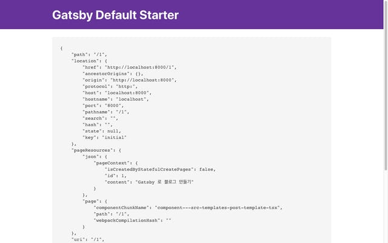
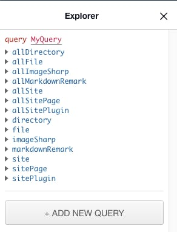
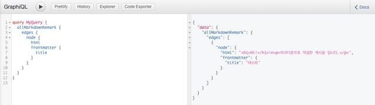
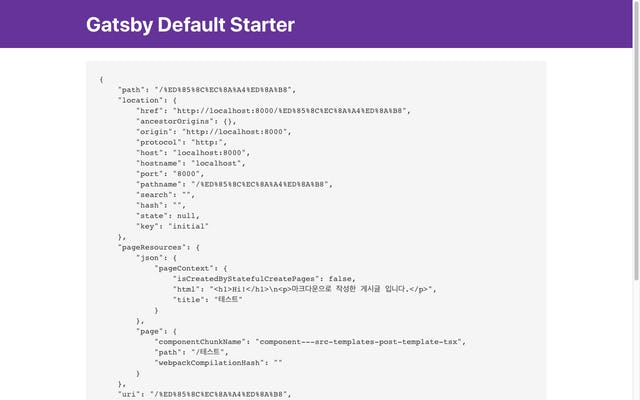

지난번에는 Gatsby 로 새로운 프로젝트를 생성하고, 타입스크립트와 Prettier 설정을 진행했습니다. 이번에는 Gatsby 의 기능을 이용해서 동적으로 페이지를 생성하는 기능을 구현 해 보겠습니다.

일반적으로는 pages 폴더에 컴포넌트를 추가하는 방식으로 페이지를 추가할 수 있지만, 블로그처럼 파일을 읽어서 각각 하나의 페이지로 만들기 위해서는 Gatsby 에서 제공하는 파일 시스템 플러그인을 기본으로 하고, 마크다운 해석과 관련된 플러그인도 필요합니다.

그래서 이번 글에서는 **플러그인을 사용하지 않고, Gatsby 에서 제공하는 API 를 사용해 페이지 만드는 방법**을 먼저 체험 해 본 다음, **플러그인을 사용하여 마크다운 파일을 블로그 포스트로 만드는 작업을 진행** 해 보겠습니다.

## createPages API를 사용하여 페이지 만들기

### 일단 해보기

일단 Gatsby 에서 페이지를 어떻게 만들 수 있는지 알아봅시다. createPages 는 Gatsby 의 Node API 입니다. 따라서, gatsby-node.js 파일을 수정해야 합니다. 기존에 작성되어 있던 주석은 지우고 아래와 같이 내용을 적은 뒤,

```
exports.createPages = () => {
  console.log('I will create a page!');
};
```

다시 gatsby develop 명령을 실행 해 보겠습니다.

```
success Processing types - 0.082 s
success building schema - 0.277 s
I will create a page!
success createPages - 0.019 s
success createPagesStatefully - 0.067 s
```

정상적으로 로그가 표시되는 것을 확인했습니다.

### 타입스크립트 설정

타입스크립트를 너무 좋아하는 저는 gatsby-node.js 파일도 타입스크립트로 작성하고 싶습니다. 지난 시간에 타입스크립트 플러그인을 구성했으니 이 파일도 타입스크립트 파일로 작성하면 잘 작동할까요? 파일의 확장자를 ts 로 변경하고 다시 실행해보면 그렇지 않다는 것을 알 수 있습니다.

```
success Processing types - 0.080 s
success building schema - 0.261 s
success createPages - 0.013 s // No...
success createPagesStatefully - 0.059 s
success onPreExtractQueries - 0.014 s
```

여러 레퍼런스를 찾아보고, 기존에 타입스크립트 기반으로 된 스타터에서는 어떻게 구현했는지 찾아본 결과 아래와 같이 구성하면 된다는 것을 알게 되었습니다.

1. gatsby-node.js 파일은 자바스크립트 확장자를 그대로 사용하되,
2. [ts-node](https://github.com/TypeStrong/ts-node) 를 패키지를 설치한 뒤 gatsby-node.js 상단에서 require() 후 register() 를 호출합니다.
3. 단, createPages 와 같은 API 는 별도의 타입스크립트 파일로 작성한 뒤 사용합니다.

일단 변경했던 확장자는 다시 js 파일로 변경한 뒤, ts-node 패키지를 설치하겠습니다.

```
$ yarn add -D ts-node
```

이후 gatsby-node.js 파일 상단에 아래와 같이 추가합니다.

```
require('ts-node').register();

exports.createPages = () => {
  console.log('I will create a page!');
};
```

그리고 createPages 함수를 별도의 타입스크립트 파일로 작성해야 하는데, 저는 src 폴더 안에 lib 폴더를 만들어 준 다음 그곳에 파일을 작성하겠습니다. (/src/lib/createPages.ts)

```
export async function createPages() {
  console.log('I will create a page!');
  console.log('Typescript!');
}
```

다시 gatsby-node.js 파일로 돌아와서, 기존에 작성된 부분을 지우고 새로 작성한 타입스크립트 함수를 사용하도록 하겠습니다.

```
require('ts-node').register();

const { createPages } = require('./src/lib/createPages');

exports.createPages = createPages;
```

다시 gatsby develop 를 실행 해 보면 작성했던 로그가 표시되는 것을 확인할 수 있습니다.

```
success Processing types - 0.068 s
success building schema - 0.229 s
I will create a page!
Typescript!
success createPages - 0.020 s
success createPagesStatefully - 0.058 s
```

### 페이지 추가해 보기

타입스크립트로 createPages API를 사용 할 준비가 되었습니다. createPages 함수가 호출 될 때 하나의 인자를 받고, 그 인자 안에 actions 나 graphql 를 포함한 헬퍼 함수들이 들어있습니다. 이 인자에 대한 타입 선언은 다행히도 Gatsby 에 포함되어 있습니다. 아래와 같이 CreatePagesArgs 타입을 사용하면 됩니다.

```
import { CreatePagesArgs } from 'gatsby';

export async function createPages({ actions }: CreatePagesArgs) {}
```

그 중에 저는 actions 라는 것을 미리 분해 할당해 두었습니다. actions 는 무엇일까요? Gatsby 는 내부적으로 리덕스를 사용하여 내부 상태를 관리합니다. 이 상태를 조작하기 위한, 리액트에서 리덕스를 사용할 때 처럼 액션 생성자와 dispatch() 가 결합된 함수들이 들어있는 객체입니다.

이전 버전의 Gatsby 로 구성된 경우 boundActionCreators 라는 이름으로 사용하고 있을 수 있습니다. 이는 V2 로 넘어오면서 이름이 변경되었고, 하위 호환성을 위해 아직까지는 여전히 유지하고 있는 것으로 확인됩니다. ([참고 링크](https://github.com/gatsbyjs/gatsby/issues/1909))

actions 내에 있는 것 중에서 createPage 액션을 사용하여 페이지를 추가 해 보겠습니다.

```
import { CreatePagesArgs } from 'gatsby';

const pages = [
  { id: 1, content: 'Gatsby 로 블로그 만들기' },
  { id: 2, content: '거기에 타입스크립트 적용 해 보기' },
  { id: 3, content: '확실히 어렵네요' },
];

export async function createPages({ actions }: CreatePagesArgs) {
  const { createPage } = actions;
  pages.forEach(page => {
    createPage({
      path: page.id.toString(),
      context: page,
      component: '', // ?,
    });
  });
}
```

이 코드에서 아직 component 부분이 빈 문자열로만 되어있습니다. 이 상태로 실행하면 오류를 반환힙니다.

```
Your site's "gatsby-node.js" created a page and didn't pass the path to the component.

The page object passed to createPage:
{
    "path": "1",
    "context": {
        "id": 1,
        "content": "Gatsby 로 블로그 만들기"
    },
    "component": ""
}

See the documentation for the "createPage" action — https://www.gatsbyjs.org/docs/actions/#createPage
```

component 부분에는 이 내용이 표시될 컴포넌트의 절대 경로를 입력해야 합니다. 우리는 아직 블로그 게시글을 표시할 컴포넌트가 없기 때문에 간단하게 만들어 보겠습니다. 블로그 게시글이 공통적으로 사용하는 템플릿 컴포넌트가 필요합니다. src 폴더 내의 templates 폴더를 만들고, PostTemplate.tsx 파일을 만들겠습니다.

```
import React from 'react';
import Layout from '../components/layout';

const PostTemplate: React.FC = React.memo(props => {
  return (
    <Layout>
      <code>
        <pre>{JSON.stringify(props, null, 4)}</pre>
      </code>
    </Layout>
  );
});

PostTemplate.displayName = 'PostTemplate';

export default PostTemplate;
```

아직 정확히 어떤 데이터가 전달되는지 모르기 때문에 props 의 모든 내용을 출력하는 템플릿입니다. 컴포넌트를 만들었으니 다시 createPages 함수 내의 component 부분에 이 컴포넌트의 경로를 입력하겠습니다.

```
import { CreatePagesArgs } from 'gatsby';
import path from 'path';

const pages = [
  { id: 1, content: 'Gatsby 로 블로그 만들기' },
  { id: 2, content: '거기에 타입스크립트 적용 해 보기' },
  { id: 3, content: '확실히 어렵네요' },
];

export async function createPages({ actions }: CreatePagesArgs) {
  const { createPage } = actions;
  pages.forEach(page => {
    createPage({
      path: page.id.toString(),
      context: page,
      component: path.resolve(__dirname, '../templates/PostTemplate.tsx'),
    });
  });
}
```

저장한 뒤, gatsby develop 을 다시 실행해 보겠습니다. 정상적으로 실행된 뒤 마지막에 표시되는 페이지 수가 늘어났음을 확인할 수 있습니다. 브라우저에 \[http://localhost:8000/1\](http://localhost:8000/1) 를 입력하면 아래와 같이, 만들어 둔 템플릿 컴포넌트에 props 가 표시되는 것을 확인할 수 있습니다.



### **마크다운 파일을 블로그 게시글로 표시하기**

이번에는 마크다운 파일을 작성하고 이 파일들을 플러그인이 불러온 다음 createPages 함수에서 createPage 액션을 사용하여 페이지로 만들어 보겠습니다. 이 기능을 구현하기 위해서 gatsby-transformer-remark 플러그인을 설치하겠습니다.

```
$ yarn add gatsby-transformer-remark
```

정확하게는 gatsby-source-filesystem 플러그인을 같이 사용해야 하기 때문에 같이 설치해야 하지만, 이미 설치되어 있기 때문에 따로 설치를 하지 않겠습니다.

그 다음, gatsby-config.js 파일을 수정하여, 설치한 마크다운 플러그인을 적용합니다.

```
plugins: [
    // ...
    {
        resolve: 'gatsby-source-filesystem',
        options: {
            name: 'posts',
            path: `${__dirname}/posts`,
        },
    },
    `gatsby-transformer-remark`,
    // ...
],
```

먼저 gatsby-source-filesystem 플러그인을 사용하여 마크다운 파일이 위치할 폴더를 읽도록 하고, 이 마크다운 파일을 해석하여 html 으로 변환하는 gatsby-transformer-remark 플러그인을 사용하였습니다. 마크다운 파일은 src 폴더 보다는 별도의 폴더를 사용하는게 낫다고 판단되어 posts 폴더를 프로젝트 루트 폴더 내에 만들었습니다. 테스트를 위해 마크다운 파일 하나를 추가하였습니다. (/posts/test.md)

```
---
title: 테스트
---

# Hi!

마크다운으로 작성한 게시글 입니다.
```

gatsby develop 을 다시 실행한 다음, 내장되어 있는 GraphiQL 브라우저를 실행해 봅시다.



좌측의 Explorer 영역을 보면allMarkdownRemark라는 스키마가 추가된 것을 확인할 수 있습니다. 대충 어떤 필드가 있는지 확인한 다음, 보고싶은 항목을 체크하여 쿼리를 날려보겠습니다.



작성한 마크다운에 대한 데이터가 표시되는 것을 볼 수 있습니다. 분명 이 쿼리를 createPages 함수 내에서 사용 한 뒤, 이 결과값을 페이지로 만들어야 합니다. 바로 해 봅시다. createPages 함수 내용을 아래와 같이 변경합니다.

```
export async function createPages({ actions, graphql }: CreatePagesArgs) {
  const { createPage } = actions;

  const { data, errors } = await graphql(`
    {
      allMarkdownRemark {
        edges {
          node {
            html
            frontmatter {
              title
            }
          }
        }
      }
    }
  `);

  if (errors) {
    throw errors;
  }

  data.allMarkdownRemark.edges.forEach(({ node }: any) => {
    createPage({
      path: node.frontmatter.title,
      context: {
        html: node.html,
        title: node.frontmatter.title,
      },
      component: path.resolve(__dirname, '../templates/PostTemplate.tsx'),
    });
  });
}
```

CreatePagesArgs 에는 GraphQL 쿼리를 요청할 수 있는 graphql 이 있습니다. 이것을 사용해서 아까 확인했던 쿼리를 넣어준 다음, 오류가 발생하면 errors 를 throw 합니다.

정상적으로 쿼리를 받아왔다면, data.allMarkdownRemark.edges 에는 변환된 마크다운과 관련된 데이터가 들어 있을 것입니다. 이 데이터와 createPage 액션을 사용해서 페이지를 추가했습니다. 저장 후 gatsby develop 을 다시 실행한 다음, path 로 지정한대로 제목을 입력 하면...



사진과 같이 마크다운으로 작성한 내용이 표시되는 것을 확인할 수 있습니다!

다음에는 타입스크립트와의 미묘한 불일치를 해결하는 내용을 다뤄보겠습니다.