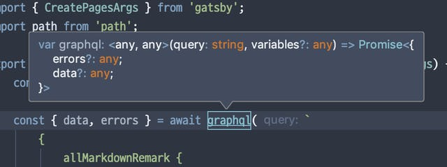
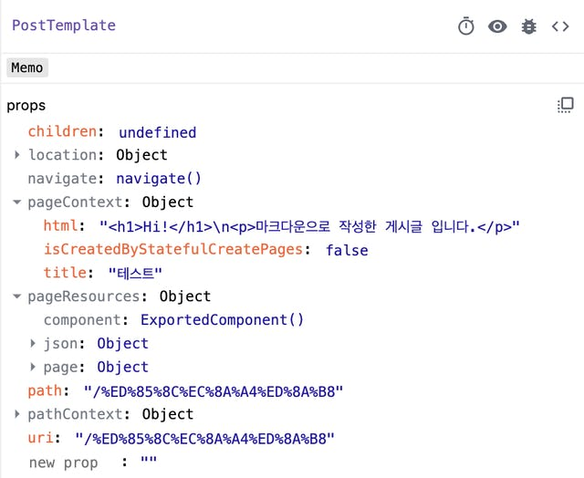
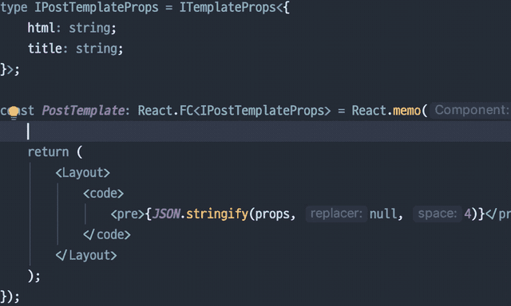

지난번에는 마크다운 파일을 사용하여 동적으로 페이지를 만드는 작업까지 진행 했습니다. 이번에는 타입스크립트를 사용하면서 발생하는 미묘한 불일치를 해결 해 보겠습니다.

## GraphQL 쿼리의 반환 타입 지정



createPages 함수 내에서 allMarkdownRemark 스키마에 대해 조회할 때 타입 추적이 되지 않는 문제가 있습니다. 쿼리문에 대한 자동 완성은 GraphiQL 내에서 확인하는 것으로 차치하더라도(이는 GraphQL Introspection 기능을 지원하는 플러그인을 사용하면 해결됩니다), 쿼리 이후 데이터를 핸들링 할 때 any 로 추적이 되면 타입스크립트의 장점을 발휘 할 수 없는 상황이죠. 😢

이때 필요한 것이 interface 또는 type 으로 쿼리 결과문에 대한 인터페이스를 작성해야 하는데 이를 수동으로 하는 것은 굉장히 수고스러운 일입니다. 다행히 이 문제를 해결하기 위한 플러그인이 존재합니다.

### 플러그인 설치

먼저 gatsby-plugin-generate-typings 플러그인을 설치합니다.

```
$ yarn add gatsby-plugin-generate-typings
```

### 플러그인 적용

그 다음, gatsby-config.js 파일을 열어서 gatsby-plugin-generate-typings 플러그인을 추가합니다. dest 필드는 타입 선언 파일을 생성할 경로입니다. 마음에 드는 곳과 이름으로 설정합니다. 아래와 같이 설정하면 src 폴더 내에 graphql-types.d.ts 파일로 생성됩니다.

```
// ...
{
        resolve: `gatsby-plugin-generate-typings`,
        options: {
                dest: `./src/graphql-types.d.ts`,
        },
},
// ...
```

### 타입스크립트 설정 변경

플러그인을 적용 한 다음, gatsby develop 을 실행합니다. 그런데 타입스크립트 설정과 관련된 문제가 발생합니다.

```
src/lib/createPages.ts:2:5 - error TS7022: '__importDefault' implicitly has type 'any' because it does not have a type annotation and is referenced directly or indirectly in its own initializer.

2 var __importDefault = (this && this.__importDefault) || function (mod) {
// ...
```

이러한 오류가 주르륵 뜨고, 타입 선언 파일이 생성되기는 커녕 서버가 실행되지도 않습니다. 이런 저런 변수들이 암묵적으로 any 타입이기 때문에 문제가 발생하는데요, 이 옵션은 tsconfig.json 내에서 noImplicitAny 옵션을 false 로 변경하면 해결됩니다.

이 옵션을 수정하는 김에 strictNullChecks 옵션도 false 로 변경하겠습니다. strictNullChecks 옵션은 어떤 변수가 확실하게 null 또는 undefined 가 아닌지 확인하도록 강제하는 옵션인데요. 타입 검증은 확실하게 가능하지만 아주 살짝 번거롭기 때문에 끄겠습니다.

```
{
  /* ... */
  "strict": true /* Enable all strict type-checking options. */,
  "noImplicitAny": false /* Raise error on expressions and declarations with an implied 'any' type. */,
  "strictNullChecks": false /* Enable strict null checks. */
  /* ... */
}
```

### 확인: 타입 선언 파일 생성 및 적용

다시 gatsby develop 을 실행하면 정상적으로 파일이 생성되는 것을 확인할 수 있습니다. 하지만 매 실행 시 아래와 같은 오류가 표시됩니다.

```
ERROR

error when trying to parse schema, ignoring Unable to find any GraphQL type defintions for the following pointers: /Users/iamchanii/dev/blog/src/**/*.{ts,tsx}
```

이 문제는 아마도, gatsby-plugin-generate-typings 플러그인에서 발생하는 문제로 확인됩니다. 이게 거슬리다면 수동으로 codegen 패키지를 사용하는 방법도 있습니다. 다만 gatsby 가 실행되는 시점에 생성이 되지 않고, 별도로 실행해야 하는 번거로움이 있습니다. 저는 이 오류를 감수하고 사용하겠지만, 해당 플러그인 저장소에 이슈를 올려두었습니다.

생성된 타입 선언 파일을 사용 해 보겠습니다. createPages 함수 내에서 사용하는 graphql 함수는 두 개의 제너릭 타입을 받을 수 있는데요, 첫번째는 응답 결과에 대한 타입이고, 두번째는 함수 두번째 인자인 variables 에 대한 타입을 지정할 수 있습니다. 지금은 첫번째 제너릭만 사용할 것이고, 생성된 타입 선언 파일 내에 Query 라는 타입이 포함되어 있습니다.

```
import { CreatePagesArgs } from 'gatsby';
import path from 'path';
import { Query } from '../graphql-types';

export async function createPages({ actions, graphql }: CreatePagesArgs) {
  const { createPage } = actions;

  const { data, errors } = await graphql<Query>(`
        {
            allMarkdownRemark {
                    /* 생략 */
            }
        `);
  /* 생략 */
}
```

이렇게 제너릭 타입을 지정 해 주면 아래와 같이, 아주 아름답게, 자동 완성 기능이 작동됩니다!


이제 아래에 써 놓았던 ({ node }): any 의 any 타입은 삭제해도 됩니다!

## 템플릿 컴포넌트의 Props 타입 지정

지난번에 간단하게 작성했던 PostTemplate 컴포넌트는 props 인터페이스가 지정되지 않은 상태입니다. 그렇다면 이 컴포넌트에 어떤 데이터가 오는지 어떻게 알 수 있을까요? gatsby 패키지에 포함되어 있는 타입 선언 파일 중에 ReplaceComponentRendererArgs 라는 인터페이스가 있습니다.

```
export interface ReplaceComponentRendererArgs extends BrowserPluginArgs {
  props: {
    path: string;
    '*': string;
    uri: string;
    location: object;
    navigate: Function;
    children: undefined;
    pageResources: object;
    data: object;
    pageContext: object;
  };
  loader: object;
}
```

그리고 지난번에 확인했던, 컴포넌트에 전달 된 props 가 어떤 항목을 포함하고 있는지 확인 해 보면...



ReplaceComponentRendererArgs 인터페이스의 props 와 일치하는 것을 알 수 있습니다. 그렇다면 ReplaceComponentRendererArgs 인터페이스를 활용해서 컴포넌트에 적용할 수 있는 헬퍼 타입을 만들어 보겠습니다.

### 헬퍼 타입 만들기

src 폴더 내에 interface.ts 파일을 만들고 아래와 같이 작성했습니다.

```
import { ReplaceComponentRendererArgs } from 'gatsby';

export type ITemplateProps<T> = ReplaceComponentRendererArgs['props'] & {
  pageContext: {
    isCreatedByStatefulCreatePages: boolean;
  } & T;
};
```

템플릿 컴포넌트에서 접근 시 필요한 내용은 pageContext 라고 판단되었고, 그 중 isCreatedByStatefulCreatePages 은 Gatsby 에서 자동으로 넘겨주는 항목입니다. 그 외에 html 이나 title 같은 항목을 임의로 지정할 수 있도록 제너릭으로 만들어 두었습니다.

### 헬퍼 타입을 사용하여 템플릿 컴포넌트의 Props 타입 정의하기

이제 ITemplateProps 타입을 활용하면 아래와 같이 컴포넌트의 Props 타입을 만들 수 있습니다.

```
import React from 'react';
import Layout from '../components/layout';
import { ITemplateProps } from '../interface';

type IPostTemplateProps = ITemplateProps<{
  html: string;
  title: string;
}>;

const PostTemplate: React.FC<IPostTemplateProps> = React.memo(props => {
  return (
    <Layout>
      <code>
        <pre>{JSON.stringify(props, null, 4)}</pre>
      </code>
    </Layout>
  );
});

PostTemplate.displayName = 'PostTemplate';

export default PostTemplate;
```

그러면 이렇게 자동 완성 기능이 작동합니다!



이제 타입스크립트와의 미묘한 불일치도 해결하였으니, 다음엔 메인 화면에서 게시글 목록을 표시하는 기능을 구현 해 보겠습니다.
