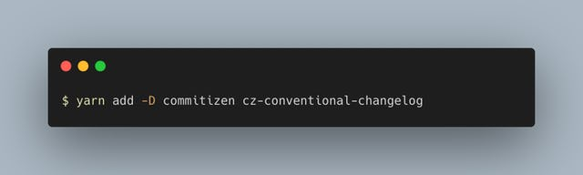
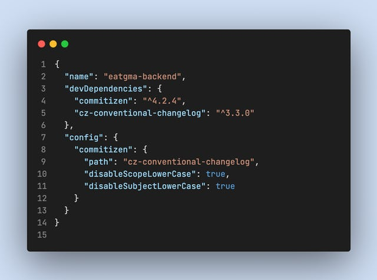
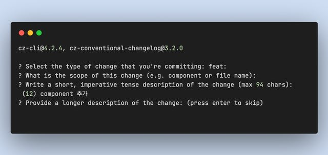
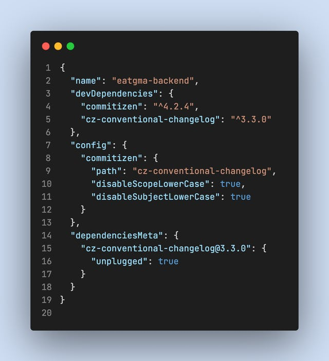
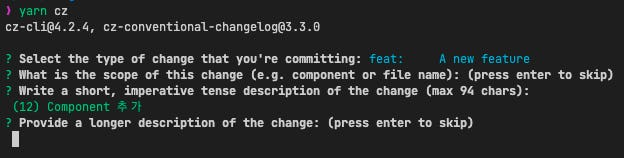

나는 커밋 메시지를 작성할 때 [Conventional Commits 스펙](https://www.conventionalcommits.org/ko/v1.0.0/)에 맞게 쓰는 것을 선호한다. (실제로 스펙이 이렇게 잘 정리되어 있는지는 처음 알았다) 대부분 chore나 feat, fix를 사용하는데에 그치는 정도지만, 일관성 있는 커밋 메시지는 협업과 개인 취향을 만족시킬 수 있다.

직접 커밋 메시지를 작성하는 경우도 있지만 대부분의 상황에서는 [Commitizen](https://github.com/commitizen/cz-cli)을 프로젝트에 구성해서 사용하려고 하는 편이다. 스펙에 맞춰 쓴다고 해도 크게 어려운 일은 아니지만 1\. 솔직히 번거롭고 2\. 팀 내에 컨벤션으로 사용중인 상황에서 잘못 쓴 커밋 메시지만큼 리뷰하기 껄끄러운 것도 없다. 그러니 (어느정도 선택만 하면) 자동으로 커밋 메시지를 작성해주는 툴을 사용하는 것은 합리적인 선택이라고 볼 수 있다.

### Yarn PnP 프로젝트에서의 문제

최근에 진행하는 사이드 프로젝트는 Yarn PnP(Zero-Installs)를 사용하고 있다. 물론 이 프로젝트에도 Commitizen을 구성했는데 의도한대로 설정이 되지 않는 문제가 발생했다.

우선 Commitizen을 구성하기 위해 프로젝트에 개발 의존성으로 두 패키지를 설치했다.

패키지를 설치한 뒤, 공식 문서에서 안내하는 대로 package.json에 Commitizen 구성을 추가했다.

그리고 cz-conventional-changelog 어댑터의 옵션을 참고하여 스코프와 커밋 메시지를 무조건 소문자로 강제하는 옵션을 비활성화했다. 의도대로라면 "feat: Component 추가" 커밋 메시지는 원본 그대로 입력되어야 한다.

하지만 이 상태에서 커밋 메시지를 작성해보면 그렇게 되지 않는다는 것을 알 수 있다.

가장 눈에 띄는 문제는 지정한대로 옵션이 작동하지 않는 것인데, 잘 보면 cz-conventional-changelog의 버전이 3.2.0인 것을 알 수 있다. 아까 설치된 버전은 분명 3.3.0 이었다. 즉, 프로젝트에 설치된 어댑터가 실행된 것이 아닐거라고 짐작했다.

짐작은 yarn why 명령어를 통해 확신으로 변했다. cz-conventional-changelog 패키지를 yarn why로 살펴본 결과, 3.2.0 버전은 commitizen 패키지 내부에 포함된 버전임을 알 수 있었다. 내부 작동 로직을 정확하게 파보진 않았지만, 어떤 이유에서 package.json에 작성한 config.comitizen.path에 해당하는 패키지를 찾지 못할 경우 내장된 어댑터를 사용하는 것 같고, 이 경우에는 지정한 옵션이 전달되지 않는다는 가설을 세웠다.

당연히 패키지를 찾지 못하는 원인은 Yarn PnP에 있다. 정확히 말하면 Yarn PnP에서는 작동할 수 없도록 Commitizen 내에서 어댑터를 찾기 때문이 아닐까... 어쨌든, 이 원인을 바탕으로 빠르고 쉽게 해결할 수 있는 방법이 있다. 바로 Yarn unplug다.

### Yarn Unplug

[yarn unplug](https://yarnpkg.com/cli/unplug)는 Yarn Berry에 추가된 명령어다. 이를 이해하기 앞서 Yarn PnP 모드를 짧게 축약해보자면,

Yarn PnP에서는 깊고 깊은 node\_modules 폴더를 만드는 전통적인 방법 대신 .yarn/cache 폴더에 의존성 파일을 저장한 다음 .pnp.cjs 파일에 각각의 패키지들을 어떻게 참조해야 하는지 기록한다. 이 파일이 런타임 의존성으로 실행되면 몇가지 몽키패칭을 통해 복잡한 node\_modules 를 생성하지 않고도 의존성을 가져다 사용할 수 있게 되는 것이다. **만약 이 허접한 설명을 듣고 Yarn PnP가 멋지다고 느껴졌다면 꼭 한 번 사용해보자. 이런 허접한 설명만 읽고 넘어가기엔 엄청 멋진 기능이다...!**

다시 Yarn Unplug로 돌아오자면, 단어 그대로 특정 패키지를 "분리"할 수 있는 기능이다. 패키지를 분리한다는 것은 .yarn/cache에 압축된 의존성을 활용하여 .yarn/unplugged 폴더에 해당 패키지를 풀어내는 것을 의미한다.

일반적인 상황에서 unplug는 필요하지 않다고 한다. 하지만 쉘 스크립트에서 사용(참조)하거나 빠르게 디버깅을 해보고 싶은 경우에는 유용한 기능이 될 것이다.

yarn unplug로 cz-conventional-changelog 패키지를 분리하면 .yarn/unplugged 폴더에 해당 패키지 폴더가 생성된다. 생성된 경로를 사용해서 package.json에 작성했던 config.commitizen.path 경로를 입력해주면 된다.

이제 커밋 메시지를 작성해보자. 어댑터의 버전도 프로젝트에 설치된 것과 동일하고, 입력한 옵션에 맞게 작동하는 것을 확인할 수 있다.

