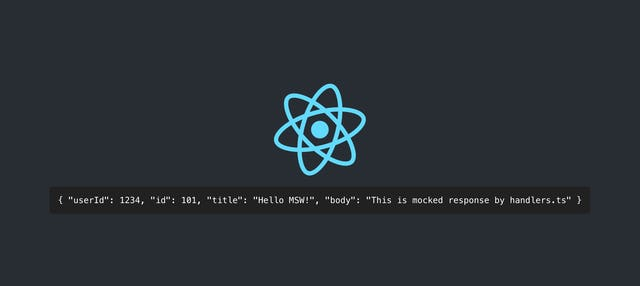
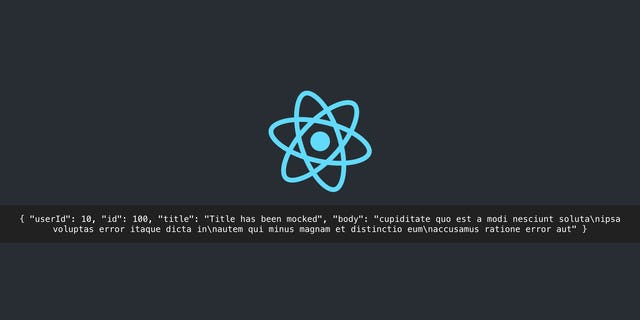

API 호출은 클라이언트에서 빼먹을 수 없는 부분이다. 일반적으로 비즈니스 로직은 서버에서 처리를 하고, 클라이언트는 처리 결과를 응답으로 받은 다음에 응답에 따라 적절한 처리를 하기 때문에, 테스트 코드를 작성한다는 것은 API 호출 부분도 테스트할 수 있는 코드를 작성한다는 것이고, 대부분 API 호출을 모킹하는 방식으로 접근한다.

이것이 내가 알고 있던 "일반적인, 클라이언트에서 API 호출과 관련된 로직 테스트하는 방법"이었다.

Don't Mock Fetch(or Axios). Fetch나 Axios를 모킹하지 말란다. 썸네일을 보고 든 생각은 "그럼 어떻게 테스트 코드를 작성하라는 것인가?"였다. 영상의 요지는 [jest-fetch-mock](https://github.com/jefflau/jest-fetch-mock)이나 [axios-mock-adapter](https://github.com/ctimmerm/axios-mock-adapter)처럼 모킹하는 방법 대신, [Mock Service Worker](https://mswjs.io/)_(이하 MSW)_를 사용하여 실제 사용자처럼 테스트를 작성하라고 한다.

실제 사용자처럼 테스트를 한다는 것은 어떤 의미일까? MSW 공식 문서의 [서비스 워커를 사용하는 이유](https://mswjs.io/docs/#why-service-workers)에 따르면, MSW는 네트워크 레벨에서 요청을 가로채기 위해 서비스 워커를 사용하는데, 덕분에 모킹 여부와 상관 없이 애플리케이션이 잘 작동하는 것을 보장하고, 특히 **코드를 변경할 필요가 없다**고 한다.

잘 작동하는지 확인하기 위해서 기존의 API 호출 코드를 주석 처리하고 임의의 데이터를 반환하도록 수정하는 식의 수정을 할 수도 있지만 그렇게 하면 기존 코드를 확인하게 아니라 임시로 수정한 코드를 확인하는 셈이다.

따라서 서비스 워커를 사용하여 기존 코드 그대로 API 모킹을 통해 작동하는지 여부를 확인하면, 실제 사용자가 API를 요청하는 방식 그대로 확인할 수 있는 것이다. "실제 사용자가 사용하는 방식을 테스트"하는 것은 꽤 중요하다고 생각된다.

서비스 워커를 사용하여 네트워크 레벨에서 요청을 가로채기 때문에, 현재 어떤 라이브러리를 쓰더라도 쉽게 모킹이 가능하다는 것이 큰 장점이라고 볼 수 있겠다.

---

## **Try it**

MSW를 써보기 위한 프로젝트를 만들어보자.

```
yarn create react-app msw-cra-example --typescript
```

프로젝트로 이동해서 MSW를 설치한다. MSW는 타입스크립트로 만들어진 프로젝트로 별도의 타이핑을 추가하지 않아도 된다.

```
yarn add msw
```

기본적으로 생성된 코드를 활용하여 JSONPlaceholder를 사용하여 API를 요청하는 코드를 작성했다.

```
function App() {
  const [user, setUser] = useState<User | null>(null);

  useEffect(() => {
    fetch('https://jsonplaceholder.typicode.com/posts/101')
      .then(response => response.json())
      .then((data: User) => setUser(data));
  }, []);

  return (
    <div className="App">
      <header className="App-header">
        
        <code>{JSON.stringify(user, undefined, 2)}</code>      </header>
    </div>
  );
}
```


코드를 실행하면 사진과 같이 나온다. JSONPlaceholder에서 posts로 요청할 수 있는 ID는 100까지인 것 같고, 101부터는 404 응답과 함께 빈 오브젝트 리터럴이 반환된다. MSW을 사용해서 이 요청을 모킹해보자.

src/mocks 폴더를 만들어주고, 해당 폴더 안에 handlers.ts를 생성한 다음 아래 코드를 입력했다.

```
import { rest } from 'msw';

export const handlers = [
  rest.get(
    'https://jsonplaceholder.typicode.com/posts/101',
    (req, res, ctx) => {
      return res(
        ctx.status(200),
        ctx.json({
          userId: 1234,
          id: 101,
          title: 'Hello MSW!',
          body: 'This is mocked response by handlers.ts',
        }),
      );
    },
  ),
];
```

이어서 같은 폴더에 browser.ts 파일을 생성하고 아래 코드를 입력했다.

```
import { setupWorker } from 'msw';
import { handlers } from './handlers';

export const worker = setupWorker(...handlers);
```

App.tsx 파일 상단에 아래 코드를 추가하여 개발 모드에서만 서비스 워커가 실행될 수 있도록 한다.

```
import React, { useState, useEffect } from 'react';
import logo from './logo.svg';
import './App.css';

if (process.env.NODE_ENV === 'development') {
  const { worker } = require('./mocks/browser');
  worker.start();
}

// ...
```

이 상태로 다시 실행해보면 예상과 달리 모킹이 되지 않는다. 콘솔을 확인 해 보니 아래와 같은 오류가 표시되었다.

**\[MSW\]** Failed to register a Service Worker:\
mFailed to register a ServiceWorker for scope ('<http://localhost:3000/'>) with script ('<http://localhost:3000/mockServiceWorker.js'>): The script has an unsupported MIME type ('text/html').

서비스 워커를 등록하려 했는데 현재 프로젝트에는 mockServiceWorker.js라는 파일이 없기 때문이다. MSW는 브라우저에서 사용할 수 있는 서비스 워커 코드를 만들기 위한 명령어를 제공한다.

```
yarn msw init public/
```

위 명령어를 입력하면 지정된 폴더(/public)에 mockServiceWorker.js 파일이 생성된다. 다시 브라우저를 새로고침 하면 handlers.ts에 정의한 대로 모킹된 응답을 받는 것을 확인할 수 있다.



존재하지 않는 API를 모킹해봤으니, 기존 API에 변경 사항이 있을 경우도 시도해보자. MSW는 실제 API 요청을 보내고 그 응답의 일부를 패치해서 받을 수도 있다. handlers.ts를 아래와 같이 수정한다.

```
import { rest } from 'msw';

export const handlers = [
  rest.get(
    'https://jsonplaceholder.typicode.com/posts/100',
    async (req, res, ctx) => {
      const data = await ctx.fetch(req);
      return res(
        ctx.json({
          ...data,
          title: 'Title has been mocked',
        }),
      );
    },
  ),
];
```

App.tsx에서 101으로 요청하는 것을 100으로 수정한다.

```
useEffect(() => {
  fetch('https://jsonplaceholder.typicode.com/posts/100')
    .then(response => response.json())
    .then((data: User) => setUser(data));
}, []);
```



모킹된 응답을 받을 수 있다. 프로젝트를 진행할 때, 기존 API를 변경하는 경우 유용하게 사용할 수 있을 것 같다.
