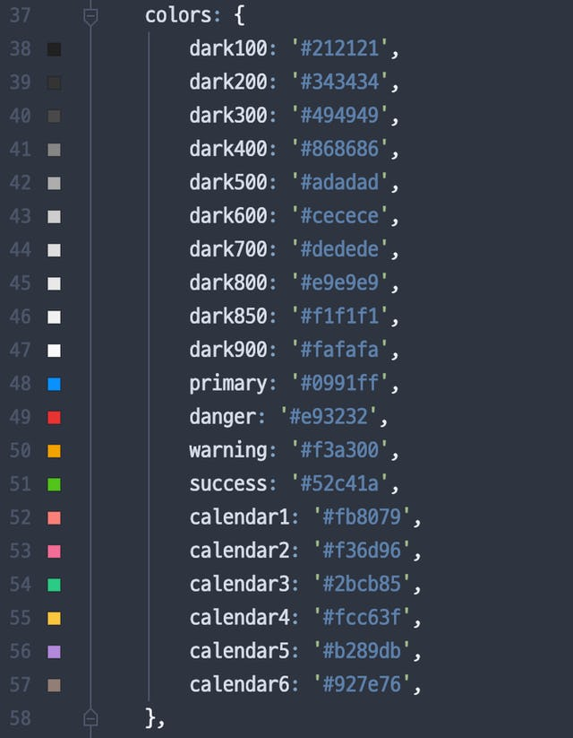
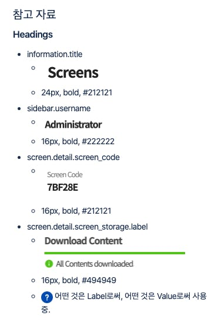
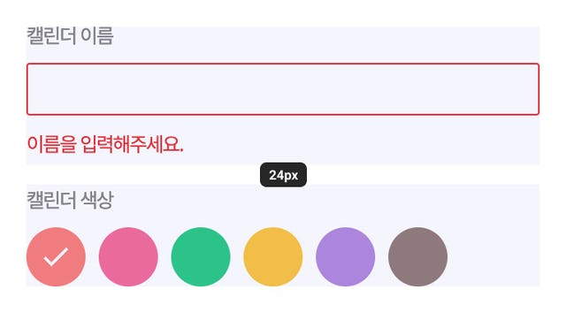
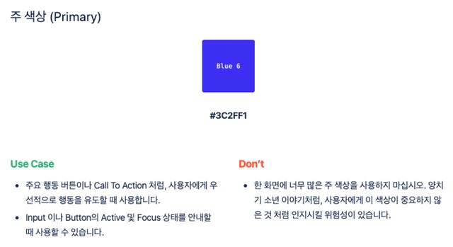

요즘 디자인 토큰 작업을 하고 있다. 개발자가 웬 디자인 관련 작업인가 싶지만 주요 기능을 개발해야 하는 일은 이제 대부분 마무리 지은 것 같고, 이제는 사용성 개선과 관련된 작업을 해야 하기에 그보다 앞선 작업으로써 파편화된 UX/UI를 수습하고 싶었다.

회고를 따로 진행 하겠지만, 2019년 나를 요약하는 키워드는 **불만**이었다.

나도 고객에게 일관성 있는 화면을 제공하고 싶고, 또 개발자로서는 재사용 가능한 컴포넌트를 만들고 싶었다. 더 나아가서 새로운 기능을 구현해야 할 때, 디자인 때문에 병목이 오지 않았으면 좋겠다고 생각했다. **불만이 지속적으로 쌓여갔다.** 당연히 업무에 대한 만족도도 떨어졌다.

그래서 파편화된 UX/UI를 수습한다는 명분 아래에는 내 업무 만족도를 끌어올리겠다는 목표가 있다. 이 작업을 UX/UI 디자이너가 없다고 못 할 이유가 뭐가 있을까? 내가 하면 안되는 이유가 있던가? 만약 새로 오신 분이 뛰어나다고 해도 당장 제품 전반을 이해하고 정제할 수 있을까?

수동적인 자세를 고치고 나니까 자연스럽게 목표가 생겼다. **언젠가 합류할 UX/UI 디자이너에게 도움이 될만한 것을 만들자.**

---

# **디자인 토큰?**

디자인 시스템은 단시간에 쌓아 올리는 모래성이 아니다. _'까짓거 만들고 말지'_ 라는 패기(객기)로 덤볐다간 금세 포기하게 될 것이다.

디자인 시스템은 단순히 재사용 가능한 구성 요소만 모아둔 라이브러리에서 그치지 않는다. 일련의 규칙이 포함되고, 수많은 고민이 녹아들어야 하는 결과물이다.

그말인 즉, 짧은 이터레이션(스프린트) 내에 만들 수 있는 것이 아니라는 것이다. 디자인 시스템을 만드는 것은 긴 시간이 필요하고, **단계적으로 접근**해야 한다. 내가 생각한(그리고 수많은 구글의 전문가가 답변한) 첫번째 단계는 **디자인 토큰**이었다.

> 디자인 토큰은 색상, 타이포그래피(글꼴), 간격 등 디자인과 관련된 값을 정의한, 일종의 원자(Atomic) 요소다.

디자인 시스템은 디자인 토큰을 기반으로 만들어지게 된다. 즉, 디자인 토큰은 매우 추상화된 개념이다.

---

# **부채 들여다보기**

디자인 토큰이 첫 단추인건 알겠는데 그건 어떻게 만들어야 할까? 나는 **기존 프로젝트에서 문제점을 찾는 방식**으로 접근했다. 부채로 가득한 프로젝트는 절망적이지만 이상적인 방향을 잡기 좋다.

## 색상

### **활용하기 어려운 회색조**

회색조는 생각보다 굉장히 자주 사용된다. 이 색상이 정제되어 있지 않으면 실수하기 쉽다. 나의 경우 자주 쓰이는 회색조를 정리해두긴 했는데, 명도 차이에 문제가 있어서 활용하기가 어렵다. 밝은 색은 너무 많고 어두운 색은 너무 적다. 심지어 'dark850' 이라는 혼종도 있다.

### 이름

곰곰히 생각 해 보면 접두사로 'dark'를 사용하는 것은 잘못된 것 같다. 'dark900'을 생각 해 보자. '어둡고 레벨이 높은' 색이 사실 밝은 색이라는 점이 팔레트를 신뢰할 수 없게 만든다. 이것이 수많은 디자인 시스템들이 'gray'를 접두사로 사용하는 이유다. 물론 추측이다.

### 보조 색상의 부재

주 색상(Primary)은 있는데 보조 색상(Secondary)이 없다. 사실 보조 색상의 필요성은 몇 번 느꼈는데, 회사 브랜드 컬러가 모호한 상태라 보조 색상을 임의로 골라서 사용할 수 없는 상태였다. 사실, 사연이 좀 복잡하지만, 사진에 있는 주 색상은 회사 브랜드 컬러가 아니다. 이번에 브랜딩을 개편하기 전까지 저 색상을 사용한 이유는 오로지 'Ant Design'이 파란색 계열이라서 그랬다.

---

## **타이포그래피**

이 사진은 내가 디자인 토큰과 관련해서 정리할 때 작성한 글의 일부다. 칸반 보드처럼 캡쳐한 사진을 한 눈에 볼 수 있도록 붙여두고, 최대한 남의 코드를 리뷰할 때 처럼 객관적으로 접근하려고 했다.

### 역할의 부재

텍스트에는 분명히 역할이 다 부여되어 있다. 텍스트 그 자체가 어떤 값일 수도 있고, 때로는 컴포넌트를 보조하기 위해 표시될 수도 있다. 아니면 작업에 대한 결과를 설명 할 수도 있다. 그러나 지금은 그러한 역할을 인식하지 않은 채, 제각기 다른 모양새를 보여주고 있다.

---

## **간격과 크기**

간격과 크기 또한 부채 중에 하나다. 이쯤되면 부채가 아닌게 무엇인지 궁금할 지경.

### 간격

지금은 일관성 없이 여백들이 잡혀있다. 최소 12px부터 64px까지 여백을 확인할 수 있고 정보 전달의 흐름을 염두에 두지 않았다. 이 간격을 잘 사용했다면 사용자가 흐름을 맺고 끊을 때 크게 도움이 되어, 사용하기 어렵다는 피드백이 줄었을텐데...

### 크기

작게는 컴포넌트의 크기일 수도 있지만, 제품 전반 수준에서 약속처럼 지켜지는 크기가 없다. 약속된 크기가 없다는 것은, 새로운 컴포넌트를 만들 때 마다 height를 매번 고민하게 될 것이고, 예측할 수가 없고, 다른 컴포넌트와 조화를 이루는 것이 어렵게 된다.

---

# **정제**

온갖 부채를 들여다보며 이상적인 방향을 메모했다면, 메모한 것 또한 다시 보자. 정확히 무엇을 원하는지 잘 모르지만 원하는 것을 아무튼 얘기하는 고객사의 요구사항처럼, 나 또한 그런 측면에서 메모하지는 않았는지 다시 검토한다.

이쯤에서 디자인 토큰에 대한 스펙을 정리하는 문서를 만든다. 이 문서를 채울 때 훑어보며 자연스럽게 정제한다. 여러 문서를 참고하며 메모하다 보면, 같은 내용이 중복으로 적힐 수도 있고, 다른 방향으로 새어나간 부분이 있을 수도 있다.

또한 디자인 토큰의 본질은 '추상화'다. UI 개념을 가정한 추상화는 나중에 실제로 구현할 때 제약 사항으로 될 것 같아서 최대한 UI 개념을 배제한다. 그렇지만, 아무래도 프론트엔드를 개발하다 보니 이 부분을 경계하며 정리하기가 어려웠다.

어차피 이를 토대로 디자인 시스템같은 결과물을 만들기 때문에, 디자인 토큰 작성할 때 양식은 중요하지 않다. 다만 나는 아래와 같이 **Use Case와 Don't**에 대한 내용을 작성했다.

예컨대 높으신 분이나, 에이전시의 방식을 고수했던 사람이라면 디자인 시스템을 도입해야 하는 필요성을 못 느낄 수 있다. 그렇다면 디자인 시스템이 왜 필요한지 설득할 수 있는 근거가 필요하다.

디자인 토큰 또한 마찬가지다. 디자인 토큰으로 색상이나 글꼴, 간격 및 크기를 정의하더라도 사용 방법을 적어두지 않으면, 이 토큰을 가지고 해석하고 활용하는 방향은 온전히 읽는 사람에 따라 달라지게 된다.

어떤 경우에서 쓰는 것이 좋고 반대로 쓰면 안되는지에 대한 가이드를 제시하면 자연스럽게 유도 할 수 있다. 또한 반발을 줄일 수 있다. 애초에 사용 방법도 알려주지 않고, 디자인 토큰이랍시고 들이밀면 누구나 거부감이 든다. 마치 오픈소스를 사용할 때 빈약한 문서를 보면 거부감이 드는 것 처럼.

특히 나로써는 기존에 없던 것을 만들고 사용하자고 설득을 해야 하는 입장이었기 때문에, 이런 부분에 대해 많은 고민을 했다.

# 더 나은 미래를 바라보자

수동적인 자세를 고쳐먹고 지난 월요일부터 디자인 토큰을 정리하기 시작했는데 이런 작업을 하면서 어느정도 즐기고 있다는 사실을 알게 되었다.

최근에 번아웃도 오고, 회사에서 개인의 목표를 추구하기 어렵다는 생각도 하면서 심리적으로 힘들었다. 그런 상황에서 정말 오랜만에 일 자체를 즐기는 기분을 느꼈다. 잘 하고 싶은 욕심도 들었고.

이렇게 할 수 있었던 이유는 더 나은 미래를 상상했기 때문인 것 같다. 그 미래에서 일하는 내 모습은 정제된 제품에 대한 명세를 보고, 디자인에 대해 최소한의 논의를 한 뒤, 마치 레고를 조립하듯 컴포넌트를 쌓아 올려서 화면을 구성한다. 그리고 테스트 코드를 작성한 다음, 로직을 구현하고 PR을 보낸다. 이것이 내가 상상하는 더 나은 미래다.

한동안 디자인 토큰을 계속해서 정제하는 시간을 가질 것 같다. 다음에는 이 디자인 토큰을 사용하여 결과물을 만들어서 글을 쓰고 싶다. 아마 Emotion을 사용해서 만들지 않을까? 그리고 급진적이지 않게 도입하는 방법에 대해 고민을 할 것 같다.

---

# **Reference**

- [Building a design system — where to start?](https://uxdesign.cc/building-a-design-system-where-to-start-part-1-first-things-first-57577153ae2d)
