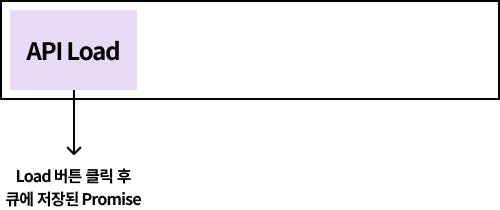

테스트 코드를 작성하다 보면, 비동기 처리를 기다리기 위해 flushPromises를 쓰는 경우가 종종 있다. 공식 Node API도 아닌 이 헬퍼 함수가 어떻게 작동하는지 궁금해서 검색하다가, 누군가 남긴 이슈의 답변이 괜찮아서 번역 해 봤다.

# Q. flushPromises는 왜 작동하나요?

당신이 답변하기 전에도, 일반적으로 이렇게 작성된 flushPromises 예제를 본 적이 있습니다. _(역주: 트위터 타임라인에서 먼저 물어봤었음.)_

```
const scheduler = typeof setImmedate === 'function' ? setImmediate : setTimeout;

export function flushPromises() {
  return new Promise(res => scheduler(res));
}
```

내가 진짜로 이해를 못하는 부분은, **실제로 이 헬퍼 함수가 작동하는 이유**를 모르겠습니다. 스케쥴링이나 자바스크립트가 실제로 비동기 작업을 처리하는 것과 관련이 있지 않을까 정도로 추측하고 있습니다.

그리고 이와 관련해서, Node 및 V8 엔진 구현에 따른 일종의 핵(트릭)인가요? (즉, 브라우저나 차크라 엔진에서 작동하지 않을 수도 있나요?) 스펙에 존재하지 않는 것이라면 바뀔 가능성이 높은지도 궁금합니다.

# A. 전문가는 아니지만...

일단 설명 해 보겠습니다.

제 생각에는 setImmediate가 주어진 콜백을 브라우저가 큐(태스크 큐)에 대기중인 작업을 모두 마친 뒤에 실행하도록 설정하기 때문에 (질문처럼 의도한 대로) 작동하는 것 같습니다.

'즉시 실행된다'고 말하지만 실제로 같은 블록에서 실행된다고 할 수 없습니다. 실제로는 스케쥴링 합니다._(역주: 이벤트 루프에서 실행될 수 있도록 한다는 것 같음.)_ 콜백을 동기적으로 실행하지 않기 때문에 가끔 setTimeout(fn, 0)으로 대체되기도 합니다. 하지만, (동일한 효과를 보기 위해) 가능한 최소한의 딜레이(0)로 설정합니다.

만약 자바스크립트의 큐(태스크 큐)에 setImmediate가 호출된 시점에 실행되어야 하는 프로미스 콜백이 있는 경우, setImmediate의 콜백이 실행되기 전에 처리됩니다. 따라서 **기존의 프로미스들이 해결된 뒤에 이 헬퍼 함수가 생성한 새로운 프로미스가 해결될 것을 보장**합니다.

향후에 문제가 발생될 여지에 대해서는, 만약 [setImmediate 문서](https://developer.mozilla.org/en-US/docs/Web/API/Window/setImmediate)에 나온 경고 때문에 그렇게 생각할 수 있지만, 문서에 Node는 지원한다고 나와있으니, Node 환경에서 테스트 라이브러리를 실행할 때에는 안심해도 괜찮을 것 같습니다. 가장 최악의 시나리오는 setTimeout(fn, 0)으로 만든 폴리필을 사용하는 것입니다.

[이 게시글](https://developer.mozilla.org/ko/docs/Web/JavaScript/EventLoop)이 일반적으로 이벤트 루프를 이해하는데 도움이 될 것입니다. 특히 지연 시간을 0으로 사용할 때에 대해 이야기하는 Zero Delay 섹션을 읽어보세요.

---

# **추가 설명**

비동기로 처리된 것을 기다리기 위해 널리 알려진 flushPromises 헬퍼 함수를 사용했는데, 이 몇 줄 안되는 간단한 헬퍼 함수가 컴포넌트에 작성한 프로미스가 끝나는 것을 기다릴 수 있는 이유는 **이벤트 루프가 비동기를 처리하는 방식**때문인 것이다.

간단하게 아래와 같은 테스트 케이스가 있다고 하자. Load 버튼을 클릭하면 API를 호출하고, 호출 결과에 따라 갯수를 표시하는 컴포넌트를 테스트하는 케이스다. 편의상 API를 모킹하는 부분은 생략한다.

```
it('버튼을 클릭하면 API를 호출한 뒤, 전체 갯수를 표시한다.', async () => {
  const { getByText } = setup(<Component />);
  userEvent.click(getByText('Load'));
  await flushPromises();

  getByText('전체 갯수: 10개');
});
```

userEvent.click이 호출되어 Load 버튼을 클릭한 뒤 태스크 큐는 이렇게 되어 있을 것이다.



flushPromises는 새로운 프라미스를 반환하고, 그 프라미스를 setImmediate가 해결하도록 되어 있다. 그래서 flushPromises를 호출하면 다음과 같이 될 것이다.


번역이 좀 허접하고 모호해서 죄송하다. setImmediate가 태스크 큐가 대기중인 작업을 실행한 뒤에 실행하도록 설정한다는 것은, setImmediate에 지정한 콜백을 태스크 큐 끝에 밀어 넣는 것이 아니다.

**이벤트 루프 내에 setImmediate를 위한 단계**가 있는데, 이 단계에서 setImmediate로 전달한 콜백, 즉. flushPromises로 생성한 프로미스의 resolve 함수가 실행된다. (자세한 내용은 [문동욱님의 블로그 글](https://evan-moon.github.io/2019/08/01/nodejs-event-loop-workflow/)을 추천한다.)

```
await flushPromises();
```

flushPromises가 반환한 프로미스 자체만을 기다리는(await) 것 처럼 보이지만, 실제로는 이벤트 루프가 setImmediate를 호출하는 단계까지 기다리는 것이라고 볼 수 있다.

이런 것을 찾아볼 때 마다, 결국 자바스크립트를 잘해야 한다는 생각이 든다.

---

### **참고**

* <https://github.com/testing-library/react-testing-library/issues/11>
* <https://evan-moon.github.io/2019/08/01/nodejs-event-loop-workflow/>