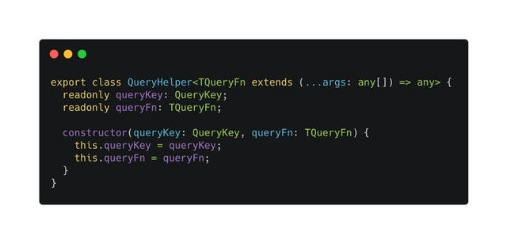
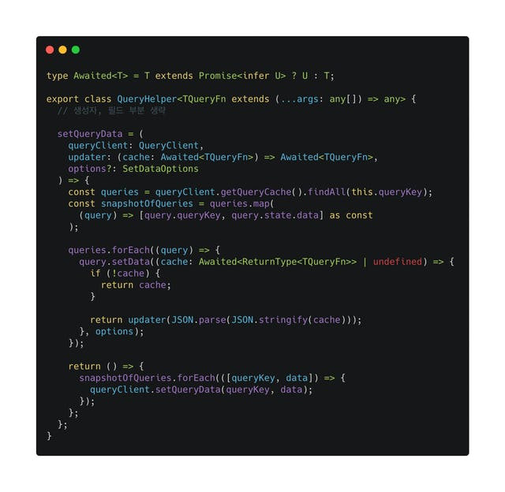
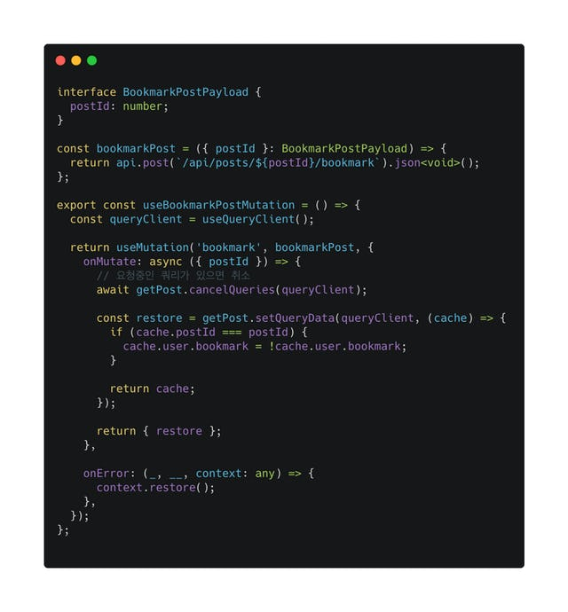

요즘 회사에서 React Query를 적극적으로 쓰고 있다. 쓰면서 느낀 점은 서버 상태를 잘 관리하는게 여러모로 꽤 중요하다는 것을 알게 되었다. (서버 상태란 API를 통해 받은 응답값을 뜻한다.)

서버 상태를 다른 컴포넌트에서 접근하려면, 가장 쉬운 방법은 Props로 전달하는 것이지만, 컴포넌트가 많아지고 깊어질 수록 내가 쓴 코드는 점점 관리하기 어려워진다. 그래서 전역 상태를 관리하는 것, 예를 들면 Context API나 리덕스 같은 것들을 사용해서 서버 상태를 저장하고 필요한 컴포넌트에서 가져다 쓰는 방식을 주로 사용해왔다. (리액트가 UI를 표현하기 위한 라이브러리라는 관점에서 전역 상태에 저장하는게 맞는가에 대한 회의감도 있긴 하다.)

이런 식으로 데이터 페칭은 어떻게든 할 수 있지만, 효과적으로 데이터를 캐싱하고 Optimistic Update를 통해 좋은 UX를 제공하려면 여간 복잡한 일이 아니다. 그래서 React Query를 사용해서 서버 상태와 관련된 로직을 처리한다. 그러면 내가 실제로 구현해야 하는 로직에만 집중할 수 있게 된다.

## React Query의 불편한 점

불편한 점은 있다. React Query에는 쿼리 키(Query Key)라는 개념이 존재하는데, 이 쿼리 키를 사용해서 전반적인 캐싱을 관리한다. 여기서의 불편함은 내가 특정 캐시에 직접 접근할 때에도 쿼리 키를 알고 있어야 한다는 점이다. 예를 들어 "posts" 라는 쿼리 키를 사용했다면, 해당 쿼리 캐시에 접근하기 위해서 "posts" 라는 쿼리 키를 매번 직접 입력하거나, 어딘가에서 import 해서 써야 한다.

타입 선언도 일일히 해줘야 하는 점도 있다. React Query의 API 자체는 타입스크립트로 아주 완성도 높게 만들어졌지만, 구체적인 데이터 형태를 제너릭으로 지정하기 위해서는 어쩔 수 없이 인자에 타입을 일일히 지정해야 한다. 이런 묘한 불편함들을 해결하기 위해 간단한 헬퍼 클래스를 만들었다.

## QueryHelper 클래스

QueryHelper 클래스는 React Query와 관련된 로직을 타입 세이프하게 처리하기 위한 클래스다. 이 클래스의 생성자는 쿼리 키와 쿼리 함수를 인자로 받는다.

생성자 부분은 별거 없다. 인자로 받은 쿼리 키와 쿼리 함수를 필드에 다시 저장한다. 주목해야 하는 곳은 QueryHelper 클래스의 제네릭 부분이다. TQueryFn 는 어떤 인자를 받으면 뭔가를 반환하는 함수일 것으로 기대하는 제약 사항을 추가했다. 이렇게 하면 이 함수가 리턴하는 값을 추론해서 필요한 곳에서 적절하게 사용할 수 있다.

이후 QueryClient 로 처리해야 하는 로직을 이 클래스 내부의 메소드로 적절하게 구현하면 된다. 예시로 setQueryData 메소드를 보자면,

이런 식으로 구현이 되었다. 우선 React Query의 queryClient 를 사용하기 위해 첫번째 인자로 전달을 받는다. 두번째 인자는 이 캐시의 데이터를 어떻게 수정할 것인지 구현한 함수를, 세번째 인자는 queryClient.setQueryData 의 옵션이다.

아까 제네릭으로 선언한 TQueryFn 의 리턴 타입을 추론하기 위해 Awaited 라는 타입을 선언했다. 이 타입은 제너릭 하나를 받고, 해당 제너릭이 Promise 이면 Promise 를 벗겨낸 타입을, 그렇지 않으면 입력받은 타입을 그대로 반환한다. 이렇게 하면 이 setQueryData 메소드를 호출하는 곳에서 적절하게 타입을 제공하여 보다 안전한 코드를 작성할 수 있게 되었다. 실제 사용 예시를 보자.

예시로 사용하는 코드의 간단한 맥락을 설명하자면, QueryHelper 인스턴스인 getPost 가 있다. getPost 는 특정 포스트 정보를 받아오는 쿼리와 관련되어 있고, 사진의 useMutation은 해당 포스트를 북마크 처리하는 훅이다. Optimistic Update 를 하려면 useMutation 의 옵션으로 onMutate 와 onError, onSuccess 를 적절히 사용해야 하는데, onMutate 는 뮤테이션이 시작되는 시점에 캐시를 수정하여 사용자에게 빠릿한 경험을 제공하도록 하고, onError는 어떠한 이유로 요청에 실패했을 때 다시 캐시를 원래대로 돌려놓는다. onSuccess 는 데이터 정합성을 위해 주로 캐시를 무효 처리하는데 위 사진에서는 생략했다.

위 사진의 onMutate 부분을 보면, 혹시라도 다시 요청중인 포스트 정보 쿼리가 있으면 취소한 뒤 현재 포스트 정보 쿼리 캐시를 수정한다. QueryHelper 의 setQueryData 는 수정하기 전 원래 캐시로 돌려놓는 함수를 리턴한다. 그래서 onMutate 에서 restore 를 반환하고, onError 에서는 context 로 전달된 restore 함수를 호출한다. 그러면 요청에 실패할 경우 원래 캐시로 되돌려진다.

이런 방식으로 내가 수정하고자 하는 쿼리 키에 대한 입력도 없고, 서버 상태에 대한 타입 선언도 없다. 한층 더 쓰기 쉬워진 느낌...

### 참고 링크

- https://react-query.tanstack.com/guides/query-keys
- 궁금증 해소 & 코드 개선에 도움을 주신 [혜성](https://twitter.com/KrComet)님께 감사를 드립니다 :pray:
