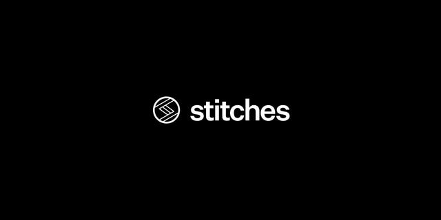

블로그를 다시 리뉴얼했다. 이번 리뉴얼은 겉보다는 속을 많이 정비했다. 특히 마크다운으로 작성하던 방식에서 Headless CMS를 사용하는 방식으로 변경한 것이 가장 큰 변화이고, Stitches 라는 CSS in JS 라이브러리를 사용하여 스타일링을 했다.

어쩌다보니 새 단장을 1년 주기로 하고 있는 것 같다.

# 마크다운에서 Headless CMS로

글 작성 방법을 마크다운에서 Headless CMS로 변경했다. 사실 나는 마크다운으로 글을 쓰는 것을 더 좋아한다. 글을 작성하는 것에 더 집중할 수 있고, 필요하다면 [remark](https://remark.js.org/) 기반의 플러그인을 사용해서 기능을 더 확장할 수 있기 때문이다. 그렇다면 왜 잘 쓰던 마크다운을 포기하고 Headless CMS를 붙이기로 결심했을까?

마크다운 방식으로 글을 쓰려면, 블로그 레포를 클론해서 글을 작성한 뒤 커밋 후 푸시를 진행해야 한다. 바꿔 말하면, 블로그 개발 환경이 갖춰지지 않은 경우 글을 쓸 수가 없었다. 그리고 글을 적는데 커밋하고 푸시까지 해야 하다니. 잔디 심기에 연연하지 않기도 했지만, 불필요하게 잔디가 심어진 것 같다는 생각도 들었다.

사소하지만 내게는 적잖게 불편했다. 글감을 따로 모아두는 것에 익숙치 않아서 로컬에서 작성한 마크다운을 이동중이나 다른 PC에서 이어서 편집을 못하는 것도 아쉬웠다. 굳이 구현한다면 frontmatter에 드래프트 여부를 추가한 뒤 공개 여부를 결정지을 수도 있었지만 근본적인 불편함을 해결하기엔 다소 부족했다.

Headless CMS는 충분히 많은 서비스가 있고, 웬만하면 대등소이한 기능을 제공하고 있다. 나는 그 중에서도 [Prismic](https://prismic.io/)을 선택했다. 가장 먼저 무료이고, 필요에 맞게 콘텐츠 모델링을 할 수 있고, 커뮤니티 기반이지만 공식 문서에서도 사용을 권장하는 [Gatsby 소싱 플러그인](https://github.com/angeloashmore/gatsby-source-prismic)이 있다. 해당 플러그인의 가이드만 잘 따라하면 연동을 할 수 있고 Prismic에서 제공하는 미리보기 기능을 사용할 수 있다.

기존에 마크다운으로 작성했던 글을 마이그레이션을 해보니 기능적인 측면에서 부족한게 많다. 특히 인라인 코드 블럭이나 코드 하이라이팅에 대한 지원이 없어서 이 부분은 다른 방식을 찾아봐야 할 것 같다.

# Stitches

GraphQL Korea 슬랙 채널에서 혜성님의 추천으로 알게된 CSS in JS 라이브러리이다. 제로 런타임에 가까운 성능이라는 문구보다 Variant, Theme를 라이브러리 레벨에서 지원하는 것이 매우 매력적이었다. 블로그를 "알게 되버린 기술을 적용하는 무대"로써 사용해왔기에 이번 리뉴얼에 적극적으로 사용해보았다.

Emotion은 CSS in JS 라이브러리여서 좋았고, Tailwind CSS는 Atomic CSS여서 좋았다. 음, Tailwind는 거기에 배우기 쉽고 빠르게 적용할 수 있다는 장점을 빼먹을 수가 없다.

Stitches는 CSS in JS인데 런타임에서 각각의 CSS 프로퍼티가 Atomic CSS처럼 적용된다. 한 번 주입된 CSS 클래스는 다른 컴포넌트에서 사용할 때 재사용된다. 같은 CSS 코드가 중복적으로 삽입되는 OOCSS 방식의 Emotion과의 가장 큰 차이점이다.

타입스크립트 지원도 훌륭한 편이다. Variant와 Theme를 메인 피처로 제공하면서 이에 대한 자동 완성과 타입 안정성까지 갖춘 라이브러리인데 아쉬운 점은 내 환경에서 타입스크립트 지원이 온전하게 작동하지 않았다. 그래서 색상 토큰을 지정해두고도 자동 완성이 되지 않아서 stitches.config.js 파일을 수시로 확인해야 했다.

아직 베타 단계에 있는 라이브러리지만 꽤 쓸만하다고 느껴졌다. 1.0이 기대된다.

---

블로그 개편을 2020년 12월이 끝나기 전에는 매듭지을 수 있을 줄 알았는데 슬금슬금 미루고 미루다보니 해를 넘겨버리고 말았다. 그래도 마무리 해서 뿌듯하고, 새해에는 새로운 기분으로 글을 작성할 수 있을 것 같다. 조금 더 정리한 뒤, 2020년 회고와 목표도 기록해야겠다.
