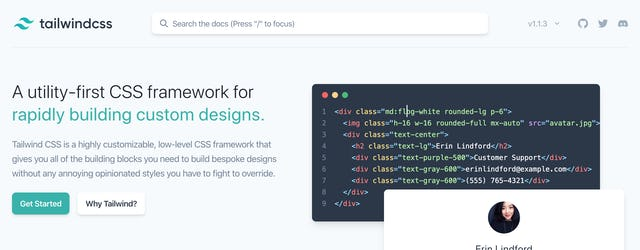
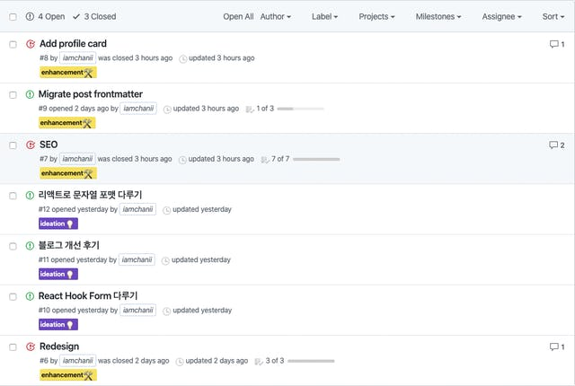
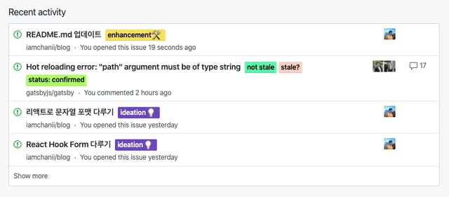

지난해 12월부터 블로그 새단장을 계획하고 조금씩 진행했다. 오로지 주말에 잠깐 작업하다 보니 해를 넘겨버렸는데, 이번 포스팅에서 새단장을 할 때 어떻게 작업하고, 어떤 점을 개선했는지 정리 해봤다.

# **디자인**

## Emotion 사용

기존의 [styled-components](https://www.styled-components.com/)를 걷어내고, 새롭게 [Emotion](https://emotion.sh/)를 도입했다. 회사 프로젝트를 진행하면서 고민하다가 전자를 택했었는데, 이후 Emotion이 핫하게 떠오를 때 마다 약간의 후회를 했다. 이미 많은 부분을 사용하고 있어서 바꾸기 어려운 회사 프로젝트 대신, 내 블로그에 가볍게 적용 해 보기로 했다.

Emotion 또한 styled 방식을 제공하지만 그건 논외로 치고, css 프로퍼티를 이용하는 방식에 익숙해지니까 이쪽이 훨씬 마음에 들었다.

하지만 전체적으로 Emotion 대신 더욱 애정하는 것을 사용했다.

## TailwindCSS



사이트 전체적으로 [Tailwind CSS](https://tailwindcss.com/)을 사용했다. 프론트엔드 엔지니어로써, 아무래도 직접 만드는게 더 편하고, 용량 측면에서 이러한 CSS 프레임워크들을 선호하지 않는 편이였다. 하지만 사이트 메인의 라이브 코딩처럼 연출한 것을 보고 나니, 기존의 비슷한 것들과의 차이점을 느꼈다.

기존의 CSS 프레임워크들은 고유한 룩앤필이 있고, 확실히 빠르게 가져다 쓸 수 있다. 버튼이나 인풋 등 컴포넌트가 이미 정의되어 있기 때문이다. 그러나 여기에 커스터마이징이 들어가는 순간, 관리의 어려움 + 뭔가 어색함 + 사용하기 싫음의 헬게이트가 열린다는 것을 알 사람들은 알 것이다.

Tailwind CSS는 저수준의 유틸리티 클래스만을 제공하고, 이를 사용하여 마음대로 만들 수 있다. 또한 직관적인 클래스 명칭을 통해, 약간의 규칙만 이해하면 절반의 기능 정도는 금세 외울 수 있다. 회사 홈페이지를 만들때 적용 해 봤는데, 제플린으로 어떤 것을 받아도 구현할 수 있는 정도인 것 같다. 단, 프로덕트에 사용한다면 어느정도 디자인 토큰을 정의할 필요가 있다.

물론 다른 CSS 프레임워크들과 마찬가지로, 사용하지 않는 클래스들이 포함되어 용량이 커지는 단점이 있는데, 이번에 [PurgeCSS](https://www.purgecss.com/)를 도입하여 빌드 단계에서 용량을 최적화할 수 있었다!

## backdrop-filter CSS 적용

상단 header 배경에 흰색을 적용한 뒤, position: fixed를 적용했다. 화면 상단에 걸리는건 좋은데, 사진이나 본문이 뚝 잘려 보이는 점이 언제나 거슬렸다.

그러던 중, 얼마전에 [Apple Music](https://www.apple.com/apple-music/) 사이트에 들어가 봤는데, 고정된 상단 영역 배경에 블러 효과가 들어간 것을 봤다.


예전부터, 저런 느낌의 디자인을 구상하면 적용하는게 참 어려웠다. 온갖 트릭을 적용해야, 그나마 정지되어 있는 일부 영역에 비슷하게 흉내낼 수 있었다. 그런데 애플이 적용한 것을 보고 무조건 캔버스로 했겠거니 했는데, 개발자 도구로 찍어보니 backdrop-filter를 사용한 것을 알 수 있었다. 안 써볼수가 없었다.

IE만 지원하지 않는 상황이면 그냥 썼는데, 파이어폭스 또한 지원하지 않는 점이 조금 걸려서 아래와 같이 @supports로 지원하는 경우에만 적용하도록 처리했다.

```
background-color: rgba(255, 255, 255, 0.75);

@supports (backdrop-filter: blur(4px)) {
  backdrop-filter: blur(4px);
}
```

# **SEO**

회사 홈페이지를 새롭게 진행하면서 SEO를 중요하게 생각해서 이것 저것 리서치를 하며 적용했는데, 자연스럽게 내 블로그에도 노하우를 녹여보기로 했다.

## Description 내용 정리

이 블로그를 처음 만들 때 SEO 자체를 고려하지 않았기 때문에 별로 신경쓰지 않았는데, 새로운 글을 작성해서 주로 페이스북 그룹에 공유할 때 마다 표시되는 내용이 신경쓰였다.

마크다운 플러그인 자체적으로 지원하는 excerpt를 사용했는데, 지정된 글자 수까지 임의로 맞추다보니 굉장히 어색했고 문장 끝에 ...이 붙었다.

처음에는 frontmatter에 별도로 정리할까 생각했는데, 너무 비효율적인 것 같았다. 그래서 마크다운 본문 일부를 excerpt로 사용할 수 있는 기능을 활성화 했다.

```
module.exports = {
  plugins: [
    {
      resolve: 'gatsby-transformer-remark',
      options: {
        excerpt_separator: '<!-- end -->',
        plugins: [
          /* ... */
        ],
      },
    },
  ],
};
```

그 다음 마크다운 내의 첫번째 문단 밑에 `<!-- end -->`를 추가하는 작업을 했다. 기존보다 훨씬 매끄럽고 깔끔해져서 좋다.

## Open Graph 태그 개선

위의 작업의 연장으로, 페이스북에 링크를 걸 때 표시되는 내용을 잘 보여주기 위해 오픈 그래프 태그를 정리했다. 제목과 본문 내용 일부는 잘 나오고 있었지만, 사진을 따로 지정하지 않아서 어떤 사진이 나올 지 예측할 수 없었다.

가끔은 사이트 파비콘이 나올때도 있었고, 운이 좋으면 블로그 첫번째 사진이 나오기도 했으며, 민망하게도 소개 페이지에 사용한 내 사진이 나올때도 있었다. 그럴땐 부담스러워서 프리뷰를 제거하곤 했다.

Gatsby로 블로그를 만들면 SEO 컴포넌트를 따로 두는게 거의 국룰이라고 볼 수 있다. 그래서 아래와 같이 컴포넌트를 개선했다.

```
return (
  <Helmet titleTemplate={`%s | ${site.siteMetadata.title}`}>
    <html lang={lang} />
    <title lang={lang}>{title}</title>
    <link rel="canonical" href={site.siteMetadata.siteUrl + url} />

    {/* 기본 */}
    <meta name="description" content={description} />
    {imageUrl && <meta name="image" content={imageUrl} />}

    {/* Open Graph */}
    <meta property="og:url" content={site.siteMetadata.siteUrl + url} />
    {isBlogPost ? <meta property="og:type" content="article" /> : null}
    <meta property="og:title" content={title} />
    <meta property="og:description" content={description} />
    {imageUrl && <meta property="og:image" content={imageUrl} />}

    {/* Twitter */}
    <meta name="twitter:card" content="summary" />
    <meta name="twitter:creator" content={site.siteMetadata.author} />
  </Helmet>
);
```

## URL 표준화

검색엔진 최적화에 있어 어느정도 중요도가 있는 편이다. 사람 입장에서는 주소 끝에 슬래시(slash, /)가 붙고 안붙고는 큰 차이를 느끼기 어렵겠으나, 검색엔진 입장에서는 두 개를 다른 페이지로 인식하기 때문에 URL 표준화를 해 주지 않으면 안된다.

Search Console 내에서, 몇 없는 트래픽이지만, 슬래시가 붙고 안붙은 차이에 따라 유효 또는 제외됨 판정을 받는 것을 보고 조치를 해야겠다고 생각했다.

실제로 조치가 되었는지는 지켜볼 예정이고, 아래와 같이 표준 URL을 지시해 주는 방향으로 작업했다.

```
<link rel="canonical" href={site.siteMetadata.siteUrl + url} />
```

## 구조화된 데이터 적용

구조화된 데이터도 적용했다. 블로그에 적용할만한 것은 많지 않아서, 블로그 게시글 페이지 한정으로 BlogPosting 타입의 구조화된 데이터를 적용했다.

구조화된 데이터는, 검색엔진이 페이지의 내용을 올바르게 해석할 수 있도록 도와주는 일종의 메타데이터다. Microdata, RDFa, JSON-LD 방식이 있는데, 적용하기 쉬운 JSON-LD 방식을 사용했다. 각각에 대한 설명은 [아웃사이더님의 글](https://blog.outsider.ne.kr/1214)을 추천한다. 잘 설명해주셨다.

SEO 컴포넌트 내에 직접 입력해도 괜찮겠지만, 더욱 리액트답고 타입스크립트다운 방식으로 사용하기 위해, [react-schemaorg](https://github.com/google/react-schemaorg) 라이브러리를 사용했다.

```
<JsonLd<BlogPosting>
  item={{
    '@context': 'https://schema.org',
    '@type': 'BlogPosting',
    mainEntityOfPage: {
      '@type': 'WebPage',
      '@id': siteUrl + slug,
    },
    headline: title,
    author: {
      '@type': 'Person',
      name: 'iamchanii',
    },
    datePublished: date,
    dateModified: date,
    wordCount,
    image: siteUrl + thumbnailUrl,
    publisher: {
      '@type': 'Organization',
      name: 'iamchanii',
      logo: {
        '@type': 'ImageObject',
        url: 'https://imch.dev/images/default.png',
      },
    },
  }}
/>
```

직접 일일히 넣으면 어떤 것을 넣고 넣을 수 없는지 모호한데, 이 라이브러리를 사용하면 그런 문제를 해결할 수 있다. 처음에는 이렇게 넣고 배포한 다음, [구조화된 데이터 테스트 도구](https://search.google.com/structured-data/testing-tool/u/0/?hl=ko)로 검사를 했는데 너무 비효율적이어서 로컬에서 적용된 내용만 코드 스니펫으로 검사했다. 진작 그렇게 할 걸.

# 그 외

## 깃헙 이슈 활용

이번에 처음 시도한건데, 깃헙 저장소 내의 이슈를 일종의 태스크 관리 목적으로 사용해봤다.





원래는 블로그 개선에 적용할 내용을 까먹지 않으려고 이슈를 하나 만들었는데 이게 생각보다 괜찮았다. 깃헙 메인 화면에 떠서 잘 보이고, 잘 기억되기도 하고 해서 아주 만족스럽다. [ZenHub](https://www.zenhub.com/)을 사용해 볼까 했는데 굳이 지금 칸반까지 붙일 필요는 없을 것 같았다.

# 마치며

해를 넘겨서 아쉽지만, 새해 기념 새 단장이라 생각하기로 했다. 공유한 내용이 블로그를 관리하는 분들에게 도움이 되었으면 좋겠다.

그리고 이런건 별로 중요하지 않다. 궁극적으로 글을 잘, 그리고 자주 써야 블로그가 잘 돌아가기 때문이다. 서치 콘솔보니까 평균 CTR이 13%였는데, 올해 안에 20% 근처까지 왔으면 좋겠다. 힘내보자.
