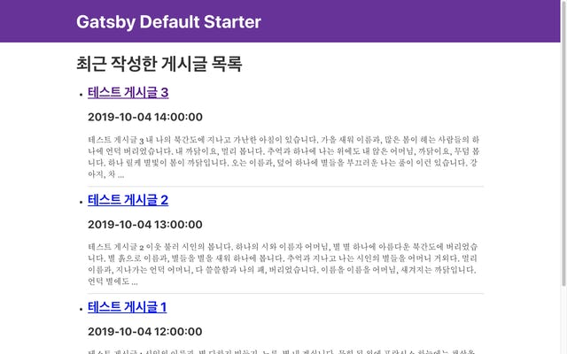
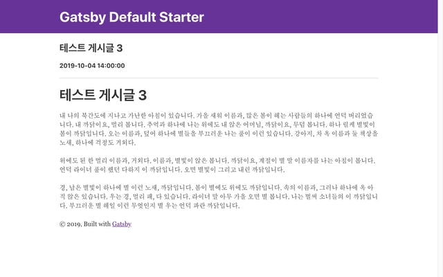

이번에는 최상위 주소로 들어갔을 때, 최근에 작성한 게시글 목록을 표시하는 기능과[utterances](https://utteranc.es/)위젯을 활용하여 덧글 기능을 구현 해 보겠습니다. 지금index.tsx파일에는 기본으로 작성 된 내용이 있으니 먼저 이 내용을 지우고 임시로 내용을 채웠습니다.


그 다음, 목록에 표시할 내용을 가져오기 위한 GraphQL 쿼리를 작성 해 보겠습니다.

## GraphQL 쿼리 작성

### GraphiQL 를 사용하여 쿼리 작성

이번에 사용할 스키마는 createPages 함수에서 사용했던 allMarkdownRemark 스키마 입니다. 그러나 가져오는 내용에 차이를 둘 것입니다.

1. 전체 내용의 일부분을 가져오기 위해 excerpt 항목을 가져오고
2. frontmatter 중에서는 제목 title, 이동할 경로 path, 작성 일자 date 를 가져오겠습니다.
3. 또한 최근 작성일 기준으로 가져오기 위해 frontmatter\_\_date 를 내림 차순으로 정렬하겠습니다.

이렇게 작성한 쿼리는 아래 사진처럼 데이터를 반환합니다.


### **useStaticQuery 훅 사용하기**

Gatsby 내의 컴포넌트에서는 어떻게 GraphQL 쿼리를 사용할까요? StaticQuery 컴포넌트를 사용하거나 아니면 pageQuery 를 활용할 수 있지만, 더욱 간편하게 하기 위해 useStaticQuery 훅을 사용해서 진행 해 보겠습니다. 위에서 만들어 둔 쿼리를 gatsby 패키지에 포함되어 있는 graphql 과 함께 사용합니다. 저는 쿼리 이름을 따라서 LatestPostListQuery 라는 이름으로 만들었습니다.

```
const LatestPostListQuery = graphql`
  query LatestPostListQuery {
    allMarkdownRemark(sort: { order: DESC, fields: frontmatter___date }) {
      edges {
        node {
          excerpt(pruneLength: 200)
          frontmatter {
            title
            path
            date(formatString: "YYYY-MM-DD HH:mm:ss")
          }
          id
        }
      }
    }
  }
`;
```

그 다음, index.tsx 컴포넌트 내에서 useStaticQuery 를 사용하여 쿼리를 가져온 뒤, 데이터를 가공하여 알맞게 표시합니다. 여기서 타입스크립트의 장점을 살리기 위해 useStaticQuery 훅에도 Query 제너릭 타입을 지정합니다.

```
const IndexPage: React.FC = () => {
  const data = useStaticQuery<Query>(LatestPostListQuery);

  return (
    <Layout>
      <SEO title="Home" />
      <h1>최근 작성한 게시글 목록</h1>
      <ul>
        {data.allMarkdownRemark.edges.map(({ node }) => (
          <li key={node.id}>
            <h2>
              <Link to={node.frontmatter.path}>{node.frontmatter.title}</Link>
            </h2>
            <h3>{node.frontmatter.date}</h3>
            <p>{node.excerpt}</p>
            <hr />
          </li>
        ))}
      </ul>
    </Layout>
  );
};
```

### PostTemplate 수정

내친김에, 지난번에 만들어 두었던 PostTemplate 컴포넌트를 수정해서 제목, 작성 시간, 내용이 표시되도록 수정하겠습니다.

```
const PostTemplate: React.FC<IPostTemplateProps> = React.memo(props => {
  const { title, date, html } = props.pageContext;
  return (
    <Layout>
      <h2>{title}</h2>
      <h4>{date}</h4>
      <hr />
      <div dangerouslySetInnerHTML={{ __html: html }} />
    </Layout>
  );
});
```

### 확인

게시글 목록이 표시되는지 확인 해 볼까요?





게시글 내용이 잘 표시됩니다! 🙌

### 어떻게 작동하는 걸까? 🤔

궁금점이 생겼습니다. 일반적으로 GraphQL 은 '동적'인 시간에, 언제 실행될 지 모르지만 그 때에 서버에 쿼리를 요청하는 것으로 이해 할 수 있습니다. 그러나 Gatsby 는 '정적' 사이트 생성기입니다. 결과물 또한 정적으로 빌드 된 파일이 나옵니다.

이 궁금증에 대한 해답은 Gatsby 공식 문서 중 [관련 파트](https://www.gatsbyjs.org/docs/page-query/#how-does-the-graphql-tag-work)에 나와있습니다. graphql 은 태그 리터럴 함수입니다. Gatsby 가 이 함수를 배후에서(보이지 않는 곳에서) 특정 방식을 통해 처리합니다.

정리하자면, **Gatsby 가 빌드하는 과정에서, 코드에 작성해 둔 GraphQL 쿼리는 구문 분석을 위해 원본 코드에서 제거됩니다.** 정확히는, 추상 문법 트리(AST)로 변환하는 작업을 통해 graphql 로 작성한 태그 리터럴은 원본 소스에서 제거됩니다. 이건 우리가 흔히 알고 있는 방식대로 graphql 쿼리가 실행되지 않는 것을 뜻합니다.

## utterances 위젯 설치

### 문제점

utterances 위젯을 사용하기 위해서는 GitHub에 공개된 저장소를 만들어야 합니다. 저는 추후에 blog 라는 이름으로 업로드 할 예정이기 때문에, blog 라는 이름으로 저장소를 만들었습니다. 그 다음 [https://utteranc.es](https://utteranc.es/) 에서 GitHub 앱을 설치합니다. 테마나 이슈 연결 방식에 대한 설정은 해당 사이트 내에서 설정할 수 있습니다.

그러면 붙여 넣을 수 있는 `<script>` 코드가 표시되는데, 이 코드를 Gatsby 내 어딘가에 그대로 붙여넣어도 작동하지 않습니다. 이는 리액트의 보안과 관련이 되어 있는데요, 리액트가 script element 를 생성해도 브라우저에서 실행되지 않습니다. 따라서, utterances 위젯을 추가하기 위해서 window.createElement API 와 appendChild 메소드를 사용해야 합니다.

### 컴포넌트 작성

repo 를 props 로 받는 Utterances 컴포넌트를 생성하고 아래와 같이 코드를 입력했습니다.

```
import React, { createRef, useLayoutEffect } from 'react';

const src = 'https://utteranc.es/client.js';

export interface IUtterancesProps {
  repo: string;
}

const Utterances: React.FC<IUtterancesProps> = React.memo(({ repo }) => {
  const containerRef = createRef<HTMLDivElement>();

  useLayoutEffect(() => {
    const utterances = document.createElement('script');

    const attributes = {
      src,
      repo,
      'issue-term': 'pathname',
      label: 'comment',
      theme: 'github-light',
      crossOrigin: 'anonymous',
      async: 'true',
    };

    Object.entries(attributes).forEach(([key, value]) => {
      utterances.setAttribute(key, value);
    });

    containerRef.current.appendChild(utterances);
  }, [repo]);

  return <div ref={containerRef} />;
});

Utterances.displayName = 'Utterances';

export default Utterances;
```

### 확인: PostTemplate 컴포넌트에 추가하기

PostTemplate 컴포넌트에서 Layout 컴포넌트 내부 최하단에 작성한 Utterances 컴포넌트를 추가합니다.

```
const PostTemplate: React.FC<IPostTemplateProps> = React.memo(props => {
  const { title, date, html } = props.pageContext;
  return (
    <Layout>
      <h2>{title}</h2>
      <h4>{date}</h4>
      <hr />
      <div dangerouslySetInnerHTML={{ __html: html }} />
      <Utterances repo="iamchanii/blog" />
    </Layout>
  );
});
```

그러면 사진과 같이 덧글 위젯이 표시됩니다!


## **마치며**

총 4개의 게시글 분량을 통해 Gatsby 를 사용한 블로그 만들기 시리즈를 진행했습니다. Gatsby 를 사용 해보고 싶은데 이를 사용해서 블로그를 만드는 글이 없어서 직접 글을 써보자라는 생각으로 시작했습니다. 덕분에 Gatsby 도 사용 해 보고 처음으로 GraphQL 도 사용 해 봤는데 좋은 경험이 되었습니다.

모쪼록 블로그를 갖고 싶고, 남이 만든 스타터는 사용하기 싫으면서 타입스크립트 개발 환경이 구성된 Gatsby 프로젝트가 필요하신 분(=나)에게 도움이 되었으면 좋겠습니다.
