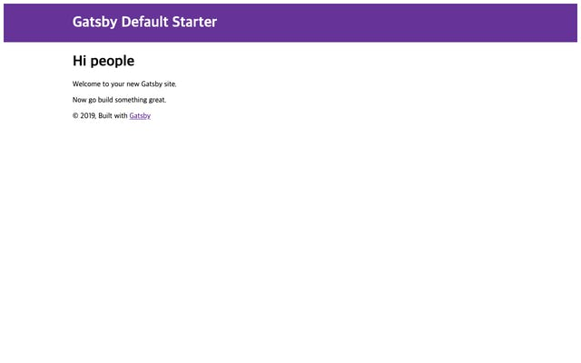
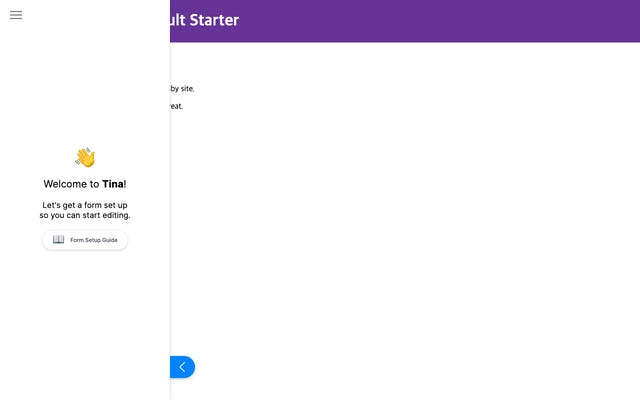
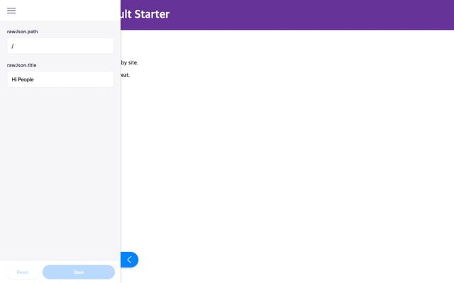
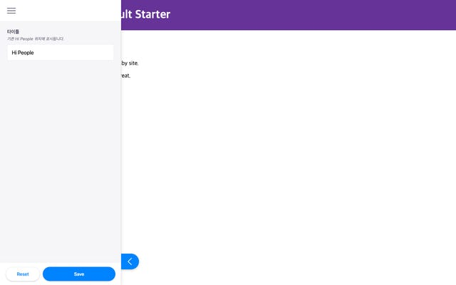
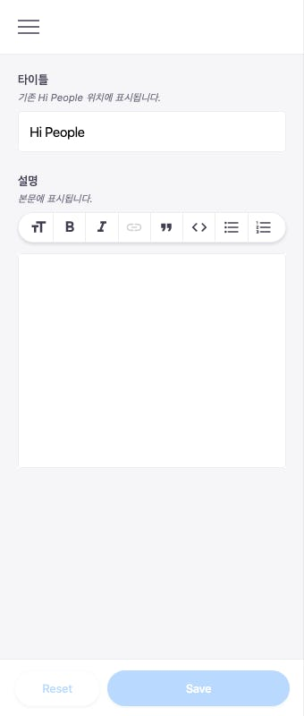
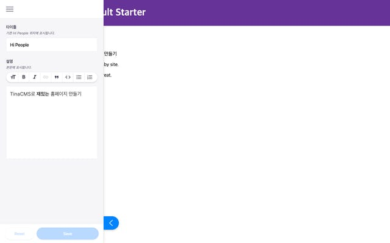

최근에 회사에서 홈페이지를 만들어 달라는 업무가 할당됐다. 지금까지는 워드프레스 기반으로 만들고 있었는데, 워드프레스 특유의 (쉬운 사용과는 다른)복잡성과 플러그인끼리 교착 상태가 발생하면서 더 이상 워드프레스로는 유지하기 어렵다는 판단을 내린 것이다.

처음에 워드프레스를 택한 이유는 비개발자도 편집할 수 있다는 장점이 있었는데, [Elementor](https://elementor.com/) 플러그인이 있기 때문이다. 나는 워드프레스로 홈페이지를 만들어본 적은 없지만, 이 플러그인을 보고 신기하다는 생각을 했다.

그리고 Gatsby로 만든 사이트에서 Elementor 같은 역할을 할 수 있는 [TinaCMS](https://tinacms.org/)가 있다. 이걸 사용하면, 개발 단계에서 Elementor 처럼 좌측에 사이드바가 표시되고, 입력한 내용이 바로 반영된다. TinaCMS는 Git-Backend라서 내용을 변경하고 저장을 누르면 변경 사항이 바로 커밋되고 푸시가 된다.

그래서 내린 나의 가설은 TinaCMS를 사용해서 Gatsby로 만들었지만 마치 워드프레스로 편집하는 것 같은 홈페이지를 만드는 것이다. 그리고 CD를 붙여서 푸시가 될 때 마다 배포가 되면, 꽤 만족스러운 결과물이 나올 것 같다.

이 글에서는 최소한의 Gatsby 프로젝트를 만들고, TinaCMS를 붙이는 삽질을 기록한다. 콘셉트나 작동 원리에 대한 설명은 공식 문서를 참고하자.

---

# **0\. 프로젝트 준비**

Gatsby 프로젝트를 만든다. 타입스크립트와 Emotion을 사용 할 것이기 때문에, 필요한 최소한의 설정을 적용했다. 궁금하시다면 [해당 커밋](https://github.com/iamchanii/gatsby-tinacms-example/tree/d99f24a6920c0871fb2e2e2590e0a5de06e8aa6d)을 참고하시라.



# **1\. TinaCMS 플러그인 설치**

TinaCMS 플러그인을 설치한 다음, gatsby-config.js 파일에 플러그인을 추가한다. 이때 styled-components를 설치하지 않으면 오류가 발생한다. TinaCMS가 내부적으로 사용하기 때문이다.

```
$ yarn add gatsby-plugin-tinacms styled-components
```

```
// ...
{
  resolve: 'gatsby-plugin-tinacms',
  options: {
    plugins: [],
  },
},
// ...
```

이후 프로젝트를 다시 실행하면 아래와 같이 사이드바가 추가된 것을 볼 수 있다.



# **2\. Git-Backend 플러그인 설치**

위에서 Git-Backend 라고 소개해서, 마치 TinaCMS만 추가하면 다 되는 것 처럼 이야기 했지만, 관련된 설정은 아직 할게 많다. 아직 폼도 추가를 못했지만, 변경 사항을 저장하면 바로 커밋될 수 있도록 Git-Backend 플러그인을 설치한다.

```
$ yarn add gatsby-tinacms-git
```

아까 gatsby-config.js에 추가했던 TinaCMS 플러그인 쪽 plugins 에 추가한다.

```
// ...
{
  resolve: 'gatsby-plugin-tinacms',
  options: {
    plugins: ['gatsby-tinacms-git'],
  },
},
// ...
```

# 3\. JSON 플러그인 설치

TinaCMS는 현재 데이터를 관리하는 방법으로 마크다운과 JSON 두가지를 제공한다. 둘 중 하나를 고른다기 보다, 어떤 데이터를 다룰 것인지에 따라 다르겠다. 예를 들어 사이트 전역에 대한 설정이라면 JSON이 맞고, 보도 자료나 블로그를 포함한다면 마크다운이 알맞지 않을까? 일단 JSON 데이터부터 다뤄보자.

```
$ yarn add gatsby-source-filesystem gatsby-transformer-json gatsby-tinacms-json
```

그 다음 gatsby-config.js에 내용을 추가한다. 이번에는 TinaCMS 플러그인에 추가하지 않고, Gatsby 플러그인으로 추가하는 것에 주의한다.

```
[
  // ...
  'gatsby-tinacms-json',
  {
    resolve: `gatsby-source-filesystem`,
    options: {
      name: `data`,
      path: `${__dirname}/src/data`,
    },
  },
  'gatsby-transformer-json',
];
```

이렇게 하면 /src/data 폴더에 있는 JSON 파일에 해당하는 노드가 생성되어 GraphQL로 조회할 수 있게 된다.

# 4\. JSON 폼 만들기

JSON 폼을 만들 준비가 되었으니 만들어보자. 목표는 간단하게 첫 화면의 **Hi People**을 마음대로 바꾸는 것이다. Gatsby가 일단 노드를 만들어야 하기 때문에, /src/data에 index.json 파일을 생성한다.

```
{
  "path": "/",
  "title": "Hi People"
}
```

이 다음, index.tsx 페이지에서 만들어진 JSON 파일 데이터를 가져오고, gatsby-tinacms-json에서 제공하는 useLocalJsonForm 훅을 사용한다. 이 훅을 사용하기 위해서는, dataJson 노드에 있는 fileRelativePath와 rawJson 항목이 필수로 있어야 한다.

```
const IndexPage = () => {
  const data = useStaticQuery(graphql`
    query($slug: String) {
      dataJson(path: { eq: $slug }) {
        title
        fileRelativePath
        rawJson
      }
    }
  `);

  const [formData] = useLocalJsonForm(data.dataJson);

  return (
    <Layout>
      <SEO title="Home" />
      <h1>{formData.title}</h1>
      <p>Welcome to your new Gatsby site.</p>
      <p>Now go build something great.</p>
    </Layout>
  );
};
```

이렇게 한 다음 프로젝트를 다시 실행하면 사이드바에 사진과 같이 편집할 수 있는 상태가 되었음을 확인할 수 있다.



useLocalJsonForm의 두번째 인자는 옵션이다. 이 옵션을 사용하지 않아도 사진처럼 사용할 수 있지만,

- 다양한 [필드](https://tinacms.org/docs/concepts/fields)를 사용할 수 없다. 오로지 text로 고정된다.
- 필드가 표시되는 순서를 보장할 수 없다.
- rawJson.path 처럼 노출되지 말아야 할 필드도 표시된다. 이걸 변경 해 버리면 작동하지 않는다.
- rawJson.title 처럼 불친절한, 개발자 친화적인 문구가 표시된다.

따라서 옵션을 사용하는 것이 바람직하다. 두번째 인자로 옵션을 추가했다.

```
// ...
const [formData] = useLocalJsonForm(data.dataJson, {
  fields: [
    {
      label: '타이틀',
      description: '기존 Hi People 위치에 표시됩니다.',
      name: 'rawJson.title',
      component: 'text',
    },
  ],
});
// ...
```

그러면 아래와 같이 나타난다. 아주 보기 좋다.



# **5\. 마크다운 플러그인 설치**

JSON 폼을 만들어 봤으니, 그 안에서 사용할 수 있는 마크다운 또한 사용 해 보자. Gatsby 내에서 마크다운을 읽기 위한 플러그인과 TinaCMS 마크다운 플러그인을 설치하고,

```
$ yarn add gatsby-tinacms-remark gatsby-transformer-remark
```

gatsby-config.js에 추가한다.

```
// ...
{
  resolve: 'gatsby-plugin-tinacms',
  options: {
    plugins: ['gatsby-tinacms-git', 'gatsby-tinacms-remark'],
  },
},
// ...
'gatsby-transformer-remark'
// ...
```

# 6\. JSON 데이터 내의 마크다운 처리하기

마크다운 플러그인을 설치했으니 description 이라는 필드에 마크다운을 입력할 수 있도록 해보자. 아까 만들었던 폼에 필드를 하나 추가한다.

```
const [formData] = useLocalJsonForm(data.dataJson, {
  fields: [
    {
      label: '타이틀',
      description: '기존 Hi People 위치에 표시됩니다.',
      name: 'rawJson.title',
      component: 'text',
    },
    {
      label: '설명',
      description: '본문에 표시됩니다.',
      name: 'rawJson.description',
      component: 'markdown',
    },
  ],
});
```

그러면 사진과 같이 마크다운을 입력할 수 있는 폼이 나온다.



그런데 문제는 HTML로 변환된 내용이 아닌 원본 마크다운 내용이 표시된다. 그러니 dangerouslySetInnerHTML를 사용해서 표시할 수 있는게 없는 상황이다. TinaCMS 공식 문서 내에도 이걸 처리하는 내용은 없다. 다만 [Tina Grande](https://github.com/tinacms/tina-starter-grande) 라는 샘플(스타터)를 제공하고 있고, 여기에는 내가 원하는 대로 마크다운이 내용으로 처리되는 것을 볼 수 있다. 지금부터 설명하는 내용은 위 프로젝트의 코드를 읽고 메모에 가깝게 설명했다.

수정 해야 하는 것은 Gatsby API 중 onCreateNode 를 수정해야 한다. Tina Grande를 보면, 특정 타입의 쿼리인 경우:

```
// Check for the correct type to only affect this
if (node.internal.type === `PagesJson`) {
  // ...
}
```

해당 노드의 content를 확인하고, 존재할 경우 해당 노드를 기준으로 새로운 마크다운 노드를 생성한 뒤, 기존 노드의 하위 필드로 markdownContent 를 연결하는 것을 볼 수 있다. (라고 적긴 했는데 무슨 말인지 나도 모르겠다.)

```
// transform markdown in node.content
if (node.content) {
  const textNode = {
    id: createNodeId(`${node.id} markdown field`),
    children: [],
    parent: node.id,
    internal: {
      content: node.content,
      mediaType: `text/markdown`, // Important!
      contentDigest: createContentDigest(node.content),
      type: `${node.internal.type}Markdown`,
    },
  };

  createNode(textNode);

  // Add link to the new node
  createNodeField({
    node,
    name: `markdownContent___NODE`, // Before the ___NODE: Name of the new fields
    value: textNode.id, // Connects both nodes
  });
}
```

일단 따라서 나도 해 보기로 했다. gatsby-node.js에 onCreateNode API를 아래와 같이 작성했다.

```
exports.onCreateNode = ({
  node,
  actions,
  createNodeId,
  createContentDigest,
}) => {
  const { createNode, createNodeField, createParentChildLink } = actions;

  if (node.internal.type === '?') {
  }
};
```

그런데 Tina Grande는 어떻게 PagesJson 이라는 타입으로 체크를 할 수 있었을까? 코드를 아무리 샅샅히 뒤져도 따로 PagesJson 을 선언하는 곳이 없었다. 해답은 폴더 구조에 있었다. Tina Grande는 내가 했던 것 처럼 /src/data에 두지 않고, /data에 모아뒀는데, 중요한 것은 여기에 또 폴더별로 나뉘어져 있다.

그 중에 pages 라는 폴더에 페이지별 JSON이 모여있다. 그리고 이 폴더의 JSON 파일들은 PagesJson 이라는 노드로 분류가 된다. 이는 gatsby-transformer-json 플러그인의 기능이다.

그래서 그렇게 폴더 구조를 변경했다. 기존 /src/data 폴더에 있던 index.json을 /data/pages/index.json으로 이동했다. 그리고 아래와 같이 onCreateNode API를 완성했다. 완성이라기 보다 Tina Grande 의 내용을 가져왔다.

```
exports.onCreateNode = ({
  node,
  actions,
  createNodeId,
  createContentDigest,
}) => {
  const { createNode, createNodeField } = actions;

  if (node.internal.type === 'PagesJson') {
    node.description = node.description || '';

    const textNode = {
      id: createNodeId(`${node.id} markdown field`),
      children: [],
      parent: node.id,
      internal: {
        content: node.description,
        mediaType: `text/markdown`, // Important!
        contentDigest: createContentDigest(node.description),
        type: `${node.internal.type}Markdown`,
      },
    };

    createNode(textNode);

    // Add link to the new node
    createNodeField({
      node,
      name: `markdownContent___NODE`, // Before the ___NODE: Name of the new fields
      value: textNode.id, // Connects both nodes
    });
  }
};
```

이제 변환된 description 내용을 가져와서 표시하자.

```
const IndexPage = () => {
  const data = useStaticQuery(graphql`
    query($slug: String) {
      pagesJson(path: { eq: $slug }) {
        title
        fileRelativePath
        rawJson
        fields {
          markdownContent {
            childMarkdownRemark {
              html
            }
          }
        }
      }
    }
  `);

  // ...

  return (
    <Layout>
      <SEO title="Home" />
      <h1>{formData.title}</h1>
      <div
        dangerouslySetInnerHTML={{
          __html: formData.fields.markdownContent.childMarkdownRemark.html,
        }}
      />
      <p>Welcome to your new Gatsby site.</p>
      <p>Now go build something great.</p>
    </Layout>
  );
};
```

그러면 아래와 같이 표시되는 것을 볼 수 있다.



---

# **마무리**

TinaCMS 삽질기는 대충 이렇게 마무리 됐다. 글로 소개한 기능이 끝이 아니다. 전역 데이터 값을 변경하는 useGlobalJsonFrom도 안 써봤지만 크게 다르지 않다고 생각되어 스킵했다. 여기에 Gatsby의 강력한 동적 페이지 생성 기능과 TinaCMS의 기능을 접목하면 한층 더 강력한 사이트를 만들 수 있다. 특히, 블럭의 개념이 있는데, 페이지 내용의 순서를 변경하거나 하는 등의 작업이 가능하다. 블럭은 따로 글을 써야할 정도의 분량이 나올 것 같다.

다만 아쉬운 점도 있다. 나온지 얼마 되지 않아서 TinaCMS 자체가 성숙하지 않은 점. 공식 문서가 완전하지 못한 점. (실제로 이 글을 쓰면서 공식 문서와 Tina Grande를 같이 읽어야 했다.) 그리고 폼 내용을 변경하면 fatal: Path 'data/pages/index.json' exists on disk, but not in 'HEAD'. 오류가 발생한다.

프로덕션에 바로 반영하기는 어려울 듯 하나, 모험심만 있다면 충분히 괜찮을 것 같다. TinaCMS의 컨셉 자체는 매우 만족스럽다.
