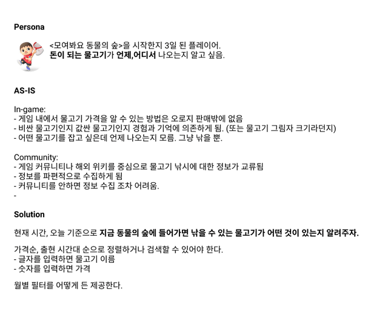
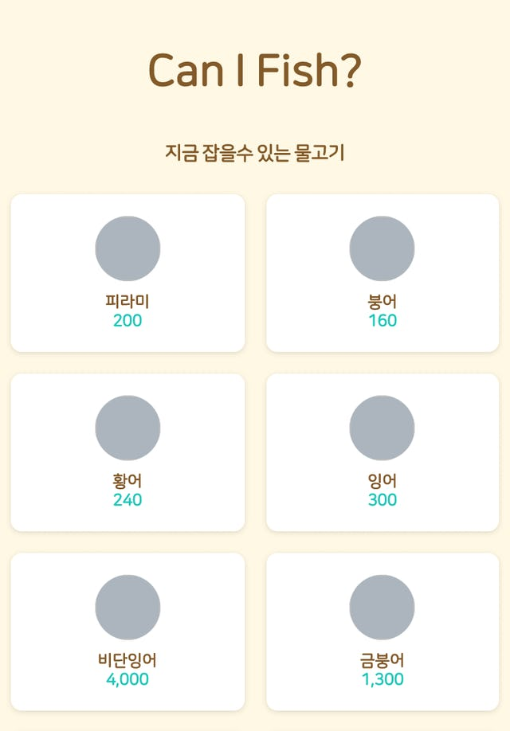
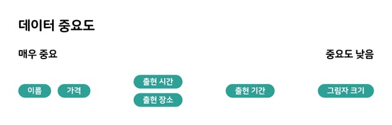
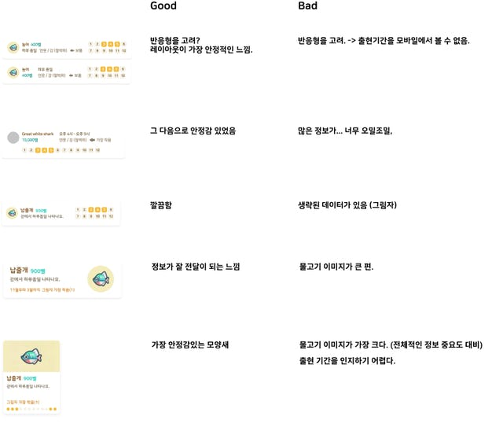
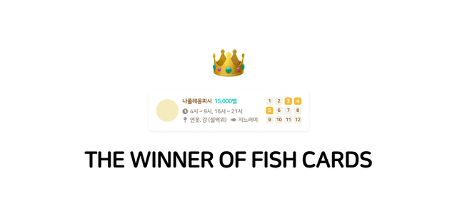

[https://canifish.now.sh](https://canifish.now.sh/)

이직하기 전, 잠시 쉬는 기간 동안 모여봐요 동물의 숲 게임의 물고기 도감 앱을 만들었다. 오랜만에 진행했던 사이드 프로젝트의 개발 후기를 남긴다.

# 휴식

1년 4개월간 근무했던 회사를 그만두고 짧은 휴식 기간을 보냈다. 원래 계획대로라면 이때쯤 여행을 다녀왔어야 했는데, 시국이 어렵게 됐다. 집에서 휴식을 취하기 시작했고, 얼마 전 발매된 '모여봐요 동물의 숲'을 즐기기 시작했다.

게임 내에서 재화를 벌기 위한 방법으로서 낚시를 할 수 있고, 잡아올린 물고기를 팔아서 빚을 갚을 수 있다. 효율적으로 빚을 갚기 위해서는 비싼 물고기를 잡는 것이 합리적이었고, 언제, 어디서, 어떤 물고기가 나오는지에 대한 정보는 게임 커뮤니티를 중심으로 정리가 잘 되어 있었다.

아쉬운 점은 그러한 정보들이 스프레드시트로 공유되고 있었고, **지금 내가 어떤 물고기를 잡을 수 있는지 확인하는 방법은 전적으로 수동으로 확인해야 했다.**

어, 이거 개발하면 재밌겠는데?

말 그대로 '개발각'이 보이자 마자 개발을 시작했다. 개발자로써 진정한 휴식을 즐기기 시작한 셈이다.

# **기획**

사이드 프로젝트지만 대충 만들고 싶지는 않았다. 길지도 짧지도 않은 기간 동안 배우고 쌓아온 실력으로 제대로 각 잡고 만들고 싶었다. 옆자리 PM의 어깨 너머로 배운 페르소나 정의도 해보고, 문제점이 무엇인지 진지하게 생각도 해 봤다. 민망한 수준이지만 나름 괜찮은 시도였다.

프로젝트 이름은 [caniuse.com](https://caniuse.com/)에서 착안하여 Can I Fish?로 결정했다. 거기에 지금 잡을 수 있는 물고기를 확인할 수 있는 서비스라는 아이덴티티를 부각시키는 목적으로 ZEIT Now를 사용하여 배포 하기로 계획했다.

결과적으로 **canifish.now.sh**라는 주소로 어떤 서비스인지 유추할 수 있게 된 점이 만족스러웠다. 비용이 들지 않는 것은 덤이다.

# 디자인

간단하게 구상을 마친 뒤, 최소한의 공수 그러나 작동하는 최소한의 제품을 목표로 개발에 돌입했다. 기능 자체가 구현하기 어려운 것이 아니라서 긴 시간이 걸리지는 않았다.

기본 기능만을 빠르게 구현한 결과물은 **매우 실망스러웠다.**

이 과정에서 무엇이 잘못되었는지 되짚어봤다. 이미지가 없어서 그런가? 하지만 이미지가 있고 없고의 문제가 아닌것 같았다. 스프레드시트의 도감보다 더 나은 것을 원했는데, 오히려 그보다도 못한 것 같았다.

스프레드시트 도감이 보기는 어려워도 **언제(시간/월), 어디서, 어떤 그림자**로 나타나는지 알 수 있는 것에 비하면, 지금의 화면에서는 이름과 가격을 제외한 나머지 정보는 제공하고 있지 않기 때문이었다. 그래서 어떤 정보가 중요한지, 데이터의 중요도를 정리하기도 했다.

사실 이름과 가격을 제외한 나머지 정보 중, 하나라도 제공되지 않는다면 원하는 물고기를 잡는 것은 어려운 일이다. 중요도 순으로 나눈 이유는 컴포넌트를 다시 디자인할 때, 효과적으로 정보를 잘 전달할 수 있도록 고려하기 위해서였다.

이때부터 Figma를 사용해서 UX/UI 디자이너를 준비하는 여자친구 ddu(뚜)와 함께 디자인을 했다. 디자인은 그림을 통해 사용자를 집중시키는 일이라고 생각한다. 나름 UX/UI에 관심이 있다고 생각했는데, 진짜 감각이 있는 사람과 해보니 나의 부족한 부분을 확실하게 느낄 수 있었다.

ddu는 최대한 많은 컴포넌트 시안을 만들었고, 그 시안들을 정리해서 어떤 점이 좋고 나쁜지 한 눈에 비교했다. 좋은 시안이 나오면 해당 시안을 바탕으로 다시 수정하고 비교한다. 이 과정을 거쳐 마침내 최종 컴포넌트 디자인을 결정했다.

시각적으로 괜찮으면서도, 흐름은 짧게, 하지만 빠짐없이 정보를 전달할 수 있는 컴포넌트는 이렇게 만들어졌다. 아기자기하다, 디자인이 괜찮다는 피드백은 ddu가 아니였으면 들을 수 없었을 이야기라고 생각한다. 빨리 좋은 회사에서 일할 수 있으면 좋겠다.

# 개발

사이드 프로젝트의 가장 큰 장점은 관심이 있았던 기술을 마음대로 적용해볼 수 있다는 것이다. 그래서 이번 프로젝트에 **모노레포** 구조를 적용 해 봤다. 모노레포는 하나의 저장소에 여러 패키지를 갖는 구조이며, 블로그에도 몇 번 관련된 글을 작성한 적이 있었다.

모노레포는 개념을 이해하는 것과, 초기 환경을 구성하는 것, Workflow를 이해하는 것이 어려웠다. 예컨대, 모놀리틱에서 하나의 번들러 설정만 있으면 되는 것을 모노레포에서는 각 패키지별로 번들러 설정을 작성해야 하기 때문이다.

가장 좋은 점은 아무래도 패키지 별로 해결하고자 하는 문제를 분리할 수 있다는 점이 아닐까? 예를 들어, CRA로 만든 패키지(앱)과, UI 컴포넌트를 담당하고, 스토리북을 적용한 UI 패키지를 나눠서 관리하는 것이 매우 만족스러웠다.

그리고 [pnpm](https://pnpm.js.org/)를 패키지 매니저로 사용해봤다. 이 또한 블로그에 글을 작성했던 적이 있는데, 실제로 사용한 것은 처음이었다. 성능도 준수하고, 모노레포 기능도 자체적으로 지원하면서 node\_modules의 도플갱어 문제를 해결하는데, 역시 가장 큰 단점은 **인지도가 낮다는 것** 아닐까?

코드는 모두 공개되어 있으니, 코드 구조가 궁금하신 분들은 참고하시라: https://github.com/iamchanii/canifish

# 마무리

Can I Fish?를 만드는 과정이 매우 즐거웠고, 반응도 나쁘지 않아서 많이 뿌듯했다. 굉장히 오랜만에 성취감 비스무리한 것을 느껴본 것 같다. 그래서 다들 그렇게 사이드 프로젝트를 하라고 하는구나 싶었다.

벌써 출근이 일주일 뒤로 다가왔다. 슬슬 휴식을 마무리 하고 출근할 준비를 해야겠다.
