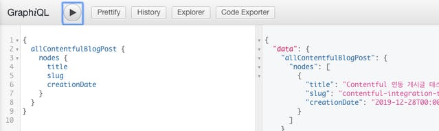

[이전 글](/posts/build-a-funny-homepage-with-tina-cms)에서도 말 했었지만, 워드프레스 기반을 벗어나서, Gatsby로 새롭게 회사 홈페이지를 만들고 있다. 그러다 보니 회사에서 Gatsby에 대해 시간을 많이 쏟아붓고 있다. 따로 정리하지 않으면 언젠가 까먹을 것 같기도 하고, 나처럼 Gatsby와 Contentful을 연동하려고 구글링 중인 사람에게 도움이 되었으면 좋겠다.

---

# **Contentful**

클라우드 기반의 Headless CMS다. 사용법만 익히면, 비개발자도 콘텐츠 모델에 대한 스키마를 웹 상에서 설계할 수 있다. 요금제가 있긴 하지만, 일반적인 블로그 사용 목적이라면 무료 플랜도 충분한 것 같다.

또한, 빌드 타임에 Gatsby 내부 GraphQL 노드로 추가해 주는 [gatsby-source-contentful](https://www.gatsbyjs.org/packages/gatsby-source-contentful/) 플러그인이 있어서, gatsby-node.js를 조금만 수정 해 주면 쉽게 연동할 수 있다.

# 준비

기본적인 사용법 설명은 생략하고, 아래 필드를 포함하는 콘텐츠 모델을 만들었다.

- title 제목
- slug /posts 이후의 주소
- creation\_date 작성 일자
- postBody 본문

> content라는 이름 대신 postBody를 사용한 이유는, content로 하니까 나중에 GraphQL 노드로 추가가 되지 않는다. 정확한 이유는 알 수 없다.

사진으로 보면 다음과 같다.


생성된 모델을 사용해서, Contentful 연동을 위한 콘텐츠를 하나 추가했다.


# **gatsby-source-contentful 설치**

Gatsby 프로젝트에 gatsby-source-contentful 플러그인을 설치한다.

```
$ yarn add gatsby-source-contentful
```

gatsby-config.js에 플러그인을 추가한다.

```
[
  // ...
  {
    resolve: 'gatsby-source-contentful',
    options: {
      spaceId: process.env.CONTENTFUL_SPACE_ID,
      accessToken: process.env.CONTENTFUL_ACCESS_TOKEN,
    },
  },
  // ...
];
```

연동에 필요한 spaceId와 accessToken을 환경 변수에서 가져오도록 했다. 공개 저장소에 노출되지 않기 위해 이런 방법으로 사용하는 것을 추천한다. Gatsby로 블로그를 만드는 경우, 지속적 배포 환경을 구성하는 것이 여러모로 이득이다.

- GitHub Action을 사용한다면, GitHub 저장소 설정에서 Secrets에 저장한다.
- Bitbucket을 사용한다면, Bitbucket 저장소 설정에서 Repository Variables나 Deployments 내의 각 환경에 알맞게 사용한다.
- Netlify를 사용한다면, Netlify 사이트 설정에서 Build & Deploy -> Environtment에 저장한다.

하지만 먼저 로컬에서 확인하는게 중요하므로, 프로젝트 루트 폴더에 .env.development와 .env.prodction 파일을 만들자.

CONTENTFUL\_SPACE\_ID와 CONTENTFUL\_ACCESS\_TOKEN을 저장해야 하는데, 두 항목은 Contentful > Settings > API Keys 에서 확인할 수 있다. 최초에 Example Key 1 이라고 추가되어 있는게 있다. 이걸 그대로 사용해도 좋고, 새로 생성해도 된다.

주의할 점은, Content Delivery API의 액세스 토큰을 사용해야 한다. 그 밑에는 Content Preview API의 액세스 토큰이 있다. 이것과 헷갈리지 않게 주의하자.


만든 로컬 환경 변수를 적용하기 위해 dotenv 패키지를 추가한다.

```
$ yarn add -D dotenv
```

이후, gatsby-node.js 파일 상단에서 dotenv 패키지를 가져와서 다음과 같이 사용한다.

```
require('dotenv').config({
  path: `.env.${process.env.NODE_ENV}`,
});
```

.env로 시작하는 파일은 Gatsby 프로젝트를 생성할 때 만들어진 .gitignore에 추가되어 있다. 혹시 없다면 꼭 추가를 하고, 절대 공개 저장소에 노출되지 않도록 하자.

# Contentful에 추가한 콘텐츠를 페이지로 등록하기

앞서 추가한 로컬 환경 변수를 이용해 정상적으로 Contentful에서 콘텐츠를 가져와 Gatsby 내부 GraphQL에 추가되는지 확인 해 보자. 그러기 위해선 gatsby develop을 실행해 보면 되는데, 이런 오류가 나타난다.


이 이슈는 글을 작성하는 12월 28일 기준, 4일 전에도 [이슈](https://github.com/gatsbyjs/gatsby/issues/16455)가 업데이트 되고 있으나, 근본적인 해결은 되지 않았고, 사용자들이 여러 트릭을 공유하고 있는 상황이다.

해당 패키지 내의 fragment.js 파일을 제거하거나, 주석 처리하는 등의 방법도 있지만, 더 쉬운 방법은 Contentful 내에서 임의의 Media 를 하나 추가하면 된다. 나는 터치바를 캡쳐한 사진이 있길래 그걸 사용했다.


추가한 뒤, 다시 실행하면 아까와 같은 오류는 해결되고, 정상적으로 실행이 되는 것을 볼 수 있다. 또한 GraphiQL에서allContentfulBlogPost를 확인할 수 있다.



그 다음은, [마크다운을 이용해 페이지를 추가하는 작업](/posts/build-a-blog-with-gatsby-and-typescript-part-2)을 해 봤다면 어렵지 않게 할 수 있다. createPage API를 작성해서, 정적 쿼리를 가져온 뒤, 페이지를 생성하면 된다.

```
exports.createPages = async ({ graphql, actions }) => {
  const { createPage } = actions;

  const { data, error } = await graphql(`
    query {
      allContentfulBlogPost {
        nodes {
          title
          slug
          creationDate
        }
      }
    }
  `);

  if (error) {
    throw error;
  }

  data.allContentfulBlogPost.nodes.forEach(({ title, slug, creationDate }) => {
    createPage({
      path: slug,
      context: { title, creationDate },
      component: path.resolve(__dirname, './src/templates/PostTemplate.tsx'),
    });
  });
};
```

gatsby develop을 다시 실행하고, 입력했던 slug 주소로 들어가면, 생성된 페이지를 확인할 수 있다.


# **Contentful의 리치 텍스트 타입을 표시하기**

페이지가 추가된 것을 확인했다면, 리치 텍스트 타입을 표시해 보자. GraphiQL에서 쿼리를 날려보면 알 수 있지만, Contentful이 리치 텍스트를 html로 파싱해서 보내주지 않는다. 아까 추가했던 postBody가 JSON 형태로 오는데, 이는 [Rich Text Abstract Text Tree](https://www.contentful.com/developers/docs/concepts/rich-text/#rules-of-rich-text)를 따른다고 한다.

AST로 온 JSON은 직접 파싱해야 하지만, 그만큼 개발자가 완벽하게, 마음대로 다룰 수 있는 장점이 있다. 이 데이터를 html로 파싱 해보자. 이 부분은 Contentful의 [공식 문서](https://www.contentful.com/developers/docs/tutorials/general/rich-text-and-gatsby/)를 참고했다.

먼저 @contentful/rich-text-html-renderer 패키지를 설치한다.

```
$ yarn add @contentful/rich-text-html-renderer
```

그리고 createPage API 내에서 작성한 쿼리에 postBody의 json도 가져올 수 있도록 수정한다.

```
const { data, error } = await graphql(`
  query {
    allContentfulBlogPost {
      nodes {
        title
        slug
        creationDate
        postBody {
          json
        }
      }
    }
  }
`);
```

createPage 액션을 사용하는 부분에 documentToHtmlString를 호출해서 넣어준다.

```
{
  path: slug,
  context: {
    title,
    creationDate,
    html: documentToHtmlString(node.postBody.json)
  }
  component: //...
}
```

gatsby develop을 다시 실행하고, 추가된 페이지를 확인하면 본문의 내용도 확인할 수 있다.


블로그의 경우, 이미 마크다운을 위해 기본 스타일이 적용되어 있어서 상관 없지만, 필요한 경우 JSON 데이터를 기반으로 리액트 컴포넌트로 만들 수 있는 [@contentful/rich-text-react-renderer](https://github.com/contentful/rich-text/tree/master/packages/rich-text-react-renderer) 패키지도 있다. 그리고 options을 두번째 인자로 넘겨서, 특수한 조건에 따라 렌더링을 다르게 해줘야 하는 경우도 대응할 수 있다.

# 추가로 해야 할 일

여기까지 되었다면, Contentful에서 콘텐츠를 변경할 때 마다 블로그가 새로 배포될 수 있도록 Webhook을 걸어야 한다. 직접 Webhook API를 작성할 수도 있지만, Contentful은 다양한 플랫폼과의 연동을 지원하기 때문에, 해당 방법을 추천한다.

# 언제 Contentful을 사용할까?

Headless CMS는 개발자 외의 직군과 협업을 할 때 도움이 될 것 같다, 예를 들면 스타트업의 홈페이지처럼, 빠른 피드백을 수용할 때는 도움이 된다.

개발자 블로그로는 Git-Backend가 더 나은 것 같다. 수동으로 마크다운을 작성하거나, [TinaCMS](https://tinacms.org/) 또는 [NetlifyCMS](https://www.netlifycms.org/)를 쓰는게 좋은 것 같다. Contentful같은 Headless CMS를 사이트 관리 도구로 활용하여, 어디서든 블로그를 작성한다면 개발 환경이 필요한 Git-Backend 보다 오히려 Headless CMS를 붙이는 편이 좋다.
