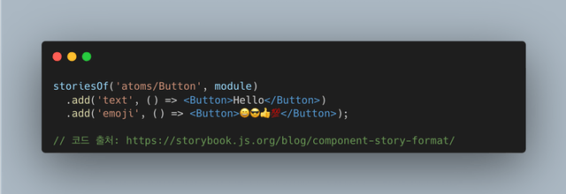
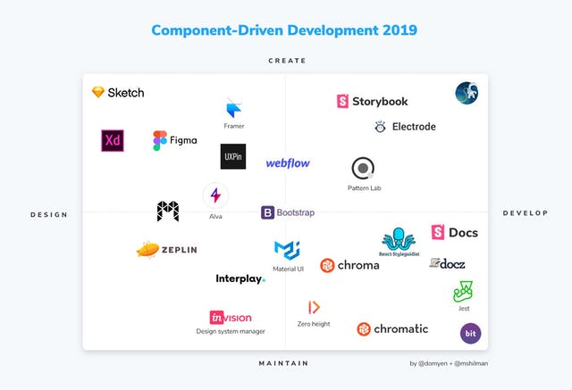
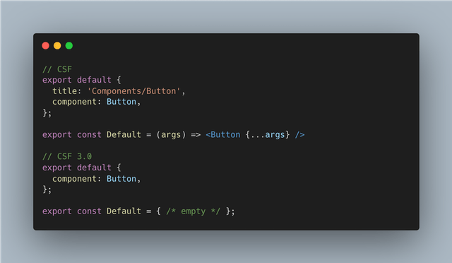
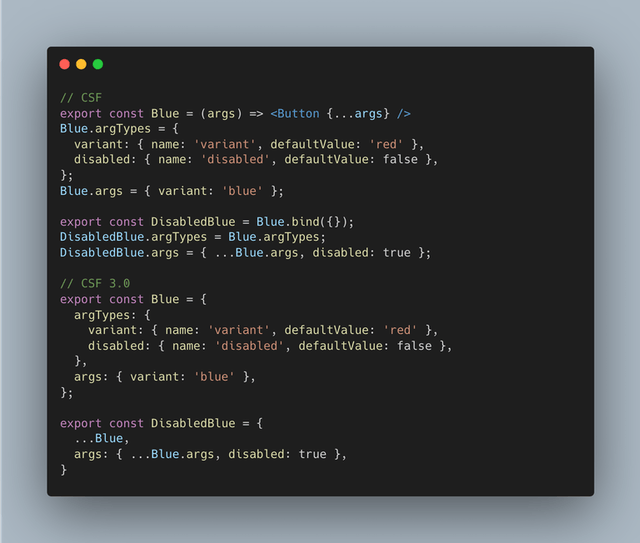
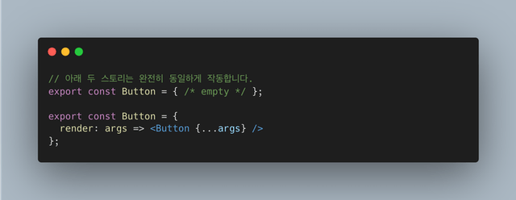

만약 컴포넌트 기반 개발을 선호한다면, 스토리북은 절대로 빠질 수 없는 명품 조연이라고 볼 수 있다. 이른바 프론트엔드 업계 표준이라고 봐도 무방하다. 안 쓰는 회사/사람은 있을 수 있어도, 한 번 사용해본 사람은 아마 스토리북 없이 개발을, 특히 컴포넌트 주도 개발을 하고 싶지 않을거라고 생각한다.

그럼에도 불구하고, 스토리북의 새로운 기능에 대해서는 미온적인 자세로 일관해왔다. 굳이 이유를 대자면, 지금도 스토리북으로 개발 하는데에 큰 문제가 없었으니까? 그래서 작년 7월에 공개된 [Component Story Format 3.0](https://storybook.js.org/blog/component-story-format-3-0/) 을 보고도 '그런갑다...' 하고 지나갔었다.

그런데 비교적 최근에 공개된 [Interactive Stories(Play Function)](https://storybook.js.org/blog/interactive-stories-beta/) 은 나의 관심을 완벽하게 사로잡았고, 덩달아 미적지근 했던 CSF 3.0에 대한 관심도 제법 뜨끈해졌다. 그래서 이번 포스팅에서는 스토리북의 CSF 3.0에 대해 한 번 써보려고 한다.

## 스토리북의 첫 인상

앞서 스토리북은 명품 조연 어쩌구 했지만, 사실 난 **스토리북을 별로 좋아하지 않았다.** 처음 스토리북을 알게 된게 아마 2019년 즈음이었는데, 그 당시에도 컴포넌트 개발을 할 때 스토리북을 쓰면 좋다는 하입Hype을 자주 들었었다. 그래서 직접 써보고자 여러 시행착오 끝에 설치를 하고 스토리를 쓰려고 했으나, 이런 방식으로 쓰는 것에 큰 거부감을 느꼈다.

그 당시의 나는 어떻게 봐도 _(매우 주관적인 측면에서)_ 직관적이지 않은 이 코드를 이해할 수 없었다. 나름 어떻게든 써먹고 싶었지만, storiesOf API와는 결국 친해지지 못했다. 나의 첫 스토리북 경험은 git reset과 함께 안좋은 기억으로 마무리가 되었다. 당시 하던 업무와 프로세스가 컴포넌트 주도 개발과는 거리가 있었던 것도 맞지만, 결정적으로 내 **역량이 부족**했기 때문이라고 생각한다.

...그런데 왜 뜬금없이 예전 스토리북 이야기를 하냐면...

## Component Story Format

이게 다 CSF를 소개하기 위한 빌드업이기 때문이다. 이제 storiesOf API가 멋지지 않았던 것은 그렇다 치자. 그렇다면 왜 스토리북 팀은 CSF를 만들었을까? 당시 CSF를 발표하는 글을 읽어보면 나름 추축해볼 수 있다. (참고로 추측하지 않아도 본문에 설명이 다 되어있긴 하다.)

이 사진이 2019년 당시의 컴포넌트 주도 개발을 위한 도구들을 한 장으로 요약한 사진이다. 정말 많은 도구들이 존재했는데, 문제는 각각의 도구들이 고유한 방식과 문법, 형식을 통해 컴포넌트 주도 개발을 도왔다는 것이다. 그럼에도 스토리북은 문서화를 포함한 다양한 기능과 오픈소스에 힘입어, 춘추전국시대 같은 상황 속에서도 많은 인기를 얻었다.

하지만 스토리북 팀은 스토리북이 **스토리를 기반으로 구축**하기 때문에 이러한 인기를 얻을 수 있었다고 생각한 것 같다. 그래서 스토리를 더욱 쓰기 쉽게 만들기 위해 노력했고, 그 결과가 Component Story Format(CSF)이다.

### 쓰기만 쉬운게 아니야

당시 새롭게 공개된 CSF는 ES6 모듈(지금의 ESM)의 형식을 바탕으로 만들어졌다. 확실히 storiesOf 보다 쓰기 쉽지만, 그게 CSF를 만들고 공개한 이유의 전부는 아니다. 단순히 쓰기 쉬운것을 목표로 한다면 이보다 더 간단하게 할 수도 있을테니까. 예를 들면 더욱 직관적인 storiesOf 라던지, 아니면 YAML 기반으로 선언 한다던지... (생각해보니 더 간단하지는 않은 것 같다.)

그렇다면 왜 ES6 모듈을 기반으로 했을까? storiesOf는 당시 스토리북이 그랬듯, 특정한 도구를 위한 방식에 지나지 않지만, ES6 모듈은 자바스크립트의 표준이었고, 모듈을 지원하는 런타임 혹은 웹팩, 롤업같은 도구를 통해서 쉽게 접근할 수 있기 때문이라고 생각한다.

이러한 접근 방식이 궁극적으로 플랫폼이나 도구에 구애받지 않는 형식을 만들 수 있고, 그렇게 되면 작성한 스토리를 스토리북 바깥에서도 재사용할 수 있다는 인사이트를 스토리북 팀이 얻었기 때문이라고 생각한다.

## Component Story Format 3.0

작년 7월, 스토리북은 Component Story Format 3.0을 공개한다. 갑자기 버전이 붙어서 의아했는데, 어디에도 3.0이 붙은 이유를 찾을 수 없었다. 아마 storiesOf (1.0) → CSF (2.0) → CSF 3.0이 된게 아닐까. 추측이지만 나름 합리적이라고 생각한다.

### CSF 3.0의 주요 변경점

CSF로 스토리를 쓰는 것도 충분히 간결했다고 생각했는데, CSF 3.0은 이보다 더 간결해졌다. 스토리북 팀의 '이런거 쓸 시간 있으면 컴포넌트 스토리나 하나 더 생각해'보라는 의지가 절로 느껴진다.

먼저, 기존 CSF에서는 함수 표현식을 통해 스토리를 작성했다면, CSF 3.0에서는 객체 표현식으로 작성한다. 객체로 작성하기 때문에, 기존 스토리를 기반으로 새 스토리를 훨신 편하게 작성할 수 있다. 아래 사진을 참고하자.

그리고 CSF 3.0에는 컴포넌트를 어떻게 렌더링 할 것인지에 대한 선언이 없다. 기존 CSF에서 작성된 대부분의 스토리 함수들은 인자로 전달받은 args를 컴포넌트에 전개하는 방식으로 전달하는 정도에 지나지 않는다. 그래서 CSF 3.0부터는 컴포넌트의 렌더링 방식을 스토리북에 구성된 프레임워크가 알아서 처리한다. 필요하다면 render 프로퍼티를 사용해서 명시적으로 선언하는 것도 가능하다.

## 정리

스토리북의 CSF가 나오게 된 배경(그런데 뇌피셜로 점철된)부터 CSF 3.0과 주요 변경점까지 살펴봤다. 다행히도 하위 호환성으로 기존에 작성된 스토리들도 실행되니까 당장 마이그레이션을 하지 않아도 괜찮을 것 같다. 그래도 여유가 있을 때 미리 6.4로 업그레이드 하고, CLI에서 제공하는 migrate 명령어로 마이그레이션을 해두는 것이 좋겠다.

원래는 인터랙티브 스토리까지 다뤄보려고 했는데, 이쪽은 따로 포스팅을 써야 할 것 같다. 인터랙티브 스토리를 간단하게 써보니, 스토리북 팀의 야망이 어디까지인지 궁금하기까지 하다.

###### 출처

- https://storybook.js.org/blog/component-story-format
- https://storybook.js.org/blog/component-story-format-3-0
